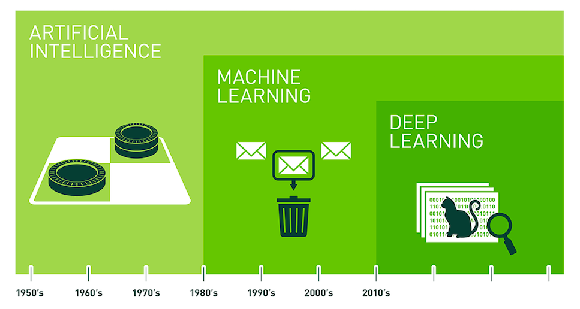
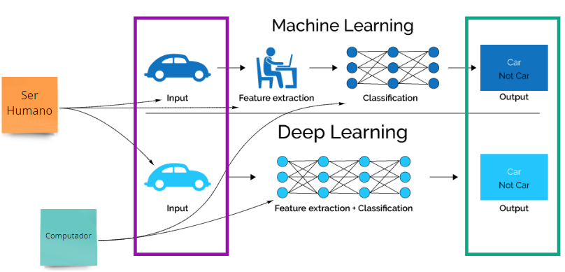
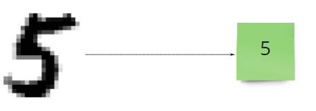

# Aula #1 - Deep Learning - Parte 1

Por <a href="https://www.youtube.com/paulosalvatore" target="_blank">Paulo Salvatore</a> - Head de Produtos <a href="https://blueedtech.com.br/quem-somos/" target="_blank">@Blue Edtech</a>

Olá :wave:, seja bem-vindo(a) ao nosso primeiro vídeo desta série. Nosso objetivo é introduzir o conceito de rede neural, neurônios, aprendizagem profunda, funções de ativação, algoritmo de Backpropagation e aplicação prática com TensorFlow Playground.

## Introdução

Antes de mergulharmos no **Deep Learning** (D.L. - aprendizagem profunda) é necessário sabermos que ele está dentro de uma estrutura de conhecimentos da **Inteligência Artificial** (I.A.).

A I.A. começou sua evolução pela década de 50 e faz parte do campo de estudos da Ciência da Computação que se combina a conjuntos de dados robustos para permitir a resolução de problemas. Alan Turing, muitas vezes chamado de "pai da ciência da computação", frequentemente questionava se as máquinas seriam capazes de pensar. A partir daí definiu que a I.A. seria categorizada como <a href="https://www.ibm.com/br-pt/cloud/learn/what-is-artificial-intelligence" target="_blank">"sistemas que agem como humanos"</a>.

O **Machine Learning** (M.L. - aprendizagem de máquina) veio um pouquinho depois, se tornando uma técnica de aprendizagem de máquina para que ela reconheça padrões e aprenda em cima de um grande conjunto de dados e a partir deste aprendizado tomamos decisões, fazemos previsões, entre outros.

O Deep Learning fez sua primeira aparição entre as décadas de 70 e 80 e começou a se popularizar a partir de 2010. É um método que incorpora redes neurais em camadas para que a aprendizagem a partir dos dados seja feita de forma iterativa.

Tanto M.L. quanto o D.L recebem informações na camada de **Input** (entrada) e, baseados nestas informações, tomam decisões ou fazem alguma previsão na camada de **Output** (saída), comparando aos dados que já eram conhecidos.

No processo de M.L., os dados entram pela camada de **Input**, e a extração deles é feita completamente por um Ser Humano. Estruturados e organizados, estes dados são classificados por uma máquina, gerando um resultado na camada de **Output**.

> **_NOTA:_** O processo de extração se caracteriza por observar, analisar e estruturar o conjunto de dados recebidos na camada **Input**.

> **_NOTA:_** O processo de classificação é feito inteiramente por uma máquina, através de uma ou um conjunto de fórmulas matemáticas classificando todas as features extraídas.

No processo de D.L., os dados entram pela camada de **Input**, e os processos de extração e classificação das features, são feitos inteiramente pela máquina gerando o **Output**. A grande vantagem é que ele pode nos trazer informações interessantes e/ou relevantes, que poderiam passar despercebidas pelo Ser Humano.

> **_Obs.:_** Para ambos os processos, os dados precisam ser preparados por um Ser Humano para entrar no processo de aprendizagem.

Para que estes conceitos fiquem mais claros, assista aos vídeos a seguir:

- Este carro autônomo usa o D.L. para saber se objetos que passam no campo de visão são carros ou não: <a href="https://www.youtube.com/watch?v=mUV5ZwIC9_g&feature=youtu.be" target="_blank">Carro Autônomo</a>.

- No reconhecimento de voz as palavras são identificadas através do Input de vários arquivos de voz: <a href="https://www.youtube.com/watch?v=NaqZkV_fBIM&feature=youtu.be" target="_blank">Reconhecimento de Voz</a>.

- Projeto GauGAN da Nvidia que transforma desenhos em paisagens usando Redes Neurais: <a href="https://www.youtube.com/watch?v=p5U4NgVGAwg" target="_blank">GauGAN</a>.

- Poder de análise de dados entre CPU vs. GPU: <a href="https://www.youtube.com/watch?v=-P28LKWTzrI" target="_blank">CPU vs. GPU</a>.

### Formas de Análise de Input de Dados

Neste exemplo, somos um algoritmo de I.A. com o objetivo de entender informações:

A letra `A` pode ser entendida de diversas formas:

- Ao analisar sua imagem, independente da forma que foi escrita
  - No caso do computador, uma imagem é um conjunto de pixels
  - No caso do ser humano, uma imagem é gerada pelos nossos olhos e processada pelo cérebro
- Ouvindo-a sendo dita
  - No caso do computador, um áudio é um arquivo que contém várias faixas de frequência (medidas em Hertz) e intensidades diferentes para cada valor de frequência
  - No caso do ser humano, um som é interpretado por nossos ouvidos e processado pelo cérebro

Para que, ao final do processo, tenhamos a informação que aquela letra representa, precisamos transformá-la, pois, afinal, não é tão prático usar um conjunto de pixels ou um arquivo de áudio em um programa de computador, trabalhar diretamente com a informação é muito melhor e mais prático.

O mesmo processo é feito para dígitos numéricos:

O dígito pode ter sido escrito à mão, digitado em um computador ou extraído de uma imagem. Como algoritmos, precisamos ler estes **Inputs** para saber que o dígito é um `5` e não uma representação dele.

Este mesmo processo de `Input -> Análise dos dados -> Output` é feito pelo nosso cérebro o tempo todo. Através da rede neural, espalhada por todo o corpo é captamos as informações do ambiente, as transformamos em estímulos sensoriais que são entendidos e traduzidos pelos neurônios no cérebro que  nos devolve a informação em forma de sensação de tato, audição, visão ou paladar e a partir disso tomamos alguma decisão.

## Preparação da Rede Neural

<13:08>

## ❗️ Links & Referências usadas nesta aula

Esta aula no <a href="https://miro.com/app/board/o9J_ljr0G-g=/" target="_blank">Miro</a>

Site <a href="https://playground.tensorflow.org/" target="_blank">Tensorflow Playground</a>

Site <a href="https://www.3blue1brown.com/topics/neural-networks" target="_blank">3Blue1Brown</a>
