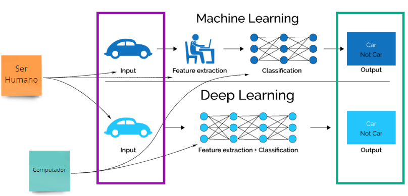
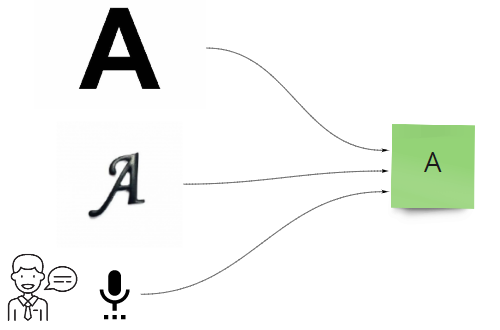
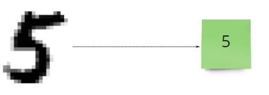
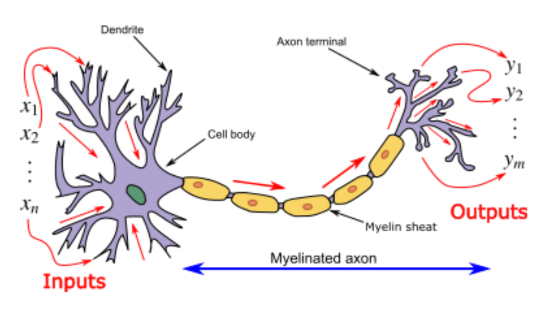
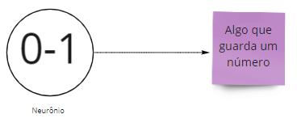
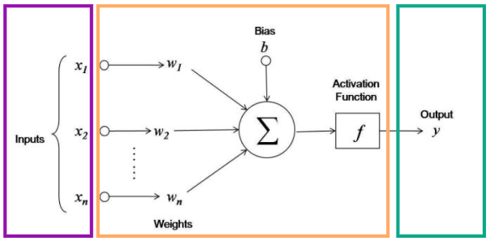
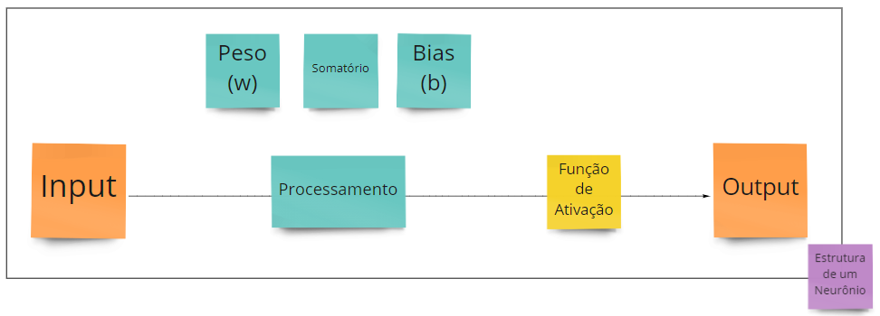
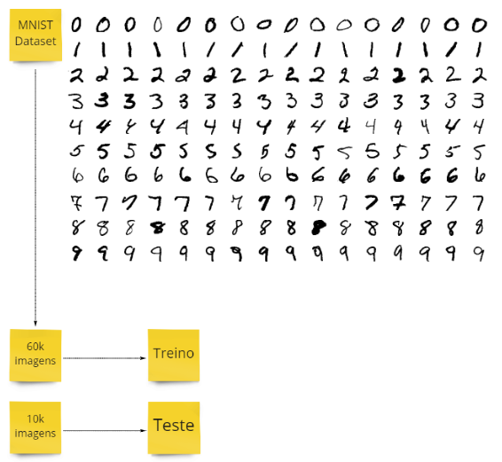
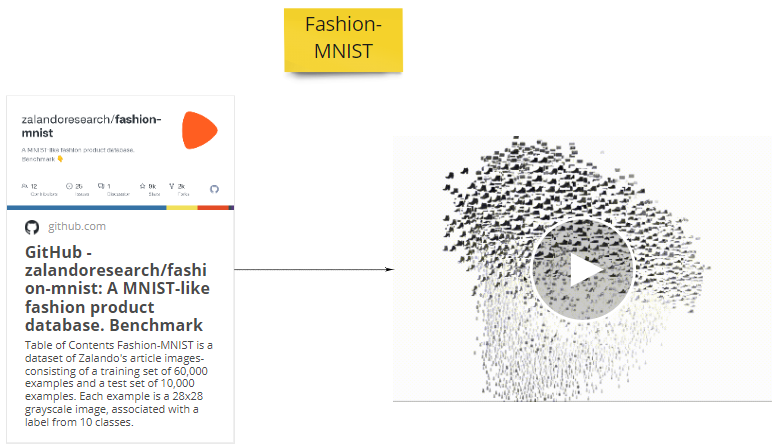
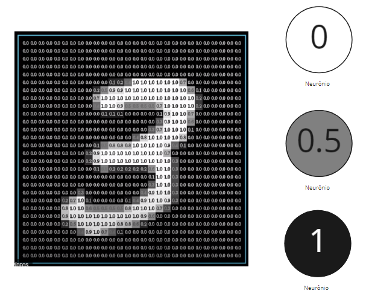

# Aula #1 - Deep Learning - Parte 1

Por <a href="https://www.youtube.com/paulosalvatore" target="_blank">Paulo Salvatore</a> - Head de Produtos <a href="https://blueedtech.com.br/quem-somos/" target="_blank">@Blue Edtech</a> & Chanely Marques - Eterna Aprendiz <a href="https://blueedtech.com.br/quem-somos/" target="_blank">@Blue Edtech</a>

Olá :wave:, seja bem-vindo(a) ao nosso primeiro vídeo desta série. Nosso objetivo é introduzir o conceito de rede neural, neurônios, aprendizagem profunda, funções de ativação, algoritmo de Backpropagation e aplicação prática com TensorFlow Playground.

## Introdução

Antes de mergulharmos no **Deep Learning** (D.L. - aprendizagem profunda) é necessário sabermos que ele está dentro de uma estrutura de conhecimentos da **Inteligência Artificial** (I.A.).

A I.A. começou sua evolução pela década de 50 e faz parte do campo de estudos da Ciência da Computação que se combina a conjuntos de dados robustos para permitir a resolução de problemas. Alan Turing, muitas vezes chamado de "pai da ciência da computação", frequentemente questionava se as máquinas seriam capazes de pensar. A partir daí definiu que a I.A. seria categorizada como <a href="https://www.ibm.com/br-pt/cloud/learn/what-is-artificial-intelligence" target="_blank">"sistemas que agem como humanos"</a>.

O **Machine Learning** (M.L. - aprendizagem de máquina) veio um pouquinho depois, se tornando uma técnica de aprendizagem de máquina para que ela reconheça padrões e aprenda em cima de um grande conjunto de dados e a partir deste aprendizado tomamos decisões, fazemos previsões, entre outros.

O Deep Learning fez sua primeira aparição entre as décadas de 70 e 80 e começou a se popularizar a partir de 2010. É um método que incorpora redes neurais em camadas para que a aprendizagem a partir dos dados seja feita de forma iterativa.

Tanto M.L. quanto o D.L recebem informações na camada de **Input** (entrada) e, baseados nestas informações, tomam decisões ou fazem alguma previsão na camada de **Output** (saída), comparando aos dados que já eram conhecidos.

No processo de M.L., os dados entram pela camada de **Input**, e a extração deles é feita completamente por um Ser Humano. Estruturados e organizados, estes dados são classificados por uma máquina, gerando um resultado na camada de **Output**.

> **_NOTA:_** O processo de extração se caracteriza por observar, analisar e estruturar o conjunto de dados recebidos na camada **Input**.

> **_NOTA:_** O processo de classificação é feito inteiramente por uma máquina, através de uma ou um conjunto de fórmulas matemáticas classificando todas as features extraídas.

No processo de D.L., os dados entram pela camada de **Input**, e os processos de extração e classificação das features, são feitos inteiramente pela máquina gerando o **Output**. A grande vantagem é que ele pode nos trazer informações interessantes e/ou relevantes, que poderiam passar despercebidas pelo Ser Humano.

> **_Obs.:_** Para ambos os processos, os dados precisam ser preparados por um Ser Humano para entrar no processo de aprendizagem.

Para que estes conceitos fiquem mais claros, assista aos vídeos a seguir:

- Este carro autônomo usa o D.L. para saber se objetos que passam no campo de visão são carros ou não: <a href="https://www.youtube.com/watch?v=mUV5ZwIC9_g&feature=youtu.be" target="_blank">Carro Autônomo</a>.

- No reconhecimento de voz as palavras são identificadas através do Input de vários arquivos de voz: <a href="https://www.youtube.com/watch?v=NaqZkV_fBIM&feature=youtu.be" target="_blank">Reconhecimento de Voz</a>.

- Projeto GauGAN da Nvidia que transforma desenhos em paisagens usando Redes Neurais: <a href="https://www.youtube.com/watch?v=p5U4NgVGAwg" target="_blank">GauGAN</a>.

- Poder de análise de dados entre CPU vs. GPU: <a href="https://www.youtube.com/watch?v=-P28LKWTzrI" target="_blank">CPU vs. GPU</a>.

### Formas de Análise de Input de Dados

Neste exemplo, somos um algoritmo de I.A. com o objetivo de entender informações:

A letra `A` pode ser entendida de diversas formas:

- Ao analisar sua imagem, independente da forma que foi escrita
  - No caso do computador, uma imagem é um conjunto de pixels
  - No caso do ser humano, uma imagem é gerada pelos nossos olhos e processada pelo cérebro
- Ouvindo-a sendo dita
  - No caso do computador, um áudio é um arquivo que contém várias faixas de frequência (medidas em Hertz) e intensidades diferentes para cada valor de frequência
  - No caso do ser humano, um som é interpretado por nossos ouvidos e processado pelo cérebro

Para que, ao final do processo, tenhamos a informação que aquela letra representa, precisamos transformá-la, pois, afinal, não é tão prático usar um conjunto de pixels ou um arquivo de áudio em um programa de computador, trabalhar diretamente com a informação é muito melhor e mais prático.

O mesmo processo é feito para dígitos numéricos:

O dígito pode ter sido escrito à mão, digitado em um computador ou extraído de uma imagem. Como algoritmos, precisamos ler estes **Inputs** para saber que o dígito é um `5` e não uma representação dele.

Este mesmo processo de `Input -> Análise dos dados -> Output` é feito pelo nosso cérebro o tempo todo. Através da rede neural, espalhada por todo o corpo é captamos as informações do ambiente, as transformamos em estímulos sensoriais que são entendidos e traduzidos pelos neurônios no cérebro que  nos devolve a informação em forma de sensação de tato, audição, visão ou paladar e a partir disso tomamos alguma decisão.

## Preparação da Rede Neural

<13:08> - Paulo, me empolguei um pouco aqui porque sou perdidamente louca por neurociências :B <3

Para que o cérebro seja capaz de fazer todas as coisas que hoje sabemos que faz, podemos imaginar que um único neurônio possui uma estrutura e forma de funcionar bastante complexa. 

Por hora não vamos nos servir desta complexidade toda mas sim de sua simplicidade funcional: receber e transmitir impulsos elétricos - receber e transmitir informação.

A estrutura básica de um neurônio consiste em:

- <b>Dendritos</b>: é por aqui que as informações entram - `Inputs`,
- <b>Corpo celular</b>: recebidas as informações, serão analisadas, processadas e decididas quanto ao destino,
- <b>Axônio envolto de ilhas de bainha de mielina</b>: fio condutor responsável por transmitir a informação do corpo celular para o axônio terminal, e;
- <b>Axônio terminal</b>:  é por aqui que as informações saem - `Outputs`

Para que as informações saiam do axônio terminal `A` para o dendrito do axônio `B`uma estrutura chamada <b>sinapse</b> - que pode ser química ou elétrica - é ativada através do estímulo que sai do axônio terminal para o dendrito.

Graças à essas sinapses nosso cérebro é capaz de processar 11 bilhões de bits por segundo através de conexões paralelas entre todos os neurônios.

> ***_Curiosidade_***: Uma sinapse se forma de um neurônio do cérebro com outro neurônio do cérebro. Quando um neurônio do cérebro precisa falar com uma célula muscular para ativar qualquer músculo no corpo, a estrutura se chama <b>junção neuromuscular</b>.

Este conceito de processar informações paralelamente é bastante conhecido por nós: <b>processamento paralelo</b>, que explora e usa simultaneamente várias unidades de processamento (CPU's).

Por exemplo, ao ouvirmos a letra `A`, a informação do som (Hz) é transmitida pelos condutos auditivos, captada pelos neurônios especializados que estimulam uma cascata de estímulos elétricos ativando o processamento paralelo nas áreas cerebrais especializadas em audição, para que finalmente o reconhecimento da informação `A` seja feito e devolvido para nós em forma de "Hmm, isso que eu ouvi é a letra `A`, eu a conheço!".

Este mesmo processo é feito para todas as informações que captamos do ambiente através dos 5 sentidos.

> Por hora, queremos que você guarde a seguinte informação: podemos  fazer uma analogia de tudo que vemos acima a um único neurônio de máquina. Vamos imaginar que esse neurônio tem a responsabilidade de armazenar um número aleatório entre 0 e 1.

## Representação Matemática em Deep Learning

<16:59>

Vamos observar e estudar com calma a figura abaixo:

Paralelamente à estrutura de um neurônio, esta representação matemática possui uma região que recebe <b>Inputs</b> (dendrito), outra que <b>analisa, processa e envia as informações</b> (corpo celular e axônio) e por fim, a que faz o <b>Output</b> (axônio terminal).

Vamos trabalhar novamente o exemplo da letra `A`. Ela entrará na camada Roxa de Input, será processada na camada Laranja trazendo algum resultado e sairá pela camada Verde de Output nos trazendo o resultado se a letra `A` foi ou não identificada.

> ***Importante.:*** Neste momento precisamos ter muito claro que a camada de Input é por onde entram as informações e a camada de Output é por onde elas saem.

### Processamento das informações

Dentre todos os conceitos de uma rede neural, certamente o entendimento sobre <b>pesos (wheight)</b> e <b>valores propagados (bias)</b> são os de fundamental importância.

Quando a informação é transmitida da camada de Input para a de processamento os pesos são aplicados à esta informação, somados, e carreados adiante para uma função de ativação juntamente com os valores propagados.

> **_NOTA:_** Os pesos são coeficientes da equação que estamos tentando resolver naquele momento.

> **_NOTA:_** Os valores propagados consistem em vetores adicionados ao produto dos Inputs e dos pesos que compensam os resultados colocando-os mais ou menos para o positivo ou negativo.

Cada informação que entra pela camada de Input é <b>multiplicada</b> por um <b>peso</b> que recebe um valor aleatório. 

Como exemplo, vamos imaginar que recebemos as letras `A` com o valor de `2` e `B` com o valor de `5` pela camada de Input. O `peso A` recebe o valor de `3` e `peso B` recebe o valor de `6`.

:key: :bulb: O <b>somatório</b> será o total de: <b>(`A` * Peso A) + (`B` * Peso B) = 36 </b>.

Agora podemos adicionar um valor de bias que pode ser um número positivo ou negativo, por exemplo, `-2`

:key: :bulb: O <b>total</b> do processamento será: <b>(somatório + bias) = 34</b>.

Com o resultado total em mãos ele será passado por uma função de ativação e a partir dela teremos um novo número que será passado para a camada de Output.

Munidos destes detalhes a estrutura básica do nosso neurônio toma uma forma diferente mas, sem alteração no seu funcionamento, como podemos ver abaixo:

<21:55>

## Camada de Entrada (Input)

Para aprofundarmos nosso estudo vamos falar sobre um banco de dados bastante específico chamado <b>MINIST</b> que contém imagens binárias de dígitos escritos à mão por diversas pessoas.

> ***Importante***: Identificar o dígito de qualquer uma destas imagens pelo nosso Deep Learning é análoga a um 'Hello World!'. Atente-se à maldição. :jack_o_lantern:

O MIINST tem um primo evoluído chamado <b>Fashion-MINIST</b>, um banco de dados de imagens de artigos da [Zalando](https://github.com/zalandoresearch/fashion-mnist). Possui um conjunto de 60.000 exemplos de treinamento para aprendizagem de máquina e um conjunto de teste de 10.000 exemplos. Cada exemplo é uma imagem em tons de cinza de 28x28, associada a um rótulo de 10 classes.

No vídeo abaixo temos um exemplo de como um algoritmo observa um conjunto de dados com artigos de moda em geral e os posiciona por similaridade.

![Aula1_Gif01](imagens\Aula01_Gif01.gif ****** VOU ARRUMAR ESTE LINK PORQUE SE DEIXAR ELE LIGADO MEU PC TRAVA kkkkkkrying

<23:57>

Das 70.000 imagens que podemos encontrar no MINIST, vamos pegar uma delas para o nosso exercício, com 28px de largura por 28px de altura totalizando 784px organizados em linhas e colunas.

Cada ponto na imagem é análogo a um neurônio tendo números no intervalo de 0 a 1.

## ❗️ Links & Referências usadas nesta aula

Esta aula no <a href="https://miro.com/app/board/o9J_ljr0G-g=/" target="_blank">Miro</a>

Site <a href="https://playground.tensorflow.org/" target="_blank">Tensorflow Playground</a>

Site <a href="https://www.3blue1brown.com/topics/neural-networks" target="_blank">3Blue1Brown</a>
