# Aula #1 - Deep Learning - Parte 1

Por <a href="https://www.youtube.com/paulosalvatore" target="_blank">Paulo Salvatore</a> - Head de Produtos <a href="https://blueedtech.com.br/quem-somos/" target="_blank">@Blue Edtech</a> & Chanely Marques - Eterna Aprendiz <a href="https://blueedtech.com.br/quem-somos/" target="_blank">@Blue Edtech</a>

Olá :wave:, seja bem-vindo(a) ao nosso primeiro vídeo desta série. Nosso objetivo é introduzir o conceito de rede neural, neurônios, aprendizagem profunda, funções de ativação, algoritmo de Backpropagation e aplicação prática com TensorFlow Playground.

## Introdução

Antes de mergulharmos no **Deep Learning** (D.L. - aprendizagem profunda) é necessário sabermos que ele está dentro de uma estrutura de conhecimentos da **Inteligência Artificial** (I.A.).

A I.A. começou sua evolução pela década de 50 e faz parte do campo de estudos da Ciência da Computação que se combina a conjuntos de dados robustos para permitir a resolução de problemas. Alan Turing, muitas vezes chamado de "pai da ciência da computação", frequentemente questionava se as máquinas seriam capazes de pensar. A partir daí definiu que a I.A. seria categorizada como <a href="https://www.ibm.com/br-pt/cloud/learn/what-is-artificial-intelligence" target="_blank">"sistemas que agem como humanos"</a>.

O **Machine Learning** (M.L. - aprendizagem de máquina) veio um pouquinho depois, se tornando uma técnica de aprendizagem de máquina para que ela reconheça padrões e aprenda em cima de um grande conjunto de dados e a partir deste aprendizado tomamos decisões, fazemos previsões, entre outros.

O Deep Learning fez sua primeira aparição entre as décadas de 70 e 80 e começou a se popularizar a partir de 2010. É um método que incorpora redes neurais em camadas para que a aprendizagem a partir dos dados seja feita de forma iterativa.

Tanto M.L. quanto o D.L recebem informações na camada de **Input** (entrada) e, baseados nestas informações, tomam decisões ou fazem alguma previsão na camada de **Output** (saída), comparando aos dados que já eram conhecidos.

No processo de M.L., os dados entram pela camada de **entrada**, e a extração deles é feita completamente por um Ser Humano. Estruturados e organizados, estes dados são classificados por uma máquina, gerando um resultado na camada de **saída**.

> ***_NOTA :clipboard: :pencil2: :_***  O processo de extração se caracteriza por observar, analisar e estruturar o conjunto de dados recebidos na camada **de entrada**.

> ***_NOTA :clipboard: :pencil2: :_***  O processo de classificação é feito inteiramente por uma máquina, através de uma ou um conjunto de fórmulas matemáticas classificando todas as features extraídas.

No processo de D.L., os dados entram pela camada de **entrada**, e os processos de extração e classificação das features, são feitos inteiramente pela máquina gerando a **saída**. A grande vantagem é que ele pode nos trazer informações interessantes e/ou relevantes, que poderiam passar despercebidas pelo Ser Humano.

> **_Obs.:_** Para ambos os processos, os dados precisam ser preparados por um Ser Humano para entrar no processo de aprendizagem.

Para que estes conceitos fiquem mais claros, assista aos vídeos a seguir:

- Este carro autônomo usa o D.L. para saber se objetos que passam no campo de visão são carros ou não: <a href="https://www.youtube.com/watch?v=mUV5ZwIC9_g&feature=youtu.be" target="_blank">Carro Autônomo</a>.

- No reconhecimento de voz as palavras são identificadas através da inserção de vários arquivos de voz: <a href="https://www.youtube.com/watch?v=NaqZkV_fBIM&feature=youtu.be" target="_blank">Reconhecimento de Voz</a>.

- Projeto GauGAN da Nvidia que transforma desenhos em paisagens usando Redes Neurais: <a href="https://www.youtube.com/watch?v=p5U4NgVGAwg" target="_blank">GauGAN</a>.

- Poder de análise de dados entre CPU vs. GPU: <a href="https://www.youtube.com/watch?v=-P28LKWTzrI" target="_blank">CPU vs. GPU</a>.

### Formas de Análise de Inserção de Dados

Neste exemplo, somos um algoritmo de I.A. com o objetivo de entender informações:

A letra `A` pode ser entendida de diversas formas:

- Ao analisar sua imagem, independente da forma que foi escrita
  - No caso do computador, uma imagem é um conjunto de pixels
  - No caso do ser humano, uma imagem é gerada pelos nossos olhos e processada pelo cérebro
- Ouvindo-a sendo dita
  - No caso do computador, um áudio é um arquivo que contém várias faixas de frequência (medidas em Hertz) e intensidades diferentes para cada valor de frequência
  - No caso do ser humano, um som é interpretado por nossos ouvidos e processado pelo cérebro

Para que, ao final do processo, tenhamos a informação que aquela letra representa, precisamos transformá-la, pois, afinal, não é tão prático usar um conjunto de pixels ou um arquivo de áudio em um programa de computador, trabalhar diretamente com a informação é muito melhor e mais prático.

O mesmo processo é feito para dígitos numéricos:

O dígito pode ter sido escrito à mão, digitado em um computador ou extraído de uma imagem. Como algoritmos, precisamos ler estes **dados** para saber que o dígito é um `5` e não uma representação dele.

Este mesmo processo de `Entrada de dados -> Análise -> Saída` é feito pelo nosso cérebro o tempo todo. Através da rede neural, espalhada por todo o corpo é captamos as informações do ambiente, as transformamos em estímulos sensoriais que são entendidos e traduzidos pelos neurônios no cérebro que  nos devolve a informação em forma de sensação de tato, audição, visão ou paladar e a partir disso tomamos alguma decisão.

## Preparação da Rede Neural

<!-- 13:08 -->

Para que o cérebro consiga de fazer todas as coisas que hoje sabemos que é capaz de fazer, podemos imaginar que um único neurônio têm sua estrutura e forma de funcionar bastante complexa. 

Por hora não vamos nos servir desta complexidade, mas sim de sua simplicidade funcional: receber e transmitir impulsos elétricos, ou seja, receber e transmitir informações.

A estrutura básica de um neurônio consiste em:

- **Dendritos**: é por aqui que as informações entram - `Input`,
- **Corpo celular**: recebidas as informações, as mesmas serão analisadas, processadas e decididas quanto ao destino,
- **Axônio envolto de ilhas de bainha de mielina**: fio condutor responsável por transmitir as informações do corpo celular para o axônio terminal, e;
- **Axônio terminal**:  é por aqui que as informações saem - `Output`.

Para que as informações saiam do axônio terminal `A` para o dendrito do axônio `B`, uma estrutura chamada **sinapse** — que pode ser química ou elétrica — é ativada através do estímulo que sai do axônio terminal de `A` para o dendrito de `B`.

Graças à essas sinapses, nosso cérebro é capaz de processar 11 bilhões de bits por segundo através de conexões paralelas entre todos os neurônios.

> ***_Curiosidade_*** 🧠: Uma sinapse se forma entre um neurônio do cérebro com outro neurônio do cérebro. Quando um neurônio do cérebro precisa falar com uma célula muscular para ativar qualquer músculo no corpo, a estrutura se chama **junção neuromuscular**.

Este conceito de processar informações paralelamente é bastante aplicado à computação. Chamado de **processamento paralelo**, ele explora e usa simultaneamente várias unidades de processamento (CPU's) para aumentar a velocidade.

Por exemplo, ao ouvirmos a letra `A`, a informação do som (em Hz) é transmitida pelos condutos auditivos e captada pelos neurônios especializados. Estes captadores formam uma cascata de estímulos elétricos ativando o processamento paralelo nas áreas cerebrais especializadas em audição, para que finalmente o reconhecimento da informação `A` seja feito e devolvido para nós em forma de "Hmm, isso que eu ouvi é a letra `A`, eu a conheço!".

Este mesmo processo é feito para todas as informações que captamos do ambiente através dos 5 sentidos.

> Por hora, queremos que você guarde o seguinte: podemos fazer uma analogia de tudo que vimos acima a um único neurônio de máquina. Na máquina. este neurônio realiza uma função muito simples que é a de armazenar um número que, a princípio, será entre 0 e 1.

## Representação Matemática

<!-- 16:59 -->

Vamos observar e estudar com calma a figura abaixo:

Paralelamente à estrutura funcional de um neurônio, esta representação matemática possui uma região que recebe **valores de entrada** (equivalente aos dendritos), outra que **analisa, processa e envia as informações** (equivalente ao corpo celular e axônio) e, por fim, a que faz a **saída** (equivalente ao axônio terminal).

Vamos trabalhar novamente o exemplo da letra `A`:

- a informação entrará na camada Roxa de entrada;
- será processada na camada Laranja; e
- sairá pela camada Verde de saída nos trazendo o resultado se a letra `A` foi ou não identificada.

> ***Importante :bangbang: :*** Neste momento precisamos ter muito claro que a camada de entrada é por onde entram as informações e a camada de saída é por onde elas saem.

### Processamento das informações

Dentre todos os conceitos de uma rede neural, certamente o entendimento sobre **pesos (weights)** e **valores propagados (bias)** são fundamentais (talvez a parte mais importante da uma rede neural 🙂).

Quando a informação é transmitida da camada de entrada para a de processamento, os pesos são aplicados à esta informação, somados e passados adiante para uma função de ativação, juntamente com os valores de Bias.

Cada **informação que entra** pela camada de entrada é **multiplicada** por um **peso** (que inicialmente corresponde um valor aleatório) antes de avançar pela rede neural.

Após essa múltiplicação da **informação que entra** vezes o **peso**, aplicamos em um **somatório**, que representa a soma de todos os valores.

Por exemplo, vamos imaginar que recebemos na camada de entrada as letras `A` e `B`, cada uma com o seguinte valor:

- `Letra A` = `2`
- `Letra B` = `5`

Para cada letra, recebemos também um **peso**, com os seguintes valores:

- `Peso A` = `3`
- `Peso B` = `6`

Com isso, temos os seguinte cálculo para saber o valor do **somatório**:

- `(Letra A * Peso A) + (Letra B * Peso B)`

Substituindo pelos valores:

- `(2 * 3) + (5 * 6)` que é igual a `36`

:key: :bulb: Portanto, o valor do **somatório** é `36`.

 Agora, podemos somar um valor de **bias** — que pode ser um número positivo ou negativo — e nesse caso será `-2`.

- `Somatório + Bias`
- `36 + -2` é igual a `34`

:key: :bulb: Portanto, o resultado corresponde a `34`.

Com o resultado total em mãos, ele será passado por uma função de ativação e, a partir dela, teremos um novo número que será passado para a camada de saída.

Vamos entrar mais a fundo em cada uma dessas partes?

<!-- 21:55 -->

## Dataset MNIST

Para aprofundarmos nosso estudo e deixá-lo mais tangível, vamos falar sobre um banco de dados bastante específico chamado **MNIST** que contém imagens binárias de dígitos escritos à mão por diversas pessoas.

> ***Importante*** :bangbang:: Desenvolver uma rede neural capaz de compreender os dígitos destas imagens é considerado o primeiro exemplo a ser aprendido por quem quer entender o universo, equivalente ao `Hello World!` no universo da programação. (PS: atente-se à maldição :jack_o_lantern:)

O MNIST se tornou uma estrutura bem difundida entre a comunidade Deep Learning. Diversos outros projetos seguem a mesma base de imagens em escala de cinza, de tamanho 28x28 pixels, com 60.000 arquivos para treino e 10.000 arquivos para teste, organizadas em 10 classes distintas.

No caso do MNIST, cada classe distinta representa um dos números de 0 a 9.

### Fashion MNIST

O **[Fashion MNIST](https://github.com/zalandoresearch/fashion-mnist)**, um banco de dados de imagens que segue a estrutura do MNIST, possui imagens de peças de roupa, também organizadas em 10 classes distintas.

No vídeo-exemplo abaixo, podemos analisar como um algoritmo observa um conjunto de dados com artigos de moda em geral e os posiciona por similaridade.

## E como interpretamos as imagens?

<!-- 23:57 -->

Das 70.000 imagens que podemos encontrar no MNIST, vamos pegar uma delas para o nosso exercício. Essa imagem possui um tamanho de `28px` de largura por 28px de altura, totalizando `784px`, organizados em linhas e colunas, da seguinte forma:

Cada pixel na imagem é análogo a um neurônio, contendo números que vão do intervalo de 0 a 1.

Quanto mais próximo o neurônio estiver do número `1`, significa que ele está sendo mais ativado. Observe na imagem que a cor fica mais branca o número `1.0` dentro dele, enquanto os outros pontos estão mais claros (entre `0.01` e `0.99`) ou até mesmo completamente pretos (`0.0`).

> ***_NOTA :clipboard: :pencil2: :_***  No dataset do MNIST, todas as imagens acompanham o significado do que ela representa. No nosso exemplo, a imagem recebe o significado `3`.

## E quando não temos imagens?

Para uma análise em que a camada de entrada receba um arquivo de áudio, a análise será realizada da mesma forma observando a frequência e sua intensidade.

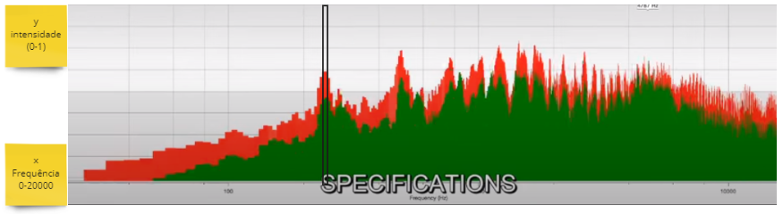

Cada frequência carrega consigo uma intensidade, gerando uma saída que pode ser uma letra qualquer ou uma frase, por exemplo.

## Modelo de Rede Neural

<!-- 27:47 -->

Semelhante à representação do neurônio, o modelo de rede neural carrega a mesma estrutura.

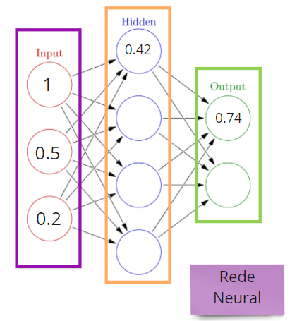

- **Camada de entrada (Input):** é a primeira camada da rede neural que recebe os valores de entrada.

  No nosso exemplo temos os valores `1`, `0.5`e `0.2` entrando no modelo.

- **Camada Oculta (Hidden):** nesta camada encontramos os neurônios organizados em nós, interconectados com as camadas de entrada e saída, que aplicam os pesos e bias aos valores recebidos. De forma didática e para nosso entendimento, podemos ver que estes nós estão verticalmente empilhados e correspondem a `4` bolinhas azuis.

  > ***_NOTA :clipboard: :pencil2: :_***  é nesta camada em que a rede realmente identifica o que está sendo recebido.

  O primeiro neurônio da camada oculta recebeu os valores da camada de entrada, aplicou os pesos e o bias, alterando-os para o resultado `0.42`, entregando esse valor para a camada de saída.

- **Camada de saída (Output):** sendo a última camada na rede, recebe o total da camada oculta.

  No nosso exemplo, o valor de saída modificado é de `0.74`.

### Olha só que interessante! :boom:

Um modelo de rede neural que não necessariamente está dentro do D.L., mas sim no M.L.

Quando vemos um modelo de rede neural com apenas **uma única camada oculta** estamos olhando para um modelo tradicional de M.L., que usamos em diversos exemplos.

A mágica fica maior, complexa e interessante quando adicionamos **mais camadas ocultas** a este modelo, caracterizando uma **Rede Neural Profunda**.

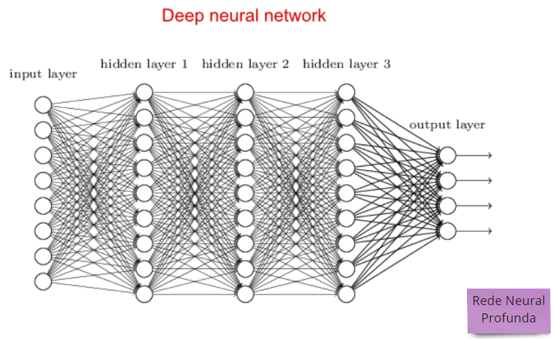

Logo, a quantidade de camadas ocultas é o que define se meu modelo se trata de uma rede neural profunda ou apenas uma rede neural normal.

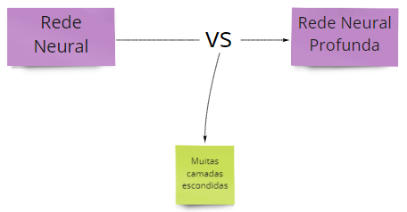

## Conectando tudo

<!-- 30:31 -->

Você se lembra que falamos sobre o MNIST alguns passos atrás? 

O banco de dados do MNIST possui um conjunto de treinamento de 60.000 imagens e um conjunto de testes com 10.000, ou seja, um sub-conjunto de um conjunto maior de treinamento disponível. 

Nós utilizamos o sub-conjunto de 10.000 imagens-teste para comparar o resultado que vamos obtendo durante o treinamento e refinando o algoritmo.

Primeiro, apresentamos as imagens de **treino** ao modelo para que ela aprenda a reconhecer os padrões. Com isso, medimos os resultados.

Para garantir que os resultados são coerentes, apresentamos as imagens de **teste** e verificamos se os resultados são tão satisfatórios quanto.

> Podemos fazer uma analogia ao treino de caligrafia (pessoa idosa aqui :older_woman:) que fazíamos na escola. Até alcançarmos algo parecido com a letra da professora (é a meta que a gente almeja, né?! kkkrying) treinamos diversas vezes e, ao longo do processo, observamos em nosso caderno centenas de formas diferentes de fazer a mesma letra (todas um horror até a perfeição, a gente sabe! :sweat:).

Na atividade **treina-compara-testa**, nossa rede é capaz de generalizar, abstrair e observar novas imagens, garantindo que os resultados se tornam cada vez mais positivos (algo que pode ser medido na curva de aprendizado de uma rede neural).

Na prática, a imagem que a rede recebe do MNIST está em em preto e branco, normalizada por tamanho e centralizada para caber em uma caixa delimitadora de pixels de `28x28`, totalizando `784px`, e suavização de borda criando os tons de cinza que vimos anteriormente.

Dentro do dataset, organizamos os arquivos das imagens (`Images`) em um local e a representação das imagens (`Labels`) em outro.

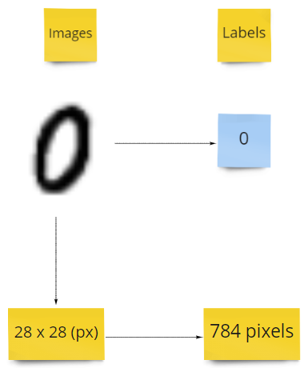

Após escolhermos a imagem de treino para o nosso modelo, precisamos realizar um procedimento antes de a colocarmos na camada de entrada, este processo se chama **achatamento**.

Este processo consiste em transformar todo a matriz de `28x28px` em um vetor linear unidimensional, ou seja, em uma única linha, para conectá-lo com a próxima camada.

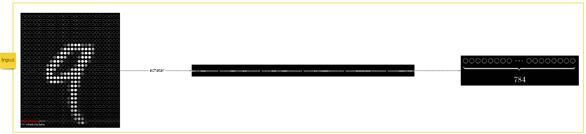

As linhas achatadas são feitas de forma sequencial, respeitando a ordem das linhas na matriz, ou seja, a primeira linha com 28 colunas é achatada e colocada na primeira posição, a segunda tem suas 28 colunas achatas e colocadas na segunda posição, e assim por diante, gerando uma única linha com 784 pixels.

Cada um destes pixels é o que de fato a rede vai usar para definir a representação da imagem.

Cada pixel da imagem contendo um valor que vai `0` a `1` equivale a um neurônio na camada de entrada.

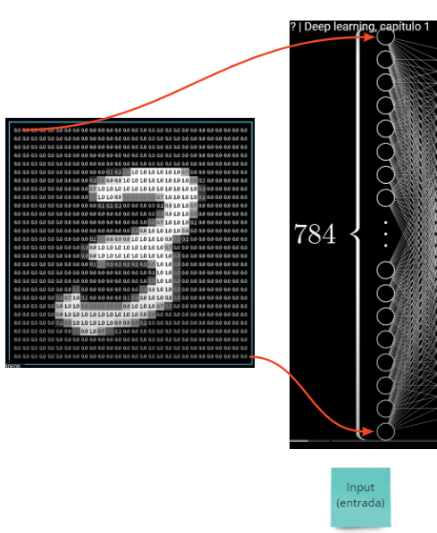

Podemos ver que o primeiro pixel vai para o primeiro neurônio da camada e o último para seu neurônio respectivo. Desta forma, temos todos os pixels da matriz representados dentro do modelo.

No nosso modelo de exemplo temos 2 camadas ocultas com 16 neurônios cada.

> ***_NOTA :clipboard: :pencil2: :_***  A quantidade de camadas ocultas e de neurônios são definidas por nós e existem várias técnicas para saber quando adicionar/remover camadas e neurônios.

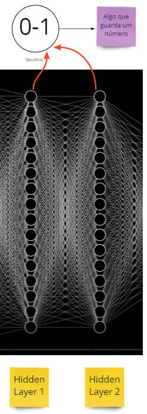

## Camada de Saída (Output)

Tudo que foi processado e se tornou relevante pelo nosso modelo deve ser apresentado nesta camada.

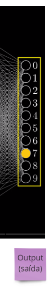

Em um outro exemplo, a nossa imagem de entrada é a representação do número `7`. Ela foi achatada e processada pelo modelo enchendo o neurônio do número `7` na camada de saída.

Se observarmos a figura acima atentamente perceberemos que temos um neurônio para cada número escrito à mão contido dentro do Dataset.

> ***Importante*** :bangbang:: Identificar o dígito de qualquer uma destas imagens pelo nosso Deep Learning é uma tarefa análoga a um 'Hello World!'. Atente-se à maldição. Cada possibilidade na camada de saída deve ser igualmente proporcional à quantidade de itens que serão inseridos através de representações em nosso modelo.

Quando juntamos todas as camadas de nosso modelo percebemos que a entrada e saída estão sempre conectadas e relacionadas pelo conjunto de dados.

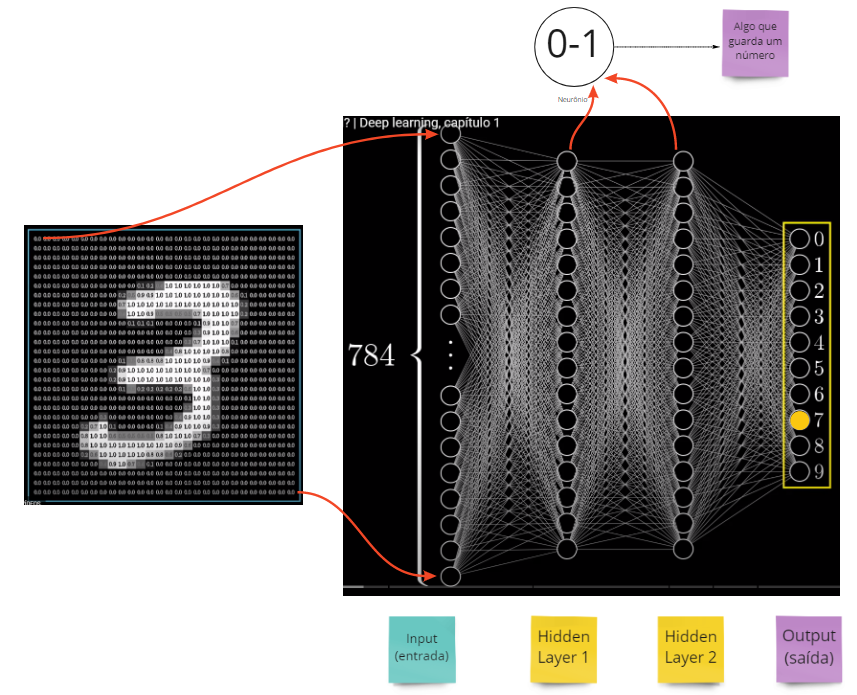

Para sabermos se nossa rede acertou o número que inserimos, precisamos identificar o número que ela assumiu para cada uma das informações e, a partir disso, vemos se acertou mais ou menos.

Os dados na camada de saída são fundamentais para sabermos se a rede está acertando ou errando durante o treinamento. Lembrando que, quanto mais o valor do neurônio estiver próximo de `1`, mais certo está o resultado.

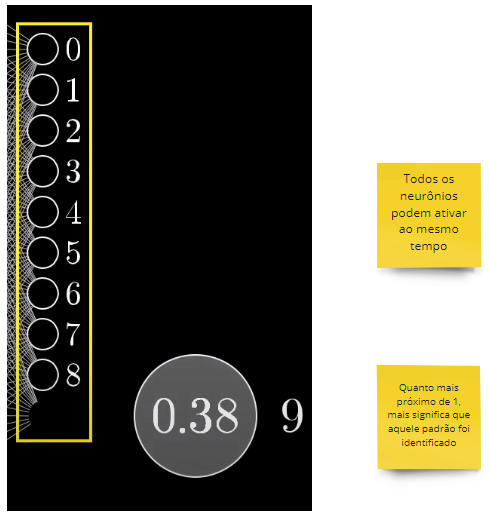

## Parâmetros Utilizados - Pesos e Bias

<!-- 39:24 -->

Cada um dos 16 neurônios da camada escondida está conectado a um pixel recebido da camada de entrada, ou seja, cada neurônio recebe os 784 pixels.

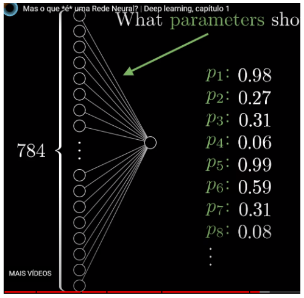

Cada **peso** multiplicado ao **valor de entrada + bias** representa a força da conexão entre os neurônios. Se o peso do neurônio `1` ao `3` for maior que o peso do neurônio `4` ao `7`, terá maior influência sobre estes.

Por lógica, percebemos que os parâmetros podem diminuir a **importância** dos pixels recebidos na camada de entrada e que serão entregues na camada de saída, dependendo de sua configuração na camada oculta.

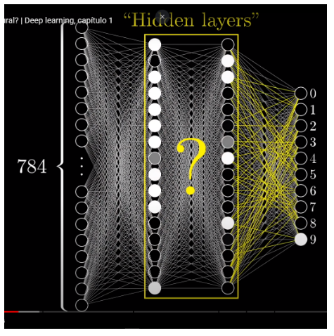

Vamos agora a um exemplo prático e simples — e que vai quebrar a tradição do 'Hello World' (certamente seremos perdoados pelos fins didáticos!).

Neste exemplo temos um único pixel com **duas** possibilidade de cores.

A **primeira** possibilidade representa o pixel de cor **preta**.

A **segunda** possibilidade representa o pixel de cor **branca**.

Note que a **camada de entrada** tem um único ponto e a de **saída** dois pontos, correspondentes ao preto e ao branco.

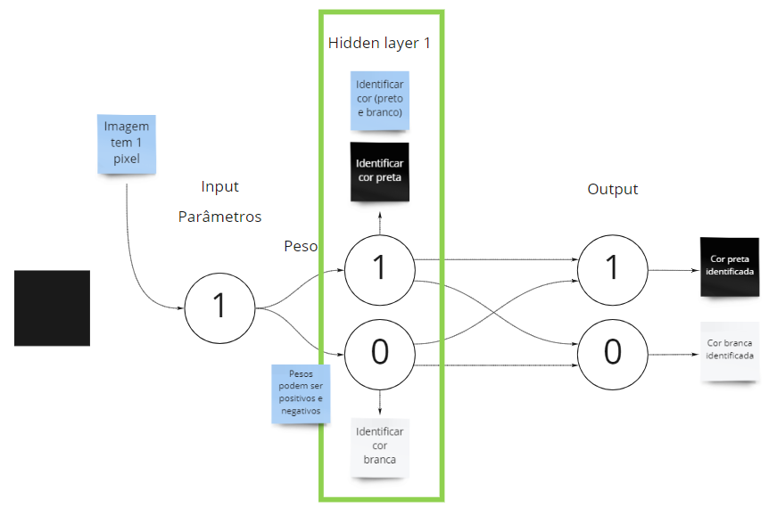

Quanto mais próximo de `1`, mais o neurônio de cor preta foi ativado na camada de saída.

Quanto mais próximo de `1`, mais o neurônio de cor branca foi ativado na camada de saída.

Sim! Existe a possibilidade dos neurônios serem ativados juntos 😮!

Recebemos então, uma imagem com um pixel preto. Chamaremos esse único pixel de **um parâmetro**.

Esse **parâmetro de entrada** está conectado aos neurônios na camada oculta. A esta conexão, damos o nome de **peso**.

> Para lembrar: Para cada um dos neurônios, multiplicamos parâmetro e peso.

> Para lembrar: Os pesos podem ser positivos ou negativos, dando mais ou menos força àquela conexão.

A camada oculta vai tentar entender a informação recebida em diversos níveis, dependendo do que foi configurado.

Cada um dos neurônios da camada oculta também se conectam aos da camada de saída. Em cada conexão, tambem temos um novo valor de pesos, que definirá as ativações finais. Essas ativações finais representam o que de fato a rede identificou.

## Combinação de Imagens para Formar um Dígito

<!-- 46:10 -->

Voltando ao exemplo do MNIST, vamos analisar as imagens abaixo:

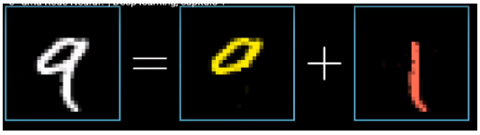

Perceba que a imagem do número `9` pode ser dividida em dois fragmentos, no primeiro temos um círculo, e no segundo um traço na vertical.

Um neurônio é responsável por identificar o `primeiro fragmento` e outro neurônio o `segundo fragmento`.

Juntos, ativam o neurônio do `número 9` na camada de saída. 

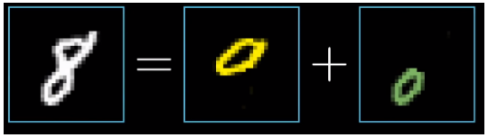

Para a imagem do número `8` temos novamente dois fragmentos — o mesmo círculo do `9` — na porção superior, e um outro círculo menor na porção inferior.

> ***_NOTA :clipboard: :pencil2: :_***  As informações são quebradas desta forma por uma questão de utilidade.

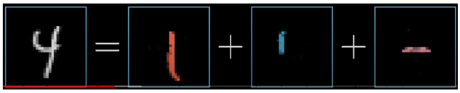

Na imagem do número `4`, o `primeiro fragmento` é representado por uma linha vertical — a mesmo vista no número `9` —, o `segundo fragmento` é também uma linha vertical e o `terceiro fragmento` representado por uma linha na horizontal.

O treinamento de reconhecimento destas imagens são feitos ao mesmo tempo nas camadas ocultas de mais alto nível.

> **NOTA:** As camadas ocultas de mais alto nível são aquelas que estão mais próximas da camada de saída.

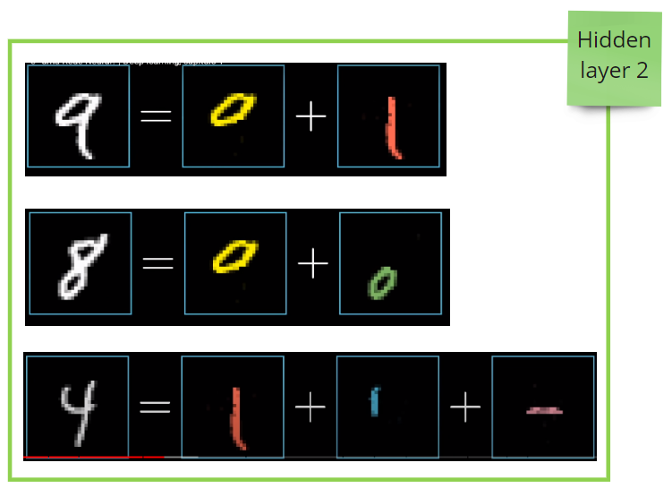

Assim, obteremos o seguinte resultado:

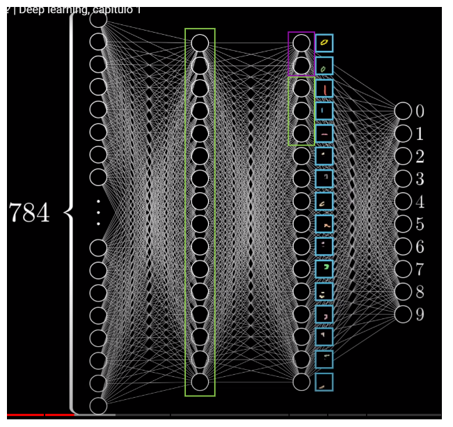

Cada um dos neurônios guarda a informação da representação de cada um dos desenhos que vimos.

A ativação dos neurônios em verde nos mostra que há grandes chances do número `4` ser ativado. Já ativação dos neurônios em roxo, maiores chances de ser o número `8`.

> :key: :bulb: Até aqui entendemos que a rede neural coleta as informações que está observando, as combina, e toma alguma decisão a partir disso.

## Como cada pedaço de fragmento é identificado?

<!-- 49:40 -->

Em média, um Ser Humano é capaz de desenhar um círculo somente aos 3 anos de idade. Neste perído, estamos aprendendo a coordenar o campo visual juntamente com a musculatura fina da mão-de-escrita para que o formato redondo saia no papel. É uma tarefa complexa e desafiadora e o mesmo acontece no aprendizado da Rede Neural.

> **_Curiosidade: _** O círculo é um símbolo universal com significado amplo, nos remete às noções de totalidade, plenitude, perfeição original, o Eu, o infinito, a eternidade. Interessante notar que uma das formas mais espalhadas na natureza exija tanto de nós aprendermos seu formato. 

Note no exemplo abaixo que o entendimento do que é um círculo pela Rede Neural seja necessária a junção de 5 pedacinhos menores:

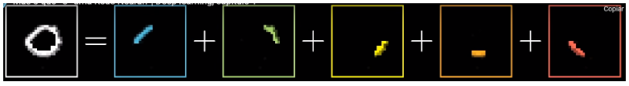

Lembra que anteriormente mencionamos que o aprendizado de algumas imagens é feito em uma camada de alto nível?

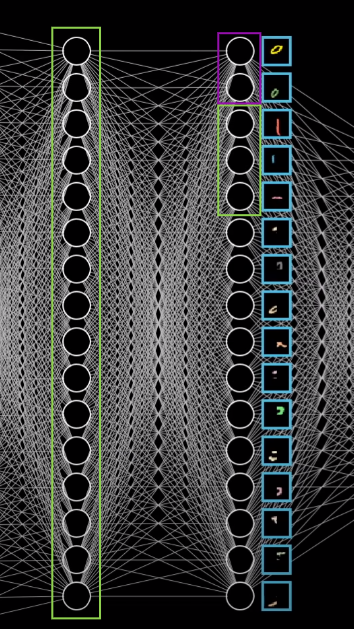

Na primeira camada de neurônios no exemplo acima, a informação que já foi aprendida é fragmentada em pequenos pedaços e juntada com as informações da segunda camada para formar algo novo, como o formato do círculo que vimos no dígito `9`. O mesmo acontece com a sua perninha, o seu reconhecimento também é fragmentado pela Rede Neural:

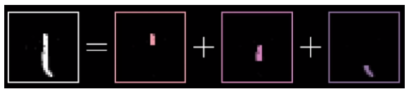

Para fins didáticos podemos dividir o processo de aprendizado do dígito `9` em quatro etapas:

- Camada de Input: recebimento do dígito `9` achatado;
- Primeira camada oculta: fragmentos do dígito `9` são reconhecidos e ativados;
- Segunda camada oculta: o dígito `9` é construído com apenas dois fragmentos ativando apenas dois neurônios, e;
- Camada de saída: preenchimento do neurônio correspondente ao dígito `9`.
	
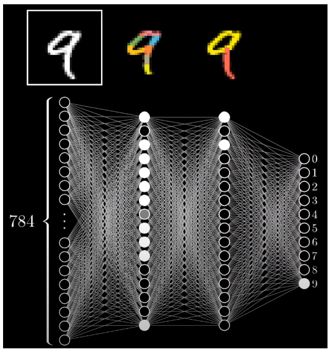

> :key: :bulb: Lembre-se que cada neurônio é um parâmetro multiplicado por peso e bias.

## Evoluindo a função do neurônio

Até aqui tratamos o neurônio como **algo que guarda um número**. Passando por todo o aprendizado vimos que seu trabalho vai além disso: **é uma função matemática**.

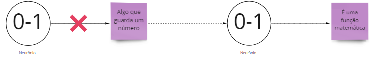

Por ser uma função, o neurônio agora vai **receber** números e **transformá-los** tornando todo o processo de aprendizagem mais flexível.

Vamos assimilar todas essas informações desta forma:

Recebemos o nosso neurônio inicial com seus parâmetros configurados. 

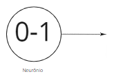

Para a nossa **primeira** camada oculta os parâmetros são a camada de entrada. 

O **primeiro** pixel será multiplicado pelo peso aleatório `1`.

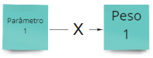

> :key: :bulb: Neste momento vamos assumir que o valor do peso é definido de forma **aleatória**.

O **segundo** pixel será multiplicado pelo peso aleatório `2`.

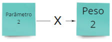

Vamos exemplificar com este cálculo:

- Parâmetro 1 x Peso 1: `1 x 0 = 0`
- Parâmetro 2 x Peso 2: `1 x 5 = 5`

Tendo em mãos o resultado de cada parâmetro, o resultado final será como segue:

- `Total = 5`

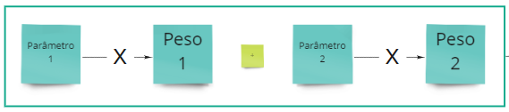

> :key: :bulb: Para cada pixel entrando nós repetimos sua multiplicação pelo peso e o somamos aos que entraram na camada anteriormente

Não podemos esquecer de agregar o valor de bias que pode ser um valor negativo ou positivo, e que neste momento também será aleatório. 

- Parâmetros + bias: `5 + 30 = 35`

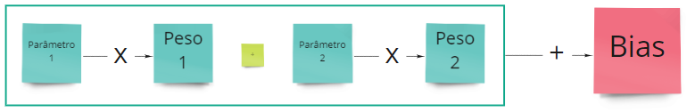

> :key: :bulb: Os valores aleatórios são ajustados conforme a Rede Neural vai crescendo em aprendizado.Os valores aleatórios são ajustados conforme a Rede Neural vai crescendo em aprendizado.

Com o valor total da soma de parâmetros + bias em mãos, precisamos passá-lo por uma **função de ativação** que o transformará em outro resultado. 

Neste momento esta função dobra o valor recebido.

- Total anterior -> função de ativação: `35 x 2 = 70`

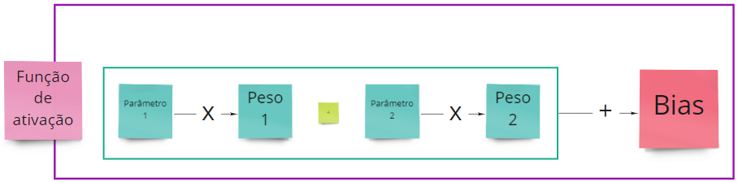

> :key: :bulb: A forma de funcionamento da função de ativação é determinada por nós. Por exemplo: por ela só seriam transformados números pares.

O processo de **aprendizado da Rede Neural** pode ser entendido da através de todas essas etapas que passamos. 

-> O neurônio é uma estrutura com uma função de ativação.
-> Os pesos e bias inicialmente são valores aleatórios.
-> O valor de cada peso e bias é ajustado conforme o aprendizado vai aumentando.

Em síntese, aprendizado é ajustar os pesos e bias de forma correta e adequada. :key: :bulb:

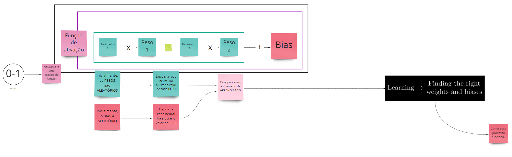

## Determinando a quantidade de pesos em uma Rede Neural Profunda

<!-- 56:35 -->

## ❗️ Links & Referências usadas nesta aula

Esta aula no <a href="https://miro.com/app/board/o9J_ljr0G-g=/" target="_blank">Miro</a>

Site <a href="https://playground.tensorflow.org/" target="_blank">Tensorflow Playground</a>

Site <a href="https://www.3blue1brown.com/topics/neural-networks" target="_blank">3Blue1Brown</a>

## Pendências

<!-- CHANELY - CRIAR UM DICIONÁRIO-RÁPIDO PARA OS TERMOS: (SALVATORE VALIDAR) -->

<!-- NEURONIO -->

<!-- CONEXÕES -->

<!-- BIAS -->

<!-- FUNÇÃO DE ATIVAÇÃO -->

<!-- CAMADA DE ENTRADA -->

<!-- CAMADA OCULTA -->

<!-- CAMADA DE SAÍDA -->

<!-- FORMATO DE ENTRADA -->

<!-- PESOS -->

<!-- PROPAGAÇÃO -->

<!-- BACKPROPAGATION -->

<!-- TAXA DE APRENDIZAGEM -->

<!-- PRECISÃO -->

<!-- ACURÁCIA -->

<!-- SENSIBILIDADE -->

<!-- CONVERGENCIA -->

<!-- REGULARIZAÇÃO -->

<!-- NORMALIZAÇÃO -->

<!-- CAMADAS COMPLETAMENTE CONECTADAS -->

<!-- PERDA DE FUNÇÃO -->

<!-- OTIMIZAÇÃO DE MODELOS -->

<!-- METRICAS DE PERFORMANCE -->

<!-- BATCH SIZE -->

<!-- TRAINING EPOCHS -->
