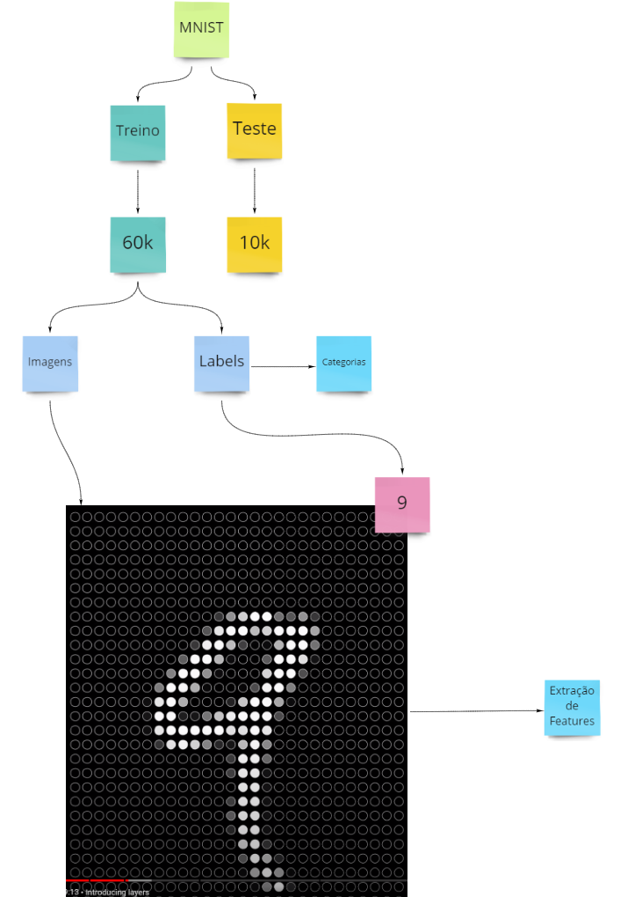
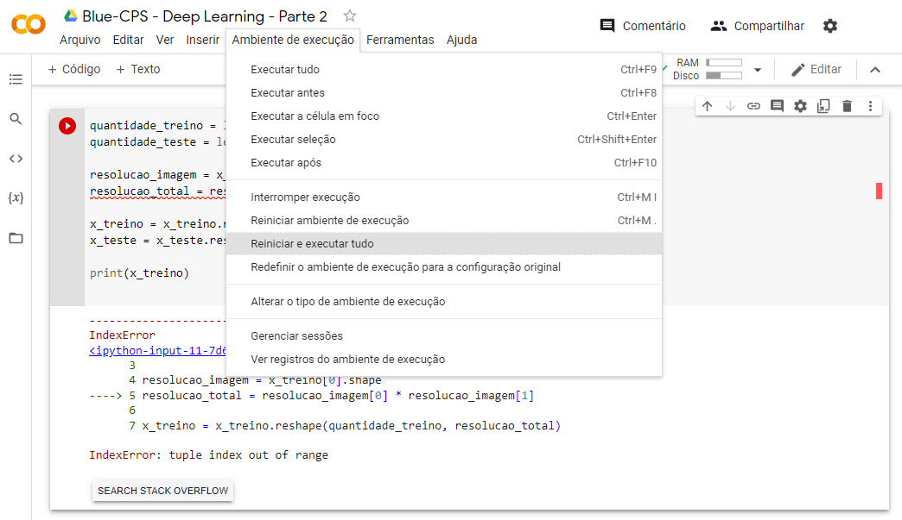
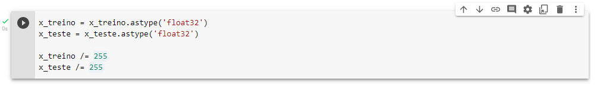

# Aula #2 - Deep Learning - Parte 2

Por <a href="https://www.youtube.com/paulosalvatore" target="_blank">Paulo Salvatore</a> - Head de Produtos <a href="https://blueedtech.com.br/quem-somos/" target="_blank">@Blue Edtech</a> & <a href="https://www.linkedin.com/in/chanelym/" target="_blank">Chanely Marques</a> - Eterna Aprendiz <a href="https://blueedtech.com.br/quem-somos/" target="_blank">@Blue Edtech</a>

Olá :wave:, seja bem-vindo(a) ao segundo vídeo desta série. Nosso objetivo é introduzir o conceito de Rede Neural, neurônios, aprendizagem profunda, funções de ativação, algoritmo de _Backpropagation_ e aplicação prática com _TensorFlow Playground_.

## É Chegado o Momento de Praticar! \o/

Assim como nós, esperamos que vocês estejam com muita vontade de colocar em prática tudo o que vimos na última aula. 

Sabemos que o conteúdo foi denso e sugerimos a leitura do material e revisão dos vídeos quantas vezes forem necessárias.

> :blue_heart: Lembre-se que o hábito de estudar, aliado à disciplina, ritmo, constância, perseverança e paciência é o que nos ajuda a construir todos os nossos sonhos. Quando o desânimo vier, lembre-se que tudo na natureza precisa de tempo para germinar, crescer e dar frutos. Assim também é com a gente. :blue_heart:
>


## Preparando o Ambiente

Antes de entrarmos nas ferramentas técnicas, queremos te dizer que para praticar tudo que verá aqui não há necessidade de **conhecimento prévio**. 

Contudo, se você não assistiu ao vídeo anterior poderá se perder no que abordaremos agora.

>  **Importante :mega: :** É essencial que você vá pausando o vídeo ao longo da aula e faça os código conosco para ficar ainda mais o conhecimento e nos deixar dúvidas caso elas surjam.

Nós iremos estudar/utilizar o que segue abaixo:

- [Google Colab](https://colab.research.google.com/) - Nos permite criar e executar códigos em Python pelo navegador e foi adequado para _Machine Learning_ e Análise de Dados.
- [Esta aula](https://miro.com/app/board/o9J_ljr0G-g=/) no Miro - Caso alguma dúvida surja, consulte a aula passada.
- [Repositório](https://github.com/blue-edtech/Blue-CPS) no GitHub - Aqui estão os arquivos preparados para esta aula

## Entendendo Google Colab e Revisando Python

<!-- 3:50 -->

Para acompanharmos o vídeo precisaremos [deste arquivo](https://github.com/blue-edtech/Blue-CPS/blob/main/%5B02%5D%20Deep%20Learning%20-%20Parte%202/DeepLearning.ipynb) no GitHub. Se você possui uma segunda tela, deixe-a aberta nela para facilitar o processo, e caso este não seja o teu caso, não tem problema, deixe-o aberto no navegador.

Agora, acesse o Google Colab e **crie** um Novo Notebook:


Após criado, altere o nome para '**Blue-CPS - Deep Learning - Parte 2**' caso queira. No Hard Feelings :wink:

> **_Nota :pencil: :_** É importante que você tenha uma conta no Google pois os arquivos do Colab serão automaticamente gravados no Google Drive.


Você pode notar que existe um botão chamado '**conectar**' e outro com o desenho de um '**Play**'. Quando executamos uma linha de código **pela primeira vez**, um servidor no Colab é criado pra gente.

Este servidor se assemelha a uma máquina virtual que nos é disponibilizada para executar os códigos que vamos criar. Isso torna dispensável a instalação das ferramentas no computador local para darmos início aos estudos.


Em _Python_, quando queremos **exibir algo na tela** usamos o comando `print("")`, que é acompanhado de parênteses e um par de **aspas**, que podem ser duplas ou simples. 

Entre as aspas vai o conteúdo que desejamos exibir. Sabendo disso, vamos já nos livrar da maldição com um '_Hello World!_' mostrando essa mensagem na tela. Digite no terminal ao lado do botão '**_Play_**' o seguinte:

```python
print("Hello World!")
```

Quando apertar o '**_Play_**' poderá notar que o servidor será criado e sua conexão é iniciada.


Quando a interface por onde digitamos os comandos é conectada ao servidor, o resultado do comando, ou seja, **a saída**, aparecerá na tela.


Caso você nunca tenha programado em Python, não se preocupe! Em _Deep Learning_ não é necessário um conhecimento profundo na linguagem. Necessitamos entender e trabalhar com **listas**, **tuplas** e **variáveis** e falaremos sobre estes itens.

> **Importante :mega: :** Caso seu desejo seja se aprofundar na linguagem, sugerimos que o faça associando aos conhecimentos em _Deep Learning_ e Ciência de Dados para que aprenda também a utilizar outras bibliotecas e com isso, explorar mais pontos.

Os notebooks do Colab, essa interface que utilizamos para digitar nossos comandos, são notebooks do **Jupyter** hospedados. 

- Os códigos pode ser criados em blocos, ou em uma única célula, clicando em `+ Código`.

- Um bloco de texto, ou um único texto, clicando em `+ Texto`.

> **_Nota :pencil: :_** A opção de Texto nos permite adicionar comentários no código. Quando comentamos algo que escrevemos, isto não gera nenhuma saída na tela.

> **Importante :mega: :** Todos os códigos são sempre executados nas células.

Para saber mais sobre o Jupyter e instalá-lo em sua máquina, clique [aqui](https://jupyter.org/about).

Em programação, costumamos **armazenar** boa parte das informações em **variáveis**. Vamos criar uma para armazenar nosso nome.

Clique em `+ Código` e digite o seguinte:

```python
nome = "digite o seu nome"
```

Onde `nome` será o nome da nossa variável e `"Paulo Salvatore"` é o conteúdo de exemplo armazenado dentro dela.

Não esqueça de utilizar as **aspas** (`""`) para que o interpretador entenda que você está armazenando seu nome em forma de `string` **dentro da variável `nome`**.

Ao executar o código, o Jupyter vai gravar esta informação no servidor e realizar a ação que pedimos através do código. Neste caso, nada será exibido na tela, pois estamos somente armazenando uma informação dentro de uma variável na memória.


Armazenada na memória, precisamos encontrar uma forma de resgatar a informação na memória e exibí-la na tela. Nós já aprendemos como exibir algo através do `print`. 

A mesma regra de funcionamento se aplica, porém, como estamos mostrando algo na tela que já existe, ou seja, não estamos criando uma nova informação, o uso das aspas não se faz necessário.

`print(nome-da-variavel)` ou seja `print(nome)`


Quando o Play é clicado:

- O bloco de código é novamente executado;
- É armazenando novamente a `string` `"Paulo Salvatore"` na variável `nome`, e;
- O comando `print(nome)` exibe `Paulo Salvatore` na tela.

Perceba uma coisa interessante... Quando executamos o código, um número é colocado no lugar do botão Play.


Isso acontece porque as execuções são sequenciais e o Jupyter as incrementas, ou seja, adiciona uma após a outra como se estivesse guardando um **histórico de execução** do nosso código.

**Importante :mega:: Quando guardamos uma informação na memória ela fica salva.** Vamos a um exemplo:

Adicione uma célula contendo o seguinte conteúdo:

```python
variavel = 1
```

e outra célula com este:

```python
print(variavel)
```


Ao dar _Play_ para exibir o conteúdo de 'variavel' na tela, recebemos um erro:


Veja que o que está acontecendo nos é mostrado através da mensagem:

```python
NameError: name 'variavel' is not defined
```

Que nos diz que a variável não foi definida. Você deve estar se perguntando por qual razão este erro aparece se definimos esta variável anteriormente, certo?

Nós declaramos a variável, somente a definimos, porém, não dissemos ao computador para armazena-la em memória. 

Se apertamos o _Play_ na célula da `variável` e novamente na do comando `print(variavel)` obteremos o resultado desejado. 


> **Importante :mega: :** Se não somos bastante explícitos com o resultado que queremos do código, o computador não será capaz de nos retornar o que esperamos dele.

Diferente do código que é lido e executado linha por linha, no Colab cada célula é executada por vez, ou seja, **a ordem da execução neste caso é o que importa.**

Quando queremos executar um único bloco sequencial de códigos, precisamos colocá-lo por inteiro dentro de uma única célula, Ok?!

### Uma Observação Importante :bangbang:

Ao longo da aula, caso a execução do seu código esteja diferente da nossa, siga estes passos:

Clique em `Ambiente de execução` -> `Reiniciar ambiente de execução`.


A máquina foi reiniciada e tudo que havia na memória não existe mais.

<!-- 11:16 -->

Para que isso fique mais claro, vamos manipular o valor armazenado dentro da variável que criamos:

```python
variavel = variavel + 1
```

Estamos dizendo ao computador que queremos que armazene dentro da `variavel` o valor que já existia dentro dela e some `+ 1` a ele.

Ao apertamos o Play **duas vezes**, esperamos o valor `3`  como saída no bloco que contém o `print(variável)`.


Apertando o _Play_ em `variável`mais 4 vezes por exemplo, e novamente em `print(varivel)`, o valor `7` será mostrado na tela.

## Entendendo Variáveis de Texto

Vamos remover as células que criamos até agora clicando na **lixeira**


E criar um bloco de código contendo:

- Variáveis `nome` armazenando o nome;
- `sobrenome` armazenando sobrenome, e;
- `print(nome + sobrenome)` para exibir o conteúdo na tela.


Quando usamos o símbolo de `+` entre duas variáveis estamos **concatenando** essas informações, ou seja, **unindo** duas informações de forma lógica.

Como `nome` e `sobrenome` são dois textos, estamos de certa forma somando os dois. 

A nossa saída ficou um pouco esquisita porque `'PauloSalvatore'` necessita de espaço entre `nome` e `sobrenome`.

Para isso, necessitamos adicionar uma `string` vazia e concatenar ao que já temos:

```python
print(nome + " " + sobrenome)
```


Outras formas de adicionar um espaço entre duas `strings` é utilizando uma vírgula `,`:

```python
print(nome, sobrenome)
```

E

```python
print(f{nome} {sobrenome})
```

Onde adicionamos `f` ao `print()`, colocando `nome` e `sobrenome` dentro de chaves `{}` e aspas `"{} {}"`.


## Atalhos Úteis

Quando seguramos `Control` e `m`, soltamos e em seguida apertamos `b` uma nova célula é criada pra gente.


Podemos agora adicionar um conteúdo dentro dela e executar apertando `Control` e `Enter`:

 

> **_Nota :pencil: :_** Caso você não se lembre dos atalhos, basta explorar o menu passando o mouse em cima das opções.

Se executarmos `Shift` e `Enter` a linha em que estamos é executada e em seguida uma nova célula é criada:


## Entendendo Variáveis Numéricas

<!-- 15:15 -->

Da mesma forma que armazenamos _strings_, ou seja, texto em uma variável, podemos fazer o mesmo com números. 

Em _Python_ podemos utilizar `print()` juntamente com o recurso `type(qualque-variavel)` para nos mostrar o tipo dela:

```python
nome = "Paulo"
numero = 5

print(nome, type(nome))
print(numero, type(numero))
```


> **_Nota :pencil: :_** Entender o tipo da informação com a qual estamos trabalhando é essencial tanto em programação quanto em _Deep Learning_. Lembre sempre de checar este ponto caso algo não ocorra do jeito que você espera. :wink:  

Em qualquer lugar do código, se adicionarmos uma _hashtag_ significa que estamos adicionando um **comentário** que nos ajuda a adicionar **mais informações** sobre o nosso código:

```python
nome = "Paulo" # str -> string -> texto
numero = 5 # int -> integer -> inteiro -> números inteiros
numero_decimal = 5.2 # float -> números decimais

print(nome, type(nome))
print(numero, type(numero))
print(numero_decimal, type(numero_decimal))
```

> **Importante :mega: :** Lembre-se que ao programar não está somente consolidando um conhecimento para você, mas também ajudando outras pessoas no processo. Comentar seu código é uma boa-prática e deve ser feita com uma dose de bom-senso.


Note que ao executar este código com `type`, é mostrado pra gente a diferença entre números **inteiros** e números **decimais**.

```python
5 <class 'int'>
5.2 <class 'float'>
```

No caso, os decimais são descritos como **float**.

## Entendendo Listas

Uma lista é sempre criadas quando colocamos colchetes `[ ]` após o nome que damos à ela. 

Vamos criar uma lista **contendo números como elementos**, exibi-los na tela juntamente com a informação de qual tipo de lista estamos trabalhando:

```python
lista = [10, 20, 30]

print(lista, type(lista))
```


Toda lista possui um **índice com a posição do elemento** ordenados de forma automática. 

Toda lista **sempre começa** em `0`, ou seja, o primeiro elemento na lista estará na posição `0` do índice, o segundo na posição `1` e assim por diante.

Nós podemos armazenar os elementos em uma variável, exibí-los na tela juntamente com a informação sobre seu tipo, como segue abaixo:

```python
lista = [10, 20, 30]
#        0   1   2

print(lista, type(lista))

primeiro_elemento = lista[0]
print(primeiro_elemento, type(primeiro_elemento))
```


Também podemos alterar o valor do elemento na lista. Vamos fazer com o **segundo elemento**, exibindo como estava a lista antes e depois da alteração:

```python
lista = [10, 20, 30]
#        0   1   2

print(lista, type(lista))

primeiro_elemento = lista[0]
print(primeiro_elemento, type(primeiro_elemento))

print("Lista antes", lista)
lista[1] = 40
print("Lista depois", lista)
```


## Entendendo Tuplas

Em termos de estrutura e criação, a tupla nos lembra uma lista. Contudo, criada, **o valor dos elementos não podem ser alterados**.

```python
tupla = (50, 60, 70)

print(tupla, type(tupla))
```


Para acessar o primeiro elemento no índice da tupla também utilizamos colchetes `[ ]`:

```python
tupla = (50, 60, 70)

print(tupla, type(tupla))

primeiro_elemento = tupla[0]
print(primeiro_elemento, type(primeiro_elemento))
```


Vamos agora tentar modificar o segundo elemento da tupla e ver o que acontece:

```python
tupla = (50, 60, 70)

print(tupla, type(tupla))

primeiro_elemento = tupla[0]
print(primeiro_elemento, type(primeiro_elemento))

tupla[1] = 1000
```


Este resultado nos mostra que de fato, não podemos alterar os valores dentro de uma tupla.

Note que ao tentar criar uma tupla com único valor, utilizar os parênteses não interfere no resultado.

```python
tupla = (50, 60, 70)

print(tupla, type(tupla))

primeiro_elemento = tupla[0]
print(primeiro_elemento, type(primeiro_elemento))

outra_tupla = (100) # Tentando criar uma tupla de um único elemento
print(outra_tupla, type(outra_tupla))
```


Uma tupla é sempre criadas quando colocamos adicionamos uma vírgula `,` entre os elementos. 

```python
tupla = (50, 60, 70)

print(tupla, type(tupla))

primeiro_elemento = tupla[0]
print(primeiro_elemento, type(primeiro_elemento))

outra_tupla = 100, # Tupla criada da forma correta
print(outra_tupla, type(outra_tupla))
```


Podemos entender então, que os parênteses são neste caso, apenas auxiliares de exibição:

```python
tupla = 50, 60, 70 # Tupla criada

print(tupla, type(tupla))

primeiro_elemento = tupla[0]
print(primeiro_elemento, type(primeiro_elemento))

outra_tupla = (100,) # Tupla criada
print(outra_tupla, type(outra_tupla))
```


## Nossa Primeira Rede Neural :fireworks:

<!-- 21:40 -->

### Relembrando: MNIST

O **MNIST** é um banco de dados que contém imagens binárias de dígitos escritos à mão por diversas pessoas. 

Suas imagens estão em escala de cinza, com tamanho 28x28 pixels. Possui 60.000 arquivos para treino e 10.000 arquivos para teste, organizadas em 10 classes distintas.

No caso do MNIST, cada classe distinta representa um dos números de `0 a 9`.


> Agora sim, podemos deixar de nos preocupar em quebrar a maldição do **_Hello World_** em _Deep Learning_!

Dentro do _dataset_, organizamos os arquivos das imagens (`Images`) em um local e a representação de cada uma das imagens (`Labels`) em outro.

Podemos acessar o site do MNIST e fazer o [download direto](http://yann.lecun.com/exdb/mnist/) das Imagens e _Labels_, ou podemos lançar mão de uma biblioteca para nos ajudar neste processo.

Esta biblioteca se chama [Keras](https://keras.io/), sendo uma das principais utilizadas para se trabalhar com aprendizado de máquina.

A Keras roda em cima de [TensorFlow](https://www.tensorflow.org/?hl=pt-br), sendo um dos principais motores e mantido pelo Google. Sugerimos fortemente que visite o site pois há muito conteúdo disponibilizado em Português.

O que vamos fazer nesta aula é preparar esta estrutura, onde o nosso _dataset_ contém as figuras para os dígitos de `0 a 9` nos dados `10` opções de saída.


Vamos organizar a rede e estruturar as 70.000 imagens, achatando-as para passarem por todo o processo que vimos na aula anterior.

> **Importante :mega: :** Se você não sabe ou não lembra do que estamos falando, dá um [pulinho aqui](https://github.com/blue-edtech/Blue-CPS/tree/main/%5B01%5D%20Deep%20Learning%20-%20Parte%201) no material. :wink:

Durante o processo de treinamento da Rede, as imagens de **treino** que são **recebidas pelo algoritmo** sempre **são comparadas** às imagens de **teste**, que lhes são as **imagens desconhecidas**. Justamente por este motivo, os arquivos precisam estar separados para que não se misturem e a Rede não se perca.

> **_Nota :pencil: :_** Quando falamos em comparar as imagens de treino com as imagens de teste, estamos dizendo sobre validação.


>  **_Nota :pencil: :_** De 100% das imagens contidas em um _dataset_, em média 70% são separadas para treino e 30% para testes. Estes números não são uma regra e nós podemos alterar sua configuração antes de iniciarmos o processo. 

Tal qual acontece com um Ser Humano, quando uma Rede Neural se compromete a aprender, ela estará sempre em contato com o desconhecido. **Os problemas por ela são generalizados e o aprendizado se torna completo quando o desconhecido se torna conhecido.**


As 60.000 imagens que utilizaremos para treino serão achatadas individualmente em 784px e cada uma delas terá uma _label_ que dirá o que a imagem representa, **que são as categorias**.



Após o processo de achatamento, olhamos para cada um destes pixels para realizar a **extração de features**, ou seja, preparar nossa Rede para identificar curvas e linhas.

## Primeiros Passos do MNIST no Colab

> **_Nota :pencil: :_** Se você não estiver utilizando o Colab, instel o tensorflow e o keras em sua máquina para acompanhar a aula. :wink:

O primeiro passo a ser executado é a importação de todas as dependências e bibliotecas que utilizaremos no Colab. 

Começaremos por trazer o somente o 'keras' da biblioteca 'tensorflow':

```python
from tensorflow import keras
```

Agora que temos o 'keras' precisamos importar dele o _dataset_ do MNIST:

```python
from keras.datasets import mnist
```

Precisamos também de `4` ferramentas para nos auxiliar no processo, entraremos no detalhe delas mais a frente:

```python
from tensorflow.python.keras import Sequential
```

O **_Sequential_** é a arquitetura da nossa rede neural que utilizaremos para ter o **modelo sequencial de neurônios** que utilizaremos, nós o importamos de dentro do keras.

Dentro do keras vamos entrar em um componente chamado **_layers_** e dele vamos importar:

- **_Dense_** que nos ajuda a construir nossas camadas, servindo como o Neurônio de base da Rede, e;
- **_Dropout_** que funciona como um regularizador que evita overfitting.

```python
from tensorflow.python.keras.layers import Dense, Dropout
```

Precisamos de um algoritmo de _backpropagation_ e utilizaremos o **RMSprop**:

```python
from tensorflow.compat.v1.keras.optimizers import RMSprop
```

O seu código dentro do Colab deve estar como segue abaixo:

```python
from tensorflow import keras

from keras.datasets import mnist

from tensorflow.python.keras import Sequential
from tensorflow.python.keras.layers import Dense, Dropout
from tensorflow.compat.v1.keras.optimizers import RMSprop
```

Se ao executar o código acima você receber algum erro, acesse o [diffchecker](https://www.diffchecker.com/) e compare o código acima com o que digitou no Colab. Em **laranja** ele indicará o que há de errado no código:


> **Importante :mega: :** É essencial que você evite colar os códigos diretamente no Colab. Lembre-se que para alcançar a perfeição precisamos praticar, praticar, praticar e praticar. :blue_heart:


Agora podemos fazer o _download_ da base do MNIST. **Sem apertar o Play**, numa nova célula digite:

```python
mnist.load_data()
```

A estrutura que recebemos contém `(x_train, y_train), (x_test_ y_test)`, ou seja, a base de treino e a base de testes, sendo:

- `x` as imagens, e;
- `y` a representação de cada imagem.

Vamos extrair do `load_data()` as bases de treino e teste de acordo com a estrutura recomendada:

```python
(x_treino, y_treino), (x_teste, y_teste) = mnist.load_data()
```

Ao executar este comando estamos dizendo que: 

- **X_Treino** recebe 60.000 imagens com 28x28 pixels cada;
- **Y_Treino** recebe 60.000 _labels_, contendo o número que está desenhado na imagem;
- **X_Teste** recebe 10.000 imagens com 28x28 pixels cada;
- **Y_Teste** recebe 10.000 _labels_, contendo o número que está desenhado na imagem, e;
- E todas as vezes que chamamos `mnist.load_data()` estamos trazendo essa estrutura.

Agora pode dar o _Play_ e criar uma célula nova. :stuck_out_tongue_winking_eye:


Vamos ver o detalhe de `mnist.load_data()`?

Vamos utilizar uma função do _Python_ chamada `len()` para nos dizer a **quantidade** de imagens para treino e teste:

```python
print("Quantidade de imagens para treino:", len(x_treino))
print("Quantidade de imagens para teste:", len(x_teste))
```


Legal, as imagens vieram organizadas do jeito que vimos! Vamos analisar qual o **tipo** da informação em `x_treino` e `x_teste`?


Vamos entender o que é esse **numpy.ndarray** quebrando em duas partes:

A [numPy](https://numpy.org/) é uma biblioteca em Python para trabalhar com álgebra linear, matemática, matriz, entre outros assuntos, facilitando a parte matemática e a escrita de algumas partes do código pra gente.

> **_Nota :pencil: :_** O NumPy trabalha com os tipos das informações não necessariamente em Python, mas em c++, que é uma linguagem **mais rápida** e complicada.

> **_Nota :pencil: :_** O NumPy já vem embutido no TensorFlow e no Keras. Sensacional, não é?! :blue_heart:

Um **array** é um nome geralmente usado para lista e funciona da mesma forma que uma.

Vamos pegar a primeira imagem de `x_treino` e armazená-la em uma variável:

```python
primeira_imagem = x_treino[0]
```

Vamos agora exibir seu conteúdo:

```python
print(primeira_imagem)
```


Bom, podemos ver que se trata de imagem maravilhosa, não é mesmo? <strike>Para o computador, no caso</strike>. :laughing:  :laughing:  :laughing:  :laughing:  :laughing:  :laughing:  :laughing: 

Como Jack, vamos quebrar essa imensidão de informações em pedaços, começando pela primeira linha. Note que temos dois colchetes um ao lado do outro:


E se riscarmos estes `0's` teremos a primeira linha do nosso arquivo:


E contarmos cada linha desta forma, teremos `28` delas.

Se assumirmos que o conteúdo entre cada colchete é uma lista, temos `28` listas.


Percebemos também que a imagem não contém somente `0's`, alguns outros valores aparecem como `136`, `253`, `251`...Se selecionarmos estes valores e juntarmos suas formas criando uma nova imagem, temos algo que representa um número:


> **_Nota :pencil: :_** Os valores dentro da imagem vão de `0 a 255` pois na escala RGB, `R`  significa vermelho (_red_), `G` significa verde (_green_) e `B` significa azul (_blue_), um pixel `0` não contém informação e `255` contém o máximo de informações. Qualquer valor intermediário representa <strike>50</strike> tons de cinza. (risos).

O risco em vermelho nos lembra o número `5`, não é verdade? Para confirmar esta informação, precisamos exibi-la de outras formas.

<!-- 42:29 -->

Se `x_treino` contém a representação da imagem, podemos checar em `y_treino` se a imagem acima é realmente o dígito `5`. Vamos ao Colab e inserir os dois comandos abaixo:

```python
representacao_primeira_imagem = y_treino[0]

print("A imagem x_treino[0] representa o número", representacao_primeira_imagem)
```

Onde `representacao_primeira_imagem` recebe `y_treino[0]`, ou seja, a primeira informação naquela lista. Em seguida, exibimos este conteúdo na tela utilizando `print()`.


Como resposta, temos a confirmação de que a primeira imagem em nosso _dataset_ se trata do número `5`.

Podemos também saber o formato e o tipo da primeira imagem, através do atributo `shape` e o `type`, que já conhecemos. Vejamos:

```python
print("Formato da primeira imagem:", primeira_imagem.shape, type(primeira_imagem.shape))
```


O resultado deste comando valida a informação de que a imagem se trata de uma matriz de 28 linhas e 28 colunas, ou seja, uma imagem que possui 28x28 pixels e que não pode ter seu conteúdo alterado por se tratar de uma tupla.

## Imagem com Cara de Imagem

Agora que entendemos como é a nossa estrutura, a maneira que ela aparece e como identificar seu tipo e formato, podemos deixar as imagens num formato que o Ser Humano consegue melhor entender.

Para isso vamos usar a biblioteca [Matplotlib](https://matplotlib.org/), que cria visualizações de dados gráficos. Precisamos importá-la no Colab e todas as vezes que necessitarmos usá-la ao longo do processo, vamos chamá-la pelo seu apelido `plt`:

```python
import matplotlib.pyplot as plt
```

Como se trata somente de uma importação, não teremos nenhuma saída para este comando.


Feita a importação, vamos visualizar como a imagem é retornada para nós quando a chamamos:

```python
plt.imshow(x_treino[0])
```


Bem melhor, não é? 

Vamos deixar essa visualização ainda melhor transformando essa imagem com diversas cores em tom de cinza, que é a cor que originalmente consta no _dataset_:

```python
plt.imshow(x_treino[0], cmap=plt.cm.binary)
```

Onde `cmap` recebe `binary`, ou seja, estamos dizendo que queremos utilizar o `colormap` em preto e branco:


Sabemos que este _dataset_ contém 60.000 imagens e para visualizar cada uma de uma forma mais dinâmica, sem precisar repetir a linha de cima diversas vezes, vamos criar uma variável que irá receber a posição da imagem que queremos:

> **_Nota :pencil: :_** Precisamos fazer desta forma pois não sabemos qual imagem está em cada posição. Até aqui sabemos que o número `5` ocupa a primeira posição no índice.

```python
indice = 0
```

Onde `indice` é a variável que recebe a primeira posição.

```python
print("A imagem representa:", y_treino[indice])
```

Onde `y_treino[indice] ` irá sempre exibir o número da imagem no **índice através do valor que nós definirmos na variável**. Como estamos querendo o valor da primeira posição no índice:


Se queremos a imagem da **quinta posição**:

```python
indice = 4
print("A imagem representa:", y_treino[indice])
```


Podemos também chamar a variável `indice` quando queremos a representação da imagem em `x_treino`:

```python
indice = 4

print("A imagem representa:", y_treino[indice])

plt.imshow(x_treino[indice], cmap=plt.cm.binary)
```


Podemos também utilizar a variável `indice` na base de teste, substituindo `x_treino` e `y_treino`:

```python
indice = 4000

print("A imagem representa:", y_teste[indice])

plt.imshow(x_teste[indice], cmap=plt.cm.binary)
```


Experimente outros valores de índice e veja o resultado nas bases de treino e teste! :wink:

> **Importante :mega: :** O índice começando em `0`, o último arquivo estará na posição `59999`. Ao tentar retornar o conteúdo da posição 60000, você obterá um erro.

## Fluxo de Construção da Rede Neural

<!-- 53:00 -->

Antes de começarmos precisamos estabelecer uma ordem para não nos perdermos no processo:

1. Organizar a camada de entrada (_input_)
   - Vamos realizar a preparação das 70.000 imagens para entrarem no modelo
2. Organizar a camada de saída (_output_)
   - Baseado em meu conjunto de dados, prepararamos as possibilidades de saída e previsões
3. Estruturar a Rede Neural
   - Número de Neurônios e camadas escondidas que utilizaremos
4. Treinar o modelo
   - Configurar adequadamente a realização do _backpropagation_ para não estagnar nossa Rede
5. Fazer as previsões
   - Parte mais divertida do processo

### 1. Organizar a camada de entrada (_input_)

Este é o processo onde transformamos a matriz de 28x28px de cada imagem em uma linha unidimensional de 784px criando uma lista de imagens.

Primeiro, vamos definir a quantidade de imagens para treino e teste:

```python
quantidade_treino = len(x_treino)
quantidade_teste = len(x_teste)
```

Onde os valores para as bases `len(x_treino)` e `len(x_teste)` serão armazenados em suas respectivas variáveis.

Vamos também armazenar a resolução destas imagens na variável `resolucao_imagem` utilizando a primeira imagem como referência:

```python
resolucao_imagem = x_treino[0].shape
```

Lembrando que a resolução padrão será de 28x28px.

> **_Nota :pencil: :_** O _dataset_ possui imagens e informações mais ou menos parecidas e para garantir que utilizaremos as informações corretas, as armazenamos dentro de variáveis. Facilita muito caso seja necessário a utilização de outra base para treino e teste.

Para transformar a matriz em uma linha, o numpy.ndarray conta com uma função auxiliar chamada `reshape` que recebe a **quantidade de itens** de treino e a **resolução total** que queremos utilizar, 784px.

```python
resolucao_total = resolucao_imagem[0] * resolucao_imagem[1]
```

Onde `resolucao_total` recebe 28pixels da primeira imagem **x** 28pixels da segunda imagem, totalizando 784px.

Não utilizamos `resolucao_imagem[0]` x `resolucao_imagem[0]`, pois queremos garantir que o resultado final seja de uma imagem que contenha a matriz de 28x28px e não uma que contenha 28x50px, por exemplo, para não alterar a quantidade de linhas e colunas.

Agora que declaramos a resolução que vamos utilizar, podemos achatar as imagens das bases de treino e teste utilizando o _reshape_:

```python
x_treino_achatado = x_treino.reshape(quantidade_treino, resolucao_total)
x_teste_achatado = x_teste.reshape(quantidade_teste, resolucao_total)
```

Vamos observar como ficaram as nossas 60.000 imagens achatadas da base de treino:

```python
print(x_treino_achatado)
```


Entrando no detalhe, vamos ver como a primeira imagem ficou achatada:

```python
print(x_treino_achatado[0])
```


Podemos perceber que temos um único par de colchetes, evidenciando uma lista, e os números organizados de forma sequencial.

Só que agora nós temos um problema, armazenadas em memória nós possuímos variáveis contendo as mesmas informações:

- `x_treino`;
- `x_treino_achatado`;
- `x_teste`;
- `x_teste_achatado`

Em _Deep Learning_ após a modificação dos dados iniciais, não precisamos mais deles pois o que verdadeiramente importa é o achatamento. É desta forma que as imagens entram no modelo e não em matriz.

Podemos então substituir o conteúdo de `x_treino` e `x_teste` pelo conteúdo achatado das outras variáveis fazendo o seguinte:

```python
x_treino = x_treino.reshape(quantidade_treino, resolucao_total)
x_teste = x_teste.reshape(quantidade_teste, resolucao_total)
```

Armazenamos o resultado do _reshape_ nas variáveis originais, sobrescrevendo seus valores. :wink:

> **Importante :mega: :** Sempre é bom reduzirmos a utilização de memória otimizando a forma que armazenamos informações que estão duplicadas em nosso código.

Caso retorne erro ao executar seu código após sobrescrever as variáveis  `x_treino` e `x_teste`:


Selecione a opção de **Reiniciar e executar tudo** em Ambiente de execução:



Com o nosso servidor reiniciado e sem erros, vamos exibir o resultado para as duas bases:


Lembra que anteriormente vimos a estrutura da imagem do dígito `5`? Vamos ver como ela está após o achatamento:

```python
print("Quantidade de itens em x_treino[0]:", len(x_treino[0]))
```


Exatamente do jeito que esperávamos: `784 pixels`!

## Recapitulando

<!-- Task: se coincidir com o fluxo do vídeo, colocar este como o último capítulo -->

O MNIST é uma base de dados que possui, a termos didáticos, uma estrutura organizada em 4 caixas:

- `x_treino`;
- `y_treino`;
- `x_teste`, e;
- `y_teste`

Cada uma delas possui imagens organizadas em matrizes de 28x28px, onde cada pixel contém um valor específico.


Na imagem abaixo, circulado em **rosa** nós temos `2 listas`, também conhecidas como `ndarray`. 

Cada uma destas listas estão organizadas dentro de uma lista maior, circulada em **amarelo** na imagem, também chamada de `ndarray`.


A lista maior, em amarelo, possui um _shape_ de `28x28` posições e cada posição individual é um novo `ndarray`.

A lista menor, em rosa, também possui um _shape_ de `28x28` posições e cada posição individual contém um número inteiro.

Com as imagens em mãos, necessitamos realizar o processo de **achatamento**, transformar a matrix de 28x28px em uma linha unidimensional que entrará pela camada de entrada. 

O resultado do achatamento também será uma lista ndarray com um _shape_ de 784px.


Independente do tamanho da imagem que você tenha recebido, por exemplo, uma imagem de 1000x1000px, esta imagem precisa ser transformada em 28x28 para entrar na rede, pois este é o _shape_ que a rede foi configurada.

> **Importante :mega: :** Para que os dados entrem pela camada de entrada, é importante que todos os dados estejam estruturados no mesmo formato.


A imagem que exploramos durante o início da aula possui o número `5` representado.


Os números inteiros dentro das imagens estão em um intervalo de `0-255` e quanto **mais próximo de 255**, **mais próximo de preto** o pixel estará.

- Se `0`, não há nenhuma ativação, sendo representada pela cor branca.

- Se `255`, sua ativação estará em nível máximo, sendo representada pela cor preta.

- Se `127`, ou seja, entre os valores acima, a ativação será média, sendo representada pela cor cinza.


Anteriormente vimos que os valores dos pixels poderiam estar entre `0 e 1`, porém, isto não é obrigatório em todos os casos sendo possível mudá-los.

Contudo, trabalhar com valores entre `0 e 1` é mais interessante para inserirmos as informações na camada de entrada e executarmos a **Normalização de Dados** com mais facilidade, ou seja:

- Transformar o valor `255` em `1`;
- Transformar o valor `127` em `0.5`, e;
- Transformar o valor `0` em `0`.

Agora que aprendemos a transformar nossa matriz e fazer o achatamento da imagem, precisamos que a informação entre pela camada de entrada, passe pelas camadas ocultas e seja devolvida na camada de saída.


Contudo, acabamos de ver que há um processo a ser feito caso os pixels fujam do intervalo entre `0-255`.

### Normalizando os Dados para a Camada de Entrada

<!-- 01:08:39 -->

Para normalizar os dados precisamos que:

- 255 vire 1;
- 127 vire 0.5, e;
- 0 vire 0.

Para isso, pegamos o valor que estamos recebendo para transformar e dividimos pelo valor máximo do intervalo, no caso, 255. Por exemplo:

- Se dividirmos 255 por 255, obteremos 1;
- Se dividirmos 125 por 255, obteremos ~0.5;
- Se dividirmos 0 por 255, obteremos 0, e;
- Se recebermos 30% de 255, que é 76.5 e dividirmos por 255, obteremos 0.3.

Cada um dos pixels da imagem, 784, precisam passar por essa normalização. Pra gente não pirar, o Numpy ajuda a gente nesse processo. 

Vamos trabalhar com a primeira imagem da base de treino, pegando o primeiro pixel dela:

```python
primeira_imagem = x_treino[0]

print(primeira_imagem[0])
```


Como resultado obtemos `0` como o valor para o primeiro pixel. Vamos agora observar o resultado do pixel na posição `160` e seu tipo:


Obtemos o valor de `166` com o tipo `numpy.uint8`, não se tratando do `class int` que vimos anteriormente.

Vamos armazenar o valor deste pixel em uma variável, dividir por `255` e exibir seu tipo:

```python
primeira_imagem = x_treino[0]

print(primeira_imagem[160], type(primeira_imagem[160]))

pixel_imagem = primeira_imagem[160]
print(pixel_imagem / 255, type(pixel_imagem / 255))
```


Quando pegamos especificamente o pixel `160` da primeira imagem em `x_treino`, este número vem como `numpy.uint8`, ou seja, **inteiro**.

Quando dividimos este pixel por `255`, ele transforma este número em `numpy.float64`, ou seja, um **float/decimal** e nos garante que o resultado da divisão está entre `0 e 1`.

Ainda precisamos realizar mais um ajuste para que estes valores passem pelo _TensorFlow_, pois ele não aceita `float64` e sim `float32`. Caso não fizermos, receberemos um erro mais adiante.

> **_Nota :pencil: :_** Esta é uma característica deste modelo que estamos utilizando no _TensorFlow_.

Em um novo bloco de código vamos fazer o seguinte:

```python
x_treino = x_treino.astype('float32')
x_teste = x_teste.astype('float32')
```

Onde `astype` é uma função específica que converte todos os valores em `x_treino` e `x_teste` em `float32`.

Como aprendemos anteriormente que precisamos otimizar memória, vamos estamos armazenando estas informações convertidas nas bases originais. :wink: 

Feita a conversão, podemos normalizar nossas bases de treino e teste, realizando o mesmo processo de divisão por `255` citado anteriormente:

```python
x_treino /= 255
x_teste /= 255
```



Onde `/=` significa dizer que a variável que está na esquerda seja igual à ela mesma e tendo seu valor dividido pelo valor à direita.

Agora nosso _dataset_ está pronto para o próximo passo, pois o Numpy sabe exatamente quantas imagens tem em cada base, pegando cada um dos pixels individualmente e os dividindo por `255`. 

- `x_treino /= 255` - Divide todos os 60000 valores de x_treino por 255 e armazena esse resultado em x_treino
- `x_teste /= 255` - Divide todos os 10000 valores de x_teste por 255 e armazena esse resultado em x_teste

E a gente pensando aqui que ia dar um trabalhão normalizar 70.000 imagens! :laughing: :laughing: :laughing: :laughing:

Vamos checar como está o pixel que vimos anteriormente, o `160` da primeira imagem de `x_treino`, juntamente com seu tipo:

```python
print(x_treino[0][160], type(x_treino[0][160]))
```


Diferente do `float64`, podemos notar que `float32` exibe menos dados pra gente, deixando a saída mais organizada.

Lindo demais, não é mesmo?! Vamos ver como ficou a base `x_treino`?

```python
print(x_treino[0][160], type(x_treino[0][160]))

print(x_treino[0])
```


Temos todas as imagens desta base transformadas em `float32` com valores entre `0 e 1`.

### 2. Organizar a camada de saída (_output_)

<!-- 01:21:18 -->

Estamos trabalhando com um _dataset_ que nos dá um número de **possibilidades finita**s para a camada de saída. Sabemos que ela pode exibir números de `0 a 9`.

Acompanhando a representação das imagens, temos suas _labels_, que também vão de `0 a 9`.

Cada Neurônio na camada de saída precisa conter uma lista para **cada um dos números**, ou seja, o formato desta camada precisa ser transformado em: [0, 0, 0, 0, 0, 0, 0, 0, 0, 0], ou seja, uma lista com `10` opções que vai de `0 a 9`. 

Cada número dentro da lista possui uma **reserva**, por exemplo:

- ```
  Número 5 [0, 0, 0, 0, 0, 1, 0, 0, 0, 0]
  ```

- ```
  Número 9 [0, 0, 0, 0, 0, 0, 0, 0, 0, 1]
  ```

- ```
  Número 0 [1, 0, 0, 0, 0, 0, 0, 0, 0, 0]
  ```

Sendo que, se a posição específica dentro da lista tiver valor igual a 1, significa que aquele espaço foi preenchido e será exibido. Lembrando quanto mais ativações, mais preenchido o Neurônio se torna, se destacando na camada de saída.

Não se preocupe se isso tudo estiver ainda um pouco confuso. Ao longo do vídeo tudo ficará mais claro.

Vamos começar a estruturar essa camada pegando a base de _labels_, `y_treino`, exibindo seu primeiro item juntamente com o tipo:

```python
print("Primeiro elemento:", y_treino[0], type(y_treino[0]))
```


Podemos ver que o primeiro elemento é o número `5` e seu tipo `uint8`, ou seja, um número inteiro.

Precisamos agora saber quais **valores são únicos** dentro da nossa base de 60.000 itens. Para isso, vamos usar a função `set()` do `numpy`:

```python
valores_unicos = set(y_treino)

print("Valores únicos", valores_unicos)
```


Podemos notar que o `numpy` foi capaz de encontrar somente os dígitos de `0 a 9` entre 60.000 _labels_. Para ficar mais claro a diferença, vamos exibir o conteúdo de `y_treino`:

```python
print(y_treino)
```


Evidenciando que sem a função `set()`o `numpy` não é capaz de agrupar o que é igual dentro da _label_.

Vamos agora descobrir a quantidade de valores únicos encontrados e armazená-los em uma variável:


Agora, podemos transformar cada um dos números únicos em suas respectivas representações da camada de saída:

```python
print("O que temos em y_treino (antes)?", y_treino)

y_treino = keras.utils.to_categorical(y_treino, quantidade_valores_unicos)
y_teste = keras.utils.to_categorical(y_teste, quantidade_valores_unicos)

print("O que temos em y_treino (depois)?", y_treino)
```

Quem nos auxilia neste processo de transformação é o **_keras_**, através da função `utils.to_categorical` e para ela passamos as bases de treino e teste, juntamente com a quantidade de valores únicos que possuem.

Otimizando a memória, sobrescrevemos o conteúdo das variáveis originais com a transformação feita pelo _keras_.


Podemos notar que na segunda posição da saída, temos o dígito `0` e na última, o `8`, evidenciando que a transformação foi feita.

### 3. Estruturando a Rede Neural

<!-- 01:33:00 -->

O primeiro passo neste momento é a criação de um **modelo sequencial**: 

```python
model = Sequential()
```

Tendo o modelo, criamos a **primeira camada** oculta e sua quantidade de neurônios. Vamos começar com `30` destes.

Sabemos que as camadas ocultas necessitam de uma **função de ativação** e por ser a primeira camada, nela definimos o **formato de entrada** dos dados:

```python
model.add(Dense(30, activation='relu', input_shape=(resolucao_total,)))
```

Adicionamos a primeira camada oculta através da função `Dense` onde fazemos a seguinte configuração:

- Dizemos que queremos `30` neurônios;
- Usaremos a função de ativação `ReLu`, e;
- O `input_shape`, será uma tupla de um único número com a `resolucao_total,` que criamos anteriormente com o valor de `784`.

A fim de evitarmos _overfitting_, ou seja, quando nosso modelo se ajusta muito bem ao conjunto de dados conhecidos mas não é capaz de resolver imagens que ela não conhece, necessitamos adicionar um regularizador dentro da camada oculta.

Vamos utilizar um genérico chamado **_dropout_** com um _rate_ de `0.2`.

```python
model.add(Dropout(0.2))
```

> **_Nota :pencil: :_** Neste momento não vamos entrar muito no detalhe matemático do _overfitting_ e como ajustar isto na Rede para não complicarmos o aprendizado.

No mesmo bloco de código, vamos construir a segunda camada, com `20` neurônios e também, a função de ativação `ReLu`:

```python
model.add(Dense(20, activation='relu'))
```

Adicionamos mais um regularizador após esta camada:

```python
model.add(Dropout(0.2))
```

Finalizamos com a **camada de saída**, com a quantidade de valores únicos que estão armazenados em `quantidade_valores_unicos`, juntamente com a função de ativação **_Softmax_**:

```python
model.add(Dense(quantidade_valores_unicos, activation='softmax'))
```

A função _softmax_ na prática é uma sigmóide, capaz de lidar com duas classes somente e vamos usá-la para categorizar as saídas do nosso modelo.

Por fim, exibimos um **resumo** do modelo criado:

```python
model.summary()
```


Na **primeira camada** temos:

- `784` pixels ligados com cada um dos `30` Neurônios, resultando em `23.520` parâmetros. 
- Como não nos esquecemos dos _bias_ que acompanham cada neurônio, temos `23.550` parâmetros. 

Na **segunda camada** temos:

- Os `30` Neurônios da primeira camada conectados aos `20` desta camada, resultando em `600` parâmetros.
- Cada Neurônio desta camada acompanha um valor de _bias_, resultando em `620` parâmetros.

Na **camada de saída** temos:

- Os `20` Neurônios da segunda camada oculta conectados aos `10` desta camada, resultando em `200` parâmetros.
- Cada Neurônio desta camada acompanha um valor de _bias_, resultando em `210` parâmetros.

Se fizermos as contas, o **total de parâmetros** de toda a Rede é de `24.380` parâmetros entre pesos e _bias_, que no início do aprendizado são aleatórios e vão sendo ajustados conforme o treinamento progride.

> **_Nota :pencil: :_** Lembre-se que o objetivo final do processo de aprendizagem é encontrar os pesos e _bias_ mais adequados ao nosso modelo.

<!-- 01:45:15 -->

**Importante :mega: :** Neste <a href="https://stats.stackexchange.com/questions/181/how-to-choose-the-number-of-hidden-layers-and-nodes-in-a-feedforward-neural-netw">link</a> você poderá se aprofundar em como escolher de forma adequada o número de camadas ocultas da Rede. Também acessível no nosso Miro. :wink:


### 4. Compilando e Treinando o Modelo

Até aqui falamos sobre:

- Estrutura da Rede Neural;
- Como as Redes funcionam;
- Função de Neurônios, e
- Função de Ativação.

Agora precisamos de fato treinar nossa rede para realizar as previsões que desejamos.

> Neste momento vamos falar alguns termos que não entraremos em detalhes aqui para não confundir nosso aprendizado, porém isso não impede a gente de buscar e aprender mais! :wink:

Em _Deep Learning_, **compilar** é uma etapa que transforma as camadas que definimos no passo anterior em uma série eficiente de transformações de matriz, ou seja, é uma etapa de pré-cálculo que possibilita o computador treinar o modelo.

O _TensorFlow_ nos permite realizar essa compilação pedindo da gente três parâmetros:

- Função de erro;
- Otimizador -> _backpropagation_, e;
- Métrica de aprendizado.

Primeiro criamos uma camada de compilação em branco para incluir essas três métricas:

```python
model.compile(loss= , optimizer=, metrics= )
```

Onde:

`categorical_crossentropy`, será nossa função de erro. Ela é a mais utilizada para um modelo com múltiplas classificações onde existem duas ou mais camadas de saída.

`RMSprop()`, é um algoritmo de _backpropagation_ muito conhecido com implementação pronta para uso.

`['accuracy']`, as métricas devem sempre ser passadas como uma lista, mesmo quando vamos utilizar só uma. Elas nos auxiliam a medir a performance do nosso modelo.

```python
model.compile(loss='categorical_crossentropy',
              optimizer=RMSprop(),
              metrics=['accuracy'])
```

Feito isso, precisamos informar quais as imagens que vamos utilizar para treino e seus valores categóricos, ou seja, suas _labels_:

`model.fit(x_treino, y_treino)`

> **_Nota :pencil: :_** Aqui, devemos lembrar que `5`, é uma lista representada desta forma: `[0, 0, 0, 0, 0, 1, 0, 0, 0, 0]`.

Enquanto programadores, sabemos que em alguns momentos vamos esbarrar em problemas de memória e para isso precisamos dizer ao computador para processar as imagens um pouquinho por vez, no nosso caso, `128`:

`Batch Size = 128`

Por conta da arquitetura das placas de vídeo, é interessante que o valor de _Batch Size_ seja sempre um múltiplo de `2`.

Agora, precisamos definir quantas vezes queremos que o computador treine com as 60.000 imagens, ou seja, quantas épocas queremos realizar:

`Epochs = 10`

Este valor é totalmente opcional e devemos lembrar que a curva de aprendizado da Rede é relativamente rápida, sendo `10` um valor satisfatório.

Também queremos ver as informações geradas durante o treinamento:

`Verbose = 1`

> **Importante :mega: :** Neste <a href="https://towardsdatascience.com/epoch-vs-iterations-vs-batch-size-4dfb9c7ce9c9" target="_blank">link</a> você encontrará mais explicações para realizar as definições de _Batch Size_, épocas e iterações.

E por último, vamos indicar o _dataset_ contendo nossas imagens e labels para teste e validação dos dados:

`validation_data=(x_teste, y_teste)`

Armazenaremos todos estes parâmetros em uma variável chamada `history`:

```python
history = model.fit(x_treino, y_treino,
                    batch_size=128,
                    epochs=10,
                    verbose=1,
                    validation_data=(x_teste, y_teste))
```

Antes de rodarmos nossos comandos vamos atualizar algumas importações que fizemos anteriormente do _TensorFlow_ para garantir que não seremos surpreendidos pelo erro com a versão do `RMSprop`. 

Busque pela célula que importamos as dependências e bibliotecas do _keras_ e _TensorFlow_ e substitua a versão do `rmsprop` e execute-a novamente:

```python
# from tensorflow.compat.v1.keras.optimizers import RMSprop # Otimizador (backpropagation)
from tensorflow.python.keras.optimizer_v2.rmsprop import RMSprop # Otimizador (backpropagation)
```


Bora então compilar e treinar?!


Podemos observar cada uma das épocas feitas com `469` ocorrências e se multiplicarmos este valor pelo _Batch Size_ veremos que caberiam `60.032` imagens para treino.

Ao final da primeira época para as **imagens de treino** obtivemos o seguinte:

- A função de perda ficou em `0.82`, um pouco alto se lembrarmos que quanto mais próximo de `0` este valor, melhor.
- Inversamente proporcional, o valor de acurácia chegou a `0.74`. Quanto mais próximo de `1` este valor, melhor.

Para as **imagens de validação**, com menos informações:

- A função de perda ficou em `0.29`.
- Inversamente proporcional, o valor de acurácia chegou a `0.91`.

O objetivo é **diminuir o valor de perda** e **aumentar o valor de acurácia**. Note que na época `10` conseguimos atingir o resultado:

Para as **imagens de treino**:

- A função de perda ficou em `0.27`.
- O valor de acurácia chegou a `0.93`.

Para as **imagens de validação**:

- A função de perda ficou em `0.16`.
- O valor de acurácia chegou a `0.95`.

### 5. Realizando Previsões

<!-- 01:53:50 -->

Com o modelo treinado, podemos começar a realizar nossas previsões!

Vamos definir uma variável de índice que vai nos ajudar a mudar as imagens e seu valor categórico:

```python
indice = 0

print("Valor categórico em y_teste[indice]:", y_teste[indice])
```


`y_teste` na posição de índice `0` possui o valor de `7`.

Como estamos falando de um dado de teste, a nossa Rede não o conhece, e para isso precisamos exibi-lo **preparando a imagem** que neste momento possui um _nd.array_ com `784` pontos:

```python
imagem = x_teste[indice].reshape((1, resolucao_total))

print()
```

Onde `reshape((1, resolucao_total))` coloca nossa imagem dentro de um outro _nd.array_ para que possamos mandar mais de uma imagem por vez.

E **fazer sua previsão**:

```python
prediction = model.predict(imagem)
print("Previsão", prediction)
```

Onde `prediction` é o que a Rede está identificando a partir da imagem:

```python
indice = 0

print("Valor categórico em y_teste[indice]:", y_teste[indice])

imagem = x_teste[indice].reshape((1, resolucao_total))

print()

prediction = model.predict(imagem)
print("Previsão", prediction)
```

Mas gente, que loucura é esse resultado?! :worried::worried::worried::worried::worried::worried::worried::worried:


Este valor obtido, a princípio, é uma notação científica. Precisamos nos ater ao valor após **e-** que nos diz a quantidade de casas decimais após sua aparição.

Onde `e-08` nos indica `8` casas decimais após o `0`. Quanto maior as casas decimais, mais longe o neurônio está de ser ativado. 

Olha só, nosso valor categórico é de `[0. 0. 0. 0. 0. 0. 0. 1. 0. 0.]`, ou seja, `7`. Vamos ver qual a **porcentagem de chances** em que cada Neurônio na camada de saída foi ativado:

- 0 = `2.2639002e-08`, **2%**;
- 1 = `1.0934781e-11`, **1%**;
- 2 = `4.6218614e-05`, **4%**;
- 3 = `8.7155577e-06`, **8%**;
- 4 = `3.2280099e-11`, **3%**;
- 5 = `3.9999484e-09`, **3%**;
- 6 = `1.3852753e-16`, **1%**;
- 7 = `9.9994493e-01`, **9%**;
- 8 = `1.4940038e-10`, **1%**, e;
- 9 = `9.2540510e-08`, **9%**.

Dentro deste valor, o maior número que obtemos é o `9.9994493e-01` pois ele possui somente **uma** casa decimal após o `0` e começa com `9.99`, chegando mais próximo a `1`, correspondendo ao `7` no valor categórico.


Vamos traduzir isso tudo para uma linguagem mais Humana?! :laughing::laughing::laughing::laughing:

```python
import numpy as np
prediction_class = np.argmax(prediction, axis=-1)
print("Previsão ajustada:", prediction_class)
```

Onde o `numpy` vai nos ajudar através da função `np.argmax(prediction, axis=-1)` 


Agora, vamos ver qual a imagem que está na Rede para validarmos o que de fato está lá:

```python
(x_treino_img, y_treino_img), (x_teste_img, y_teste_img) = mnist.load_data()
plt.imshow(x_teste_img[indice], cmap=plt.cm.binary)
plt.show()
```

Como esperado, a imagem do número `7` que tem cara de `7`.


Bonitão, não é?! :heart_eyes::heart_eyes::heart_eyes:

Vamos testar o que está no índice `1`?


> **_Nota :pencil: :_** Você pode explorar cada vez mais, alterando o valor da variável `indice`. :wink:

<!-- 02:02:35 -->

Vamos deixar nossa exploração mais automatizada utilizando um **laço de repetição** chamado **for** para alterar o valor do índice.

> **_Nota :pencil: :_** Para colocar todo o trecho de código que queremos repetir, devemos selecioná-lo e apertar a tecla `TAB`.

Vamos ver o que nos é trazido entre `3 e 6`:

```python
for indice in range(3, 6):
# indice = 1

    print("Valor categórico em y_teste[indice]:", y_teste[indice])

    imagem = x_teste[indice].reshape((1, resolucao_total))

    print()

    prediction = model.predict(imagem)
    print("Previsão", prediction)

    import numpy as np
    prediction_class = np.argmax(prediction, axis=-1)
    print("Previsão ajustada:", prediction_class)

    print()

    (x_treino_img, y_treino_img), (x_teste_img, y_teste_img) = mnist.load_data()
    plt.imshow(x_teste_img[indice], cmap=plt.cm.binary)
    plt.show()
```


<!-- 02:05:00 -->

## Indo Além

Você pode se desafiar submetendo o que fizemos até aqui, com o **MNIST** no **<a href="https://www.kaggle.com/c/digit-recognizer" target="_blank">Kaggle</a>**. Ele é um site para cientistas de dados do mundo inteiro, com diversas competições, algumas pagas e outras não, para fixarmos ainda mais o que estamos aprendendo.


<!-- 02:07:50 -->

Caso você queira aprender a reutilizar a estrutura que criamos para treinamento do modelo, pode acessar este <a href="https://www.tensorflow.org/guide/keras/save_and_serialize" target="_blank">link</a>.

<!-- 02:08:30 -->

No nosso <a href="https://github.com/blue-edtech/Blue-CPS/tree/main/%5B02%5D%20Deep%20Learning%20-%20Parte%202" target="_blank">GitHub</a> você vai encontrar um arquivo de treinamento para uma Rede treinada pelo Google chamada **<a href="https://github.com/blue-edtech/Blue-CPS/blob/main/%5B02%5D%20Deep%20Learning%20-%20Parte%202/ResNet50_Exemplo.ipynb" target="_blank">ResNet50</a>**, que é um modelo de reconhecimento de imagens. Disponibilizamos um arquivo **jpg** de um violão, mas você pode brincar com outras imagens! :stuck_out_tongue_winking_eye:

## The End

Assim como nós, desejamos que tenha se divertido e aprendido com tudo o que vimos. 

Sabemos que é muita coisa, e novamente deixamos o convite para rever as aulas e se aprofundar no assunto.

Até a volta! :laughing: :blue_heart: