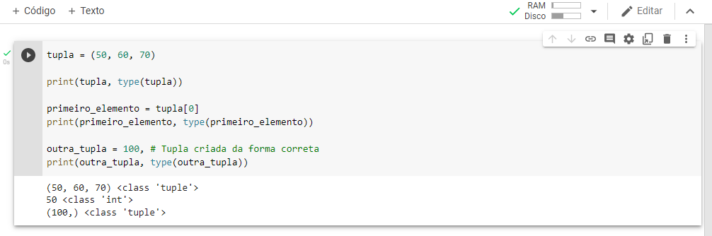

# Aula #2 - Deep Learning - Parte 2

Por <a href="https://www.youtube.com/paulosalvatore" target="_blank">Paulo Salvatore</a> - Head de Produtos <a href="https://blueedtech.com.br/quem-somos/" target="_blank">@Blue Edtech</a> & Chanely Marques - Eterna Aprendiz <a href="https://blueedtech.com.br/quem-somos/" target="_blank">@Blue Edtech</a>

Olá :wave:, seja bem-vindo(a) ao segundo vídeo desta série. Nosso objetivo é introduzir o conceito de Rede Neural, neurônios, aprendizagem profunda, funções de ativação, algoritmo de _Backpropagation_ e aplicação prática com _TensorFlow Playground_.

## É Chegado o Momento de Praticar! \o/

Assim como nós, esperamos que vocês estejam com muita vontade de colocar em prática tudo o que vimos na última aula. 

Sabemos que o conteúdo foi denso e sugerimos a leitura do material e revisão dos vídeos quantas vezes forem necessárias.

> :blue_heart: Lembre-se que o hábito de estudar, aliado à disciplina, ritmo, constância, perseverança e paciência é o que nos ajuda a construir todos os nossos sonhos. Quando o desânimo vier, lembre-se que tudo na natureza precisa de tempo para germinar, crescer e dar frutos. Assim também é com a gente. :blue_heart:
>


## Preparando o Ambiente

Antes de entrarmos nas ferramentas técnicas, queremos te dizer que para praticar tudo que verá aqui não há necessidade de **conhecimento prévio**. 

Contudo, se você não assistiu ao vídeo anterior poderá se perder no que abordaremos agora.

>  **Importante :mega: :** É essencial que você vá pausando o vídeo ao longo da aula e faça os código conosco para ficar ainda mais o conhecimento e nos deixar dúvidas caso elas surjam.

Nós iremos estudar/utilizar o que segue abaixo:

- [Google Colab](https://colab.research.google.com/) - Nos permite criar e executar códigos em Python pelo navegador e foi adequado para _Machine Learning_ e Análise de Dados.
- [Esta aula](https://miro.com/app/board/o9J_ljr0G-g=/) no Miro - Caso alguma dúvida surja, consulte a aula passada.
- [Repositório](https://github.com/blue-edtech/Blue-CPS) no GitHub - Aqui estão os arquivos preparados para esta aula

## Entendendo Google Colab e Revisando Python

<!-- 3:50 -->

Para acompanharmos o vídeo precisaremos [deste arquivo](https://github.com/blue-edtech/Blue-CPS/blob/main/%5B02%5D%20Deep%20Learning%20-%20Parte%202/DeepLearning.ipynb) no GitHub. Se você possui uma segunda tela, deixe-a aberta nela para facilitar o processo, e caso este não seja o teu caso, não tem problema, deixe-o aberto no navegador.

Agora, acesse o Google Colab e **crie** um Novo Notebook:


Após criado, altere o nome para '**Blue-CPS - Deep Learning - Parte 2**' caso queira. No Hard Feelings :wink:

> **_Nota :pencil: :_** É importante que você tenha uma conta no Google pois os arquivos do Colab serão automaticamente gravados no Google Drive.


Você pode notar que existe um botão chamado '**conectar**' e outro com o desenho de um '**Play**'. Quando executamos uma linha de código **pela primeira vez**, um servidor no Colab é criado pra gente.

Este servidor se assemelha a uma máquina virtual que nos é disponibilizada para executar os códigos que vamos criar. Isso torna dispensável a instalação das ferramentas no computador local para darmos início aos estudos.


Em _Python_, quando queremos **exibir algo na tela** usamos o comando `print("")`, que é acompanhado de parênteses e um par de **aspas**, que podem ser duplas ou simples. 

Entre as aspas vai o conteúdo que desejamos exibir. Sabendo disso, vamos já nos livrar da maldição com um '_Hello World!_' mostrando essa mensagem na tela. Digite no terminal ao lado do botão '**_Play_**' o seguinte:

```
print("Hello World!")
```

Quando apertar o '**_Play_**' poderá notar que o servidor será criado e sua conexão é iniciada.


Quando a interface por onde digitamos os comandos é conectada ao servidor, o resultado do comando, ou seja, **a saída**, aparecerá na tela.


Caso você nunca tenha programado em _Python_, não se preocupe! Em _Deep Learning_ não é necessário um conhecimento profundo na linguagem. Necessitamos entender e trabalhar com **listas**, **tuplas** e **variáveis** e falaremos sobre estes itens.

> **Importante :mega: :** Caso seu desejo seja se aprofundar na linguagem, sugerimos que o faça associando aos conhecimentos em _Deep Learning_ e Ciência de Dados para que aprenda também a utilizar outras bibliotecas e com isso, explorar mais pontos.

Os notebooks do Colab, essa interface que utilizamos para digitar nossos comandos, são notebooks do **Jupyter** hospedados. 

- Os códigos pode ser criados em blocos, ou em uma única célula, clicando em `+ Código`.

- Um bloco de texto, ou um único texto, clicando em `+ Texto`.

> **_Nota :pencil: :_** A opção de Texto nos permite adicionar comentários no código. Quando comentamos algo que escrevemos, isto não gera nenhuma saída na tela.

> **Importante :mega: :** Todos os códigos são sempre executados nas células.

Para saber mais sobre o _Jupyter_ e instalá-lo em sua máquina, clique [aqui](https://jupyter.org/about).

Em programação, costumamos **armazenar** boa parte das informações em **variáveis**. Vamos criar uma para armazenar nosso nome. Clique em `+ Código` e digite o seguinte:

`nome = "digite-seu nome"`

Onde `nome` será o nome da nossa variável e `"Paulo Salvatore"` é o conteúdo de exemplo armazenado dentro dela.

Não esqueça de utilizar as **aspas** para que o interpretador entenda que você está armazenando seu nome em forma de _String_ **dentro da variável nome**.

Ao executar o código, o _Jupyter_ vai gravar esta informação no servidor e realizar a ação que pedimos através do código. Neste caso, nada será exibido na tela, pois estamos somente armazenando uma informação dentro de uma variável na memória.


Armazenada na memória, precisamos encontrar uma forma de resgatar a informação na memória e exibi-la na tela. Nós já aprendemos como exibir algo através do `print`. 

A mesma regra de funcionamento se aplica, porém, como estamos mostrando algo na tela que já existe, ou seja, não estamos criando uma nova informação, o uso das aspas não se faz necessário.

`print(nome-da-variável)` ou seja `print(nome)`


Quando o _Play_ é clicado:

- O bloco de código é novamente executado;
- É armazenando novamente a _string_ "Paulo Salvatore" na variável "nome", e;
- O comando print(nome) exibe Paulo Salvatore na tela.

Perceba uma coisa interessante... Quando executamos o código, um número é colocado botão _Play_.


Isso acontece porque as execuções são sequenciais e o _Jupyter_ as incrementas, ou seja, adiciona uma após a outra como se estivesse guardando um **histórico de execução** do nosso código.

**Importante :mega:: Quando guardamos uma informação na memória ela fica salva.** Vamos a um exemplo:

Adicione uma célula contendo o seguinte conteúdo:

`variavel = 1`

e outra célula com este:

`print(variavel)`


Ao dar _Play_ para exibir o conteúdo de 'variavel' na tela, recebemos um erro:


Veja que o que está acontecendo nos é mostrado através da mensagem:

```
NameError: name 'variavel' is not defined
```

Que nos diz que a variável não foi definida. Você deve estar se perguntando por qual razão este erro aparece se definimos esta variável anteriormente, certo?

Nós declaramos a variável, somente a definimos, porém, não dissemos ao computador para armazena-la em memória. 

Se apertamos o _Play_ na célula da `variável` e novamente na do comando `print(variavel)` obteremos o resultado desejado. 


> **Importante :mega: :** Se não somos bastante explícitos com o resultado que queremos do código, o computador não será capaz de nos retornar o que esperamos dele.

Diferente do código que é lido e executado linha por linha, no Colab cada célula é executada por vez, ou seja, **a ordem da execução neste caso é o que importa.**

Quando queremos executar um único bloco sequencial de códigos, precisamos colocá-lo por inteiro dentro de uma única célula, Ok?!

### Uma Observação Importante :bangbang:

Ao longo da aula, caso a execução do seu código esteja diferente da nossa, siga estes passos:

Clique em `Ambiente de execução` -> `Reiniciar ambiente de execução`.


A máquina foi reiniciada e tudo que havia na memória não existe mais.

<!-- 11:16 -->

Para que isso fique mais claro, vamos manipular o valor armazenado dentro da variável que criamos:

`variavel = variavel + 1`

Estamos dizendo ao computador que queremos que armazene dentro da variável o valor que já existia dentro dela e some + 1 a ele.

Ao apertamos o _Play_ **duas vezes** esperamos o valor `3`  como saída ao darmos o Play em `print(variável)` novamente.


Apertando o _Play_ em `variável`mais 4 vezes por exemplo, e novamente em `print(varivel)`, o valor `7` será mostrado na tela.

## Entendendo Variáveis de Texto

Vamos remover as células que criamos até agora clicando na **lixeira**


E criar um bloco de código contendo:

- Variáveis `nome` armazenando o nome;
- `sobrenome` armazenando sobrenome, e;
- `print(nome + sobrenome)` para exibir o conteúdo na tela.


Quando usamos o símbolo de `+` entre duas variáveis estamos **concatenando** essas informações, ou seja, **unindo** duas informações de forma lógica.

Como `nome` e `sobrenome` são dois textos, estamos de certa forma somando os dois. 

A nossa saída ficou um pouco esquisita porque 'PauloSalvatore' necessita de espaço entre nome e sobrenome. Para isso, necessitamos adicionar uma _string_ vazia e concatenar ao que já temos:

- `print(nome + " " + sobrenome)`


Outras formas de adicionar um espaço entre duas _strings_ é utilizando uma vírgula `,`:

- `print(nome, sobrenome)`

E

- `print(f{nome} {sobrenome})`

Onde adicionamos `f` ao `print()`, colocando nome e sobrenome dentro de chaves `{}` e aspas `"{} {}"`.


## Atalhos Úteis

Quando seguramos `Control` e `m`, soltamos e em seguida apertamos `b` uma nova célula é criada pra gente.


Podemos agora adicionar um conteúdo dentro dela e executar apertando `Control` e `Enter`:

 

> **_Nota :pencil: :_** Caso você não se lembre dos atalhos, basta explorar o menu passando o mouse em cima das opções.

Se executarmos `Shift` e `Enter` a linha em que estamos é executada e em seguida uma nova célula é criada:


## Entendendo Variáveis Numéricas

<!-- 15:15 -->

Da mesma forma que armazenamos _strings_, ou seja, texto em uma variável, podemos fazer o mesmo com números. 

Em _Python_ podemos utilizar `print()` juntamente com o recurso `type(qualque-variavel)` para nos mostrar o tipo dela:

```
nome = "Paulo"
numero = 5

print(nome, type(nome))
print(numero, type(numero))
```


> **_Nota :pencil: :_** Entender o tipo da informação com a qual estamos trabalhando é essencial tanto em programação quanto em _Deep Learning_. Lembre sempre de checar este ponto caso algo não ocorra do jeito que você espera. :wink:  

Em qualquer lugar do código, se adicionarmos uma _hashtag_ significa que estamos adicionando um **comentário** que nos ajuda a adicionar **mais informações** sobre o nosso código:

```
nome = "Paulo" # str -> string -> texto
numero = 5 # int -> integer -> inteiro -> números inteiros
numero_decimal = 5.2 # float -> números decimais

print(nome, type(nome))
print(numero, type(numero))
print(numero_decimal, type(numero_decimal))
```

> **Importante :mega: :** Lembre-se que ao programar não está somente consolidando um conhecimento para você, mas também ajudando outras pessoas no processo. Comentar seu código é uma boa-prática e deve ser feita com uma dose de bom-senso.


Note que ao executar este código com `type`, é mostrado pra gente a diferença entre números **inteiros** e números **decimais**.

```
5 <class 'int'>
5.2 <class 'float'>
```

No caso, os decimais são descritos como **float**.

## Entendendo Listas

Uma lista é sempre criadas quando colocamos colchetes `[ ]` após o nome que damos à ela. 

Vamos criar uma lista **contendo números como elementos**, exibi-los na tela juntamente com a informação de qual tipo de lista estamos trabalhando:

```
lista = [10, 20, 30]

print(lista, type(lista))
```


Toda lista possui um **índice com a posição do elemento** ordenados de forma automática. 

Toda lista **sempre começa** em `0`, ou seja, o primeiro elemento na lista estará na posição `0` do índice, o segundo na posição `1` e assim por diante.

Nós podemos armazenar os elementos em uma variável, exibí-los na tela juntamente com a informação sobre seu tipo, como segue abaixo:

```
lista = [10, 20, 30]
#        0   1   2

print(lista, type(lista))

primeiro_elemento = lista[0]
print(primeiro_elemento, type(primeiro_elemento))
```


Também podemos alterar o valor do elemento na lista. Vamos fazer com o **segundo elemento**, exibindo como estava a lista antes e depois da alteração:

```
lista = [10, 20, 30]
#        0   1   2

print(lista, type(lista))

primeiro_elemento = lista[0]
print(primeiro_elemento, type(primeiro_elemento))

print("Lista antes", lista)
lista[1] = 40
print("Lista depois", lista)
```


## Entendendo Tuplas

Em termos de estrutura e criação, a tupla nos lembra uma lista. Contudo, criada, **o valor dos elementos não podem ser alterados**.

```
tupla = (50, 60, 70)

print(tupla, type(tupla))
```


Para acessar o primeiro elemento no índice da tupla também utilizamos colchetes `[ ]`:

```
tupla = (50, 60, 70)

print(tupla, type(tupla))

primeiro_elemento = tupla[0]
print(primeiro_elemento, type(primeiro_elemento))
```


Vamos agora tentar modificar o segundo elemento da tupla e ver o que acontece:

```
tupla = (50, 60, 70)

print(tupla, type(tupla))

primeiro_elemento = tupla[0]
print(primeiro_elemento, type(primeiro_elemento))

tupla[1] = 1000
```


Este resultado nos mostra que de fato, não podemos alterar os valores dentro de uma tupla.

Note que ao tentar criar uma tupla com único valor, utilizar os parênteses não interfere no resultado.

```
tupla = (50, 60, 70)

print(tupla, type(tupla))

primeiro_elemento = tupla[0]
print(primeiro_elemento, type(primeiro_elemento))

outra_tupla = (100) # Tentando criar uma tupla de um único elemento
print(outra_tupla, type(outra_tupla))
```


Uma tupla é sempre criadas quando colocamos adicionamos uma vírgula `,` entre os elementos. 

```
tupla = (50, 60, 70)

print(tupla, type(tupla))

primeiro_elemento = tupla[0]
print(primeiro_elemento, type(primeiro_elemento))

outra_tupla = 100, # Tupla criada da forma correta
print(outra_tupla, type(outra_tupla))
```



Podemos entender então, que os parênteses são neste caso, apenas auxiliares de exibição:

```
tupla = 50, 60, 70 # Tupla criada

print(tupla, type(tupla))

primeiro_elemento = tupla[0]
print(primeiro_elemento, type(primeiro_elemento))

outra_tupla = (100,) # Tupla criada
print(outra_tupla, type(outra_tupla))
```


## Nossa Primeira Rede Neural :fireworks:

<!-- 21:40 -->

### Relembrando: MNIST

O **MNIST** é um banco de dados que contém imagens binárias de dígitos escritos à mão por diversas pessoas. 

Suas imagens estão em escala de cinza, com tamanho 28x28 pixels. Possui 60.000 arquivos para treino e 10.000 arquivos para teste, organizadas em 10 classes distintas.

No caso do MNIST, cada classe distinta representa um dos números de `0 a 9`.


> Agora sim, podemos deixar de nos preocupar em quebrar a maldição do **_Hello World_** em _Deep Learning_!

Dentro do _dataset_, organizamos os arquivos das imagens (`Images`) em um local e a representação de cada uma das imagens (`Labels`) em outro.

Podemos acessar o site do MNIST e fazer o [download direto](http://yann.lecun.com/exdb/mnist/) das Imagens e _Labels_, ou podemos lançar mão de uma biblioteca para nos ajudar neste processo.

Esta biblioteca se chama [Keras](https://keras.io/), sendo uma das principais utilizadas para se trabalhar com aprendizado de máquina.

A Keras roda em cima de [TensorFlow](https://www.tensorflow.org/?hl=pt-br), sendo um dos principais motores e mantido pelo Google. Sugerimos fortemente que visite o site pois há muito conteúdo disponibilizado em Português.

O que vamos fazer nesta aula é preparar esta estrutura, onde o nosso _dataset_ contém as figuras para os dígitos de `0 a 9` nos dados `10` opções de saída.


Vamos organizar a rede e estruturar as 70.000 imagens, achatando-as para passarem por todo o processo que vimos na aula anterior.

> **Importante :mega: :** Se você não sabe ou não lembra do que estamos falando, dá um [pulinho aqui](https://github.com/blue-edtech/Blue-CPS/tree/main/%5B01%5D%20Deep%20Learning%20-%20Parte%201) no material. :wink:

Durante o processo de treinamento da Rede, as imagens de **treino** que são **recebidas pelo algoritmo** sempre **são comparadas** às imagens de **teste**, que lhes são as **imagens desconhecidas**. Justamente por este motivo, os arquivos precisam estar separados para que não se misturem e a Rede não se perca.

> **_Nota :pencil: :_** Quando falamos em comparar as imagens de treino com as imagens de teste, estamos dizendo sobre validação.


>  **_Nota :pencil: :_** De 100% das imagens contidas em um _dataset_, em média 70% são separadas para treino e 30% para testes. Estes números não são uma regra e nós podemos alterar sua configuração antes de iniciarmos o processo. 

Tal qual acontece com um Ser Humano, quando uma Rede Neural se compromete a aprender, ela estará sempre em contato com o desconhecido. **Os problemas por ela são generalizados e o aprendizado se torna completo quando o desconhecido se torna conhecido.**


As 60.000 imagens que utilizaremos para treino serão achatadas individualmente em 784px e cada uma delas terá uma _label_ que dirá o que a imagem representa, **que são as categorias**.


## MNIST no Colab

> **_Nota :pencil: :_** Se você não estiver utilizando o Colab, instel o tensorflow e o keras em sua máquina para acompanhar a aula. :wink:

O primeiro passo a ser executado é a importação de todas as dependências e bibliotecas que utilizaremos no Colab. 

Começaremos por trazer o somente o 'keras' da biblioteca 'tensorflow':

```
from tensorflow import keras
```

Agora que temos o 'keras' precisamos importar dele o _dataset_ do MNIST:

```
from keras.datasets import mnist
```

Precisamos também de `4` ferramentas para nos auxiliar no processo, entraremos no detalhe delas mais a frente:

```
from tensorflow.python.keras import Sequential
```

O **_Sequential_** é a arquitetura da nossa rede neural que utilizaremos para ter o **modelo sequencial de neurônios** que utilizaremos, nós o importamos de dentro do keras.

Dentro do keras vamos entrar em um componente chamado **_layers_** e dele vamos importar:

- **_Dense_** que nos ajuda a construir nossas camadas, servindo como o Neurônio de base da Rede, e;
- **_Dropout_** que funciona como um regularizador que evita overfitting.

```
from tensorflow.python.keras.layers import Dense, Dropout
```

Precisamos de um algoritmo de _backpropagation_ e utilizaremos o **RMSprop**:

```
from tensorflow.compat.v1.keras.optimizers import RMSprop
```

O seu código dentro do Colab deve estar como segue abaixo:

```
from tensorflow import keras

from keras.datasets import mnist

from tensorflow.python.keras import Sequential
from tensorflow.python.keras.layers import Dense, Dropout
from tensorflow.compat.v1.keras.optimizers import RMSprop
```

Se ao executar o código acima você receber algum erro, acesse o [diffchecker](https://www.diffchecker.com/) e compare o código acima com o que digitou no Colab. Em **laranja** ele indicará o que há de errado no código:


> **Importante :mega: :** É essencial que você evite colar os códigos diretamente no Colab. Lembre-se que para alcançar a perfeição precisamos praticar, praticar, praticar e praticar. :blue_heart:


Agora podemos fazer o _download_ da base do MNIST. **Sem apertar o Play**, numa nova célula digite:

```
mnist.load_data()
```

A estrutura que recebemos contém `(x_train, y_train), (x_test_ y_test)`, ou seja, a base de treino e a base de testes, sendo:

- `x` as imagens, e;
- `y` a representação de cada imagem.

Vamos extrair do `load_data()` as bases de treino e teste de acordo com a estrutura recomendada:

```
(x_treino, y_treino), (x_teste, y_teste) = mnist.load_data()
```

Ao executar este comando estamos dizendo que: 

- **X_Treino** recebe 60.000 imagens com 28x28 pixels cada;
- **Y_Treino** recebe 60.000 _labels_, contendo o número que está desenhado na imagem;
- **X_Teste** recebe 10.000 imagens com 28x28 pixels cada;
- **Y_Teste** recebe 10.000 _labels_, contendo o número que está desenhado na imagem, e;
- E todas as vezes que chamamos `mnist.load_data()` estamos trazendo essa estrutura.

Agora pode dar o _Play_ e criar uma célula nova. :stuck_out_tongue_winking_eye:


Vamos ver o detalhe de `mnist.load_data()`?

Vamos utilizar uma função do _Python_ chamada `len()` para nos dizer a **quantidade** de imagens para treino e teste:

```
print("Quantidade de imagens para treino:", len(x_treino))
print("Quantidade de imagens para teste:", len(x_teste))
```


Legal, as imagens vieram organizadas do jeito que vimos! Vamos analisar qual o **tipo** da informação em `x_treino` e `x_teste`?


Vamos entender o que é esse **numpy.ndarray** quebrando em duas partes:

A [numPy](https://numpy.org/) é uma biblioteca em Python para trabalhar com álgebra linear, matemática, matriz, entre outros assuntos, facilitando a parte matemática e a escrita de algumas partes do código pra gente.

> **_Nota :pencil: :_** O NumPy trabalha com os tipos das informações não necessariamente em Python, mas em c++, que é uma linguagem **mais rápida** e complicada.

> **_Nota :pencil: :_** O NumPy já vem embutido no TensorFlow e no Keras. Sensacional, não é?! :blue_heart:

Um **array** é um nome geralmente usado para lista e funciona da mesma forma que uma.

Vamos pegar a primeira imagem de `x_treino` e armazená-la em uma variável:

```
primeira_imagem = x_treino[0]
```

Vamos agora exibir seu conteúdo:

```
print(primeira_imagem)
```


Bom, podemos ver que se trata de imagem maravilhosa, não é mesmo? Para o computador, no caso. :laughing:  :laughing:  :laughing:  :laughing:  :laughing:  :laughing:  :laughing: 

Como Jack, vamos quebrar essa imensidão de informações em pedaços, começando pela primeira linha. Note que temos dois colchetes um ao lado do outro:


E se riscarmos estes `0's` teremos a primeira linha do nosso arquivo:


E contarmos cada linha desta forma, teremos `28` delas.

Se assumirmos que o conteúdo entre cada colchete é uma lista, temos `28` listas.


Percebemos também que a imagem não contém somente `0's`, alguns outros valores aparecem como `136`, `253`, `251`...Se selecionarmos estes valores e juntarmos suas formas criando uma nova imagem, temos algo que representa um número:


O risco em vermelho nos lembra o número `5`, não é verdade? Para confirmar esta informação, precisamos exibi-la de outras formas:

<!-- 42:29 -->