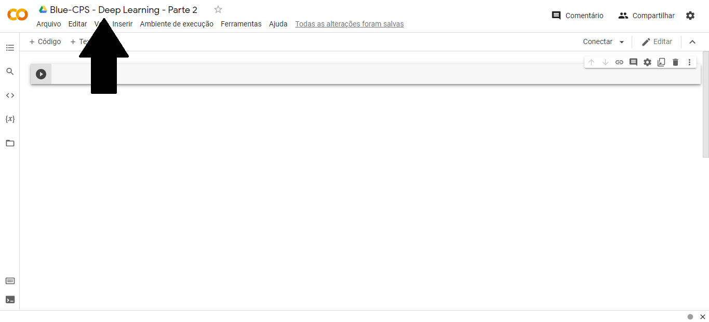

# Aula #2 - Deep Learning - Parte 2

Por <a href="https://www.youtube.com/paulosalvatore" target="_blank">Paulo Salvatore</a> - Head de Produtos <a href="https://blueedtech.com.br/quem-somos/" target="_blank">@Blue Edtech</a> & Chanely Marques - Eterna Aprendiz <a href="https://blueedtech.com.br/quem-somos/" target="_blank">@Blue Edtech</a>

Olá :wave:, seja bem-vindo(a) ao segundo vídeo desta série. Nosso objetivo é introduzir o conceito de Rede Neural, neurônios, aprendizagem profunda, funções de ativação, algoritmo de _Backpropagation_ e aplicação prática com _TensorFlow Playground_.

## É Chegado o Momento de Praticar! \o/

Assim como nós, esperamos que vocês estejam com muita vontade de colocar em prática tudo o que vimos na última aula. 

Sabemos que o conteúdo foi denso e sugerimos a leitura do material e revisão dos vídeos quantas vezes forem necessárias.

> :blue_heart: Lembre-se que o hábito de estudar, aliado à disciplina, ritmo, constância, perseverança e paciência é o que nos ajuda a construir todos os nossos sonhos. 
>
> Quando o desânimo vier, lembre-se que tudo na natureza precisa de tempo para germinar, crescer e dar frutos. Assim também é com a gente. :blue_heart:

Vamos!?


## Relembrando: MNIST

O **MNIST** é um banco de dados que contém imagens binárias de dígitos escritos à mão por diversas pessoas. 

Suas imagens estão em escala de cinza, com tamanho 28x28 pixels. Possui 60.000 arquivos para treino e 10.000 arquivos para teste, organizadas em 10 classes distintas.

No caso do MNIST, cada classe distinta representa um dos números de `0 a 9`.


Agora sim, podemos deixar de nos preocupar em quebrar a maldição de **_Hello World_** em _Deep Learning_!

## Preparando o Ambiente

Antes de entrarmos nas ferramentas técnicas é imprescindível dizermos que para a prática desta aula não há necessidade de **conhecimento prévio**. 

Entretanto, se você não assistiu ao vídeo anterior poderá se perder no que abordaremos agora.

>  É importante que você vá pausando o vídeo nas partes práticas e realize os exercícios, code conosco, para fixar o conhecimento.

- [Google Colab](https://colab.research.google.com/) - Nos permite criar e executar códigos em Python pelo navegador e foi adequado para _Machine Learning_ e Análise de Dados.
- [Esta aula](https://miro.com/app/board/o9J_ljr0G-g=/) no Miro - Caso alguma dúvida surja, consulte a aula passada.
- [Repositório](https://github.com/blue-edtech/Blue-CPS) no GitHub - Aqui estão os arquivos preparados para esta aula

## #Partiu

<!-- 3:50 -->

Para acompanharmos o vídeo precisaremos [deste arquivo](https://github.com/blue-edtech/Blue-CPS/blob/main/%5B02%5D%20Deep%20Learning%20-%20Parte%202/DeepLearning.ipynb) no GitHub. 

Se você possui uma segunda tela, deixe-o aberto nela para facilitar o processo, e caso este não seja o teu caso, não tem problema, deixe-o aberto no navegador.

Agora, acesse o Google Colab e **crie** um Novo Notebook:


Após criado, altere o nome para '**Blue-CPS - Deep Learning - Parte 2**' caso queira. No Hard Feelings :wink:

> **_Nota :pencil: :_** É importante que você tenha uma conta no Google pois os arquivos do Codelab serão automaticamente gravados no Google Drive.



Você pode notar que existe um botão chamado '**conectar**' e outro com o desenho de um '**Play**'. Ambos, quando pressionados o Google nos traz um servidor de execução. 


Em _Python_, quando queremos exibir algo na tela usamos o comando `print("")` que é acompanhado de parênteses e o conteúdo deve ficar **dentro das aspas**, que podem ser duplas ou simples. 

Sabendo disso, vamos já nos livrar da maldição com um '_Hello World!_'

Digite no terminal ao lado do botão '**_Play_**' o seguinte comando:

```
print("Hello World!")
```

Quando apertar o '**_Play_**' poderá notar que o servidor começará a conexão.


Quando ela for terminada, o resultado do comando, ou seja, a saída, aparecerá na tela.


Caso você nunca tenha programado em _Python_, não se preocupe! Em _Deep Learning_ não é necessário um conhecimento profundo na linguagem. Necessitamos entender e trabalhar com **listas**, **tuplas** e **variáveis** e faremos um _overview_ destes itens.

> **Importante :mega: :** Caso seu desejo seja se aprofundar na linguagem, sugerimos que o faça associando aos conhecimentos de _Deep Learning_ e Ciência de Dados para que aprenda também a utilizar outras bibliotecas e com isso, explorar mais pontos.

Os notebooks do Colab são notebooks do **Jupyter** hospedados. Nos permitindo criar blocos de código, ou uma única célula, clicando em `+ Código` ou um bloco de texto, ou um único texto, clicando em `+ Texto`.

Para saber mais sobre _Jupyter_ e instalá-lo em sua máquina, clique [aqui](https://jupyter.org/about).

> **_Nota :pencil: :_** A opção de Texto nos permite adicionar comentários no código. Quando comentamos algo que escrevemos, isto não gera nenhuma saída na tela.

> **Importante :mega: :** Todos os códigos são sempre executados nas células.

Em programação, costumamos **armazenar** algumas informações em **variáveis**. Vamos criar uma para armazenar nosso nome. Clique em `+ Código` e digite o seguinte:

`nome = "Paulo Salvatore"`

Onde `nome` será o nome da nossa variável e `"Paulo Salvatore"` é o conteúdo armazenado dentro dela.

Não esqueça de utilizar as **aspas** para que o interpretador entenda que você está armazenando seu nome em forma de _String_ dentro da variável nome.

Ao executar o código, o _Jupyter_ vai gravar esta informação no computador e realizar a ação que pedimos através do código.

Neste caso, nada será exibido na tela pois estamos somente armazenando uma informação dentro de uma variável na memória.


Armazenada na memória, precisamos encontrar uma forma de mostrar na tela essa informação e nós já aprendemos o comando para fazer isso, o `print`. 

A mesma regra de funcionamento se aplica, porém, como estamos mostrando algo na tela que já existe, ou seja, não estamos criando uma nova informação, o uso das aspas não se faz necessário.

`print(nome-da-variável)` ou seja `print(nome)`


Quando o 'Play' é clicado:

- O bloco de código é novamente executado;
- Armazenando novamente a _string_ "Paulo Salvatore" na variável "nome", e;
- O comando print(nome) exibe Paulo Salvatore na tela.

Perceba uma coisa interessante, quando executamos um número é colocado botão _Play_.


Isso acontece porque as execuções são sequenciais e o Jupyter as incrementas, ou seja, adiciona uma após a outra como se estivesse guardando um **histórico de execução**.

Quando guardamos uma informação na memória ela fica salva. Vamos a um exemplo:

Adicione uma célula contendo o seguinte conteúdo:

`variavel = 1`

e outra célula com este:

`print(variavel)`


Ao dar _Play_ para exibir o conteúdo de 'variavel' na tela, recebemos um erro:


Veja que o que está acontecendo nos é mostrado através da mensagem:

```
NameError: name 'variavel' is not defined
```

Que nos diz que a variável não foi definida. Você deve estar se perguntando por qual razão este erro aparece se definimos esta variável anteriormente, certo?

Nós declaramos a variável, porém, não dissemos ao computador para armazena-la em memória. 

Se apertamos o _Play_ na célula da `variável` e novamente na do comando `print(variavel)` obteremos o resultado desejado. ****


> **Importante :mega: :** Se não somos bastante explícitos com o que estamos fazendo, o computador não será capaz de nos retornar o que esperamos dele.

Diferente do código que é lido e executado linha por linha, no Colab cada célula é executada por vez, ou seja, **a ordem da execução neste caso é o que importa.**

Quando queremos executar um único bloco sequencial de códigos, precisamos colocá-lo por inteiro dentro de uma única célula.

Caso a execução do seu código esteja diferente da nossa, siga estes passos:

Clique em `Ambiente de execução` -> `Reiniciar ambiente de execução`.


A máquina foi reiniciada e tudo que havia na memória não existe mais.

<!-- 11:16 -->