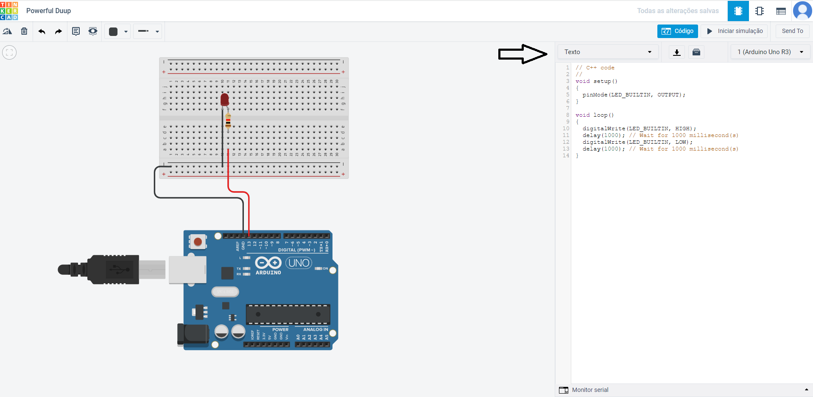

## Aula #3 - Arduíno: Introdução

Por <a href="https://www.linkedin.com/in/violigon/" target="_blank">Vinicius Gonçalves</a> - Professor <a href="https://blueedtech.com.br/quem-somos/" target="_blank">@Blue Edtech</a> & Chanely Marques - Eterna Aprendiz <a href="https://blueedtech.com.br/quem-somos/" target="_blank">@Blue Edtech</a>

Olá :wave:, seja bem-vindo(a) ao primeiro vídeo desta série. Nosso objetivo é introduzir conceitos básicos de prototipação de circuitos, eletrônica e programação em conjunto através da construção de um **semáforo**. #partiu :blue_heart:

## Introdução

Para darmos início ao nosso projeto, precisamos realizar o _Login_ em uma plataforma de desenvolvimento chamada [ThinkerCad](https://www.tinkercad.com/).

Basta que você clique no botão **Entrar**:


Realize seu _login_ na conta **Google** ou **GitHub**:


Para ter acesso à **Página Principal**. Com o devido acesso, vamos clicar na opção **Circuitos**:


E em seguida, clique em **Criar novo Circuito** para ter acesso à nossa **Área de Trabalho Virtual** para prototiparmos o nosso circuito:


À direita podemos ver nossa **Galeria de Componentes** e acima, os **Botões de Controle**.

## Ligando um Led

Para que possamos construir o nosso semáforo, a primeira etapa é aprender a ligar um Led, ou seja, uma pequena luz.

<!-- 2:31 -->

Ao arrastarmos o Led vermelho para o centro da tela e passarmos o mouse em ambas as pernas, podemos observar que:

- A perna torta `Anodo`, é sempre **positivo**, e;
- A perna reta `Catódica`, é sempre **negativo**.


Por se tratar de um componente que necessita de eletricidade para funcionar, podemos liga-lo à uma fonte de alimentação ou, para o nosso projeto, uma **bateria** de `9V` que já possui conectores. 

Selecione esta bateria através da caixa de busca, arraste-a para a tela e a rotacione apertando a letra `R` no teclado, alinhando-a com o **led**:


> **_Nota_:** Não estranhe a proporção dos tamanhos reais das peças, pois o _Tinkercad_ os deixa assim propositadamente.

Para interconectar a bateria ao led, necessitamos de fios virtuais. 

Vamos criar estas conexões levando um fio do polo **negativo da bateria** para o **positivo do led** e, um outro fio do polo **positivo da bateria** para o **negativo do led**.

Seguindo as convenções, vamos utilizar a cor **preta** para as interconexões de polos **negativos** e a cor **vermelha** para as interconexões de polos **positivos**.


Vamos ver se já está funcionando?! Apertando o botão **Iniciar Simulação** nos dará uma ideia:


Eita, parece que o led explodiu! Por que isso acontece?

Estamos fornecendo uma tensão de `9V` para este led, contudo, ele precisa de um consumo de tensão e corrente baixos. 
Para limitar a nossa corrente, necessitamos ligar o **polo positivo** da nossa bateria e do led ao **resistor**. 


O que ele está fazendo é transformar parte da energia em calor, retendo o excesso e deixando passar somente o necessário para o led.

<!-- 6:28 -->

## Adicionando um Botão para Ligar o Led

Agora que conseguimos fazer nosso sistema inicial funcionar, vamos adicionar um botão para ligar e manter o led aceso:

- Vamos procurar pelo botão mais simples;
- Ligar a ponta superior do resistor ao botão;
- Ligar o fio do botão ao polo positivo do led;
- Iniciar a simulação, e;
- Manter pressionando o botão esquerdo do mouse.


## Ganhando Mais Controle com o Arduíno

<!-- 7:44 -->

E se quisermos acender o led num horário programado? Ou, em um tempo específigo?

Adicionando o **Arduíno Uno R3** em nossa mesa, podemos notar que ele possui diversas coisas bacanas:


- As **portas digitais** nos furinhos superiores;
- As  **portas analógicas** nos furinhos inferiores, e;
- **Chip Atmega** programável que realiza o controle das portas digitais e analógicas.

As portas servem tanto para entrada de dados como saídas dos mesmos. Podemos colocar sensores que são lidos por elas, ou ligar e desligar as coisas.

Para o nosso exemplo, vamos usar as portas como saída para ligar e desligar o led.

A fim de deixar nosso projeto mais organizado, necessitamos de uma **protoboard**, ou, placa de ensaio. Ela serve para espetarmos nossos componentes e organizá-los, além de ser um expansor de portas.


> **_Nota_**: Se passarmos o mouse pelas indicações de `= e -` podemos notar que os pontos estão todos interconectados na horizontal.

> **_Nota_**: Se passarmos o mouse pelas indicações de `letras e números` podemos notar que os pontos estão todos interconectados na vertical.

Podemos notar que o Arduíno possui **3 portas GND** que possuem polo negativo e servem para se ligar ao **polo positivo** dos componentes.


Caso a gente precise expandir em mais componentes, temos na _protoboard_ mais pontos de conexão positivos `+` e negativos `-`.

Como o Arduíno possui uma fonte de energia através do **cabo USB**, podemos remover a bateria de nossa mesa e ligar nosso Arduíno os demais componentes à placa:

- Ligar o led na **parte superior**;
- Ligar o resistor no **polo positivo** do led até um dos furinhos na **parte inferior** da placa;
- Ligar uma porta **GND** a um ponto **negativo** na _protoboard_, expandindo os polos **negativos**;
- Ligar um fio do **catodo** do led à parte **negativa** na placa;
- Ligar o polo **positivo** do led/resistor à parte **positiva** na porta `13` do Arduíno.

Neste momento, podemos dispensar o botão, pois usaremos um digital no Arduíno.


Ao iniciar a simulação, podemos notar que o led fica piscando, mesmo sem termos feito esta programação. Isto acontece porque todo Arduíno vem com um programa padrão chamado **blink**, que no nosso exemplo, está **ligando e desligando** a porta `13`, com dados positivos (`ligando o led`) e negativos (`desligando o led`).

<!-- 13:45 -->

### Entendendo a Programação por Detrás do Arduíno

Ao clicar no botão **Código**, é aberta para nós uma janela com blocos, porém, vamos selecionar a opção **Texto**:



Para entendermos o que está acontecendo, vamos construir o código do zero. Apague tudo o que está escrito e começaremos pelo:

```c++
void setup()
{
  pinMode();
}
```

O `void setup`() é uma **função essencial** para o funcionamento do Arduíno, sendo executada **somente** quando o ligamos. Nela, definimos as portas de saída e entrada.

O `pinMode`(), é o código que define uma porta, vamos adicionar a porta `13`, que estamos usando e adicionar o parâmetro `OUTPUT`, indicando que este pino é uma saída de dados.

```c++
void setup()
{
  pinMode(13, OUTPUT);
}
```

Outra função essencial é a `void loop()`, que de forma bem grosseira podemos dizer que é um **laço de repetição**, ou seja, executará o que colocarmos dentro dele até pararmos manualmente sua execução. 

A partir desta função partir começamos a construir o comportamento do nosso led:

```c++
void loop()
{
   digitalWrite(13, HIGH);
}
```

Através da função `digitalWrite()`, faremos uma gravação na porta `13`, mandado um sinal(`HIGH`) de que ela está ligada.

Se executarmos somente este código, veremos que o Arduíno ligará o led, e nada além disso:

```c++
void setup()
{
  pinMode(13, OUTPUT);
}

void loop()
{
   digitalWrite(13, HIGH);
}
```


<!-- 17:03 -->

Para podermos ligar e desligar o led, necessitamos adicionar algumas linhas de código:

```c++
void setup()
{
  pinMode(13, OUTPUT);
}

void loop()
{
   digitalWrite(13, HIGH);
   digitalWrite(13, LOW);
}
```

Da forma que está o código acima, a velocidade para ligar e desligar o led está tão **rápida** que ao executar o código, a sensação que temos é que o led está somente ligado. Vamos ajustar isso:

```c++
void setup()
{
  pinMode(13, OUTPUT);
}

void loop()
{
   digitalWrite(13, HIGH);
   	delay(1000);
   digitalWrite(13, LOW);
    delay(1000);
}
```

Com a função `delay()` dizemos ao Arduíno que queremos o intervalo de `1 segundo` entre ligar e desligar o led.

Digite o código acima e execute a simulação.

<!-- 17:00 -->
