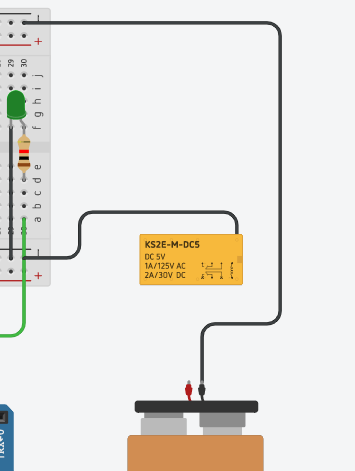

## Aula #3 - Arduíno: Introdução

Por <a href="https://www.linkedin.com/in/violigon/" target="_blank">Vinicius Gonçalves</a> - Professor <a href="https://blueedtech.com.br/quem-somos/" target="_blank">@Blue Edtech</a> & Chanely Marques - Eterna Aprendiz <a href="https://blueedtech.com.br/quem-somos/" target="_blank">@Blue Edtech</a>

Olá :wave:, seja bem-vindo(a) ao primeiro vídeo desta série. Nosso objetivo é introduzir conceitos básicos de prototipação de circuitos, eletrônica e programação em conjunto através da construção de um **semáforo**. #partiu :blue_heart:

## Introdução

Para darmos início ao nosso projeto, precisamos realizar o _Login_ em uma plataforma de desenvolvimento chamada [ThinkerCad](https://www.tinkercad.com/).

Basta que você clique no botão **Entrar**:


Realize seu _login_ na conta **Google** ou **GitHub**:


Para ter acesso à **Página Principal**. Com o devido acesso, vamos clicar na opção **Circuitos**:


E em seguida, clique em **Criar novo Circuito** para ter acesso à nossa **Área de Trabalho Virtual** para prototiparmos o nosso circuito:


À direita podemos ver nossa **Galeria de Componentes** e acima, os **Botões de Controle**.

## Ligando um LED

Para que possamos construir o nosso semáforo, a primeira etapa é aprender a ligar um LED, ou seja, uma pequena luz.

<!-- 2:31 -->

Ao arrastarmos o LED vermelho para o centro da tela e passarmos o mouse em ambas as pernas, podemos observar que:

- A perna torta `Anodo`, é sempre **positivo**, e;
- A perna reta `Catódica`, é sempre **negativo**.


Por se tratar de um componente que necessita de eletricidade para funcionar, podemos liga-lo à uma fonte de alimentação ou, para o nosso projeto, uma **bateria** de `9V` que já possui conectores. 

Selecione esta bateria através da caixa de busca, arraste-a para a tela e a rotacione apertando a letra `R` no teclado, alinhando-a com o **LED**:


> **_Nota :pencil: :_** Não estranhe a proporção dos tamanhos reais das peças, pois o _Tinkercad_ os deixa assim propositadamente.

Para interconectar a bateria ao LED, necessitamos de fios virtuais. 

Vamos criar estas conexões levando um fio do polo **negativo da bateria** para o **positivo do LED** e, um outro fio do polo **positivo da bateria** para o **negativo do LED**.

Seguindo as convenções, vamos utilizar a cor **preta** para as interconexões de polos **negativos** e a cor **vermelha** para as interconexões de polos **positivos**.


Vamos ver se já está funcionando?! Apertando o botão **Iniciar Simulação** nos dará uma ideia:


Eita, parece que o LED explodiu! Por que isso acontece?

Estamos fornecendo uma tensão de `9V` para este LED, contudo, ele precisa de um consumo de tensão e corrente baixos. 
Para limitar a nossa corrente, necessitamos ligar o **polo positivo** da nossa bateria e do LED ao **resistor**. 


O que ele está fazendo é transformar parte da energia em calor, retendo o excesso e deixando passar somente o necessário para o LED.

<!-- 6:28 -->

## Adicionando um Botão para Ligar o LED

Agora que conseguimos fazer nosso sistema inicial funcionar, vamos adicionar um botão para ligar e manter o LED aceso:

- Vamos procurar pelo botão mais simples;
- Ligar a ponta superior do resistor ao botão;
- Ligar o fio do botão ao polo positivo do LED;
- Iniciar a simulação, e;
- Manter pressionando o botão esquerdo do mouse.


## Ganhando Mais Controle com o Arduíno

<!-- 7:44 -->

E se quisermos acender o LED num horário programado? Ou, em um tempo específigo?

Adicionando o **Arduíno Uno R3** em nossa mesa, podemos notar que ele possui diversas coisas bacanas:


- As **portas digitais** nos furinhos superiores;
- As  **portas analógicas** nos furinhos inferiores, e;
- **Chip Atmega** programável que realiza o controle das portas digitais e analógicas.

As portas servem tanto para entrada de dados como saídas dos mesmos. Podemos colocar sensores que são lidos por elas, ou ligar e desligar as coisas.

Para o nosso exemplo, vamos usar as portas como saída para ligar e desligar o LED.

A fim de deixar nosso projeto mais organizado, necessitamos de uma **protoboard**, ou, placa de ensaio. Ela serve para espetarmos nossos componentes e organizá-los, além de ser um expansor de portas.


> **_Nota :pencil: :_** Se passarmos o mouse pelas indicações de `= e -` podemos notar que os pontos estão todos interconectados na horizontal.

> **_Nota :pencil: :_** Se passarmos o mouse pelas indicações de `letras e números` podemos notar que os pontos estão todos interconectados na vertical.

Podemos notar que o Arduíno possui **3 portas GND** que possuem polo negativo e servem para se ligar ao **polo positivo** dos componentes.


Caso a gente precise expandir em mais componentes, temos na _protoboard_ mais pontos de conexão positivos `+` e negativos `-`.

Como o Arduíno possui uma fonte de energia através do **cabo USB**, podemos remover a bateria de nossa mesa e ligar nosso Arduíno os demais componentes à placa:

- Ligar o LED na **parte superior**;
- Ligar o resistor no **polo positivo** do LED até um dos furinhos na **parte inferior** da placa;
- Ligar uma porta **GND** a um ponto **negativo** na _protoboard_, expandindo os polos **negativos**;
- Ligar um fio do **catodo** do LED à parte **negativa** na placa;
- Ligar o polo **positivo** do LED/resistor à parte **positiva** na porta `13` do Arduíno.

Neste momento, podemos dispensar o botão, pois usaremos um digital no Arduíno.


Ao iniciar a simulação, podemos notar que o LED fica piscando, mesmo sem termos feito esta programação. Isto acontece porque todo Arduíno vem com um programa padrão chamado **blink**, que no nosso exemplo, está **ligando e desligando** a porta `13`, com dados positivos (`ligando o LED`) e negativos (`desligando o LED`).

<!-- 13:45 -->

### Entendendo a Programação por Detrás do Arduíno

Ao clicar no botão **Código**, é aberta para nós uma janela com blocos, porém, vamos selecionar a opção **Texto**:


Para entendermos o que está acontecendo, vamos construir o código do zero. Apague tudo o que está escrito e começaremos pelo:

```c++
void setup()
{
	pinMode();
}
```

O `void setup`() é uma **função essencial** para o funcionamento do Arduíno, sendo executada **somente** quando o ligamos. Nela, definimos as portas de saída e entrada.

O `pinMode`(), é o código que define uma porta, vamos adicionar a porta `13`, que estamos usando e adicionar o parâmetro `OUTPUT`, indicando que este pino é uma saída de dados.

```c++
void setup()
{
	pinMode(13, OUTPUT);
}
```

Outra função essencial é a `void loop()`, que de forma bem grosseira podemos dizer que é um **laço de repetição**, ou seja, executará o que colocarmos dentro dele até pararmos manualmente sua execução. 

A partir desta função partir começamos a construir o comportamento do nosso LED:

```c++
void loop()
{
	digitalWrite(13, HIGH);
}
```

Através da função `digitalWrite()`, faremos uma gravação na porta `13`, mandado um sinal(`HIGH`) de que ela está ligada.

Se executarmos somente este código, veremos que o Arduíno ligará o LED, e nada além disso:

```c++
void setup()
{
	pinMode(13, OUTPUT);
}

void loop()
{
	digitalWrite(13, HIGH);
}
```


<!-- 17:03 -->

Para podermos ligar e desligar o LED, necessitamos adicionar algumas linhas de código:

```c++
void setup()
{
	pinMode(13, OUTPUT);
}

void loop()
{
	digitalWrite(13, HIGH);
	digitalWrite(13, LOW);
}
```

Da forma que está o código acima, a velocidade para ligar e desligar o LED está tão **rápida** que ao executar o código, a sensação que temos é que o LED está somente ligado. Vamos ajustar isso:

```c++
void setup()
{
	pinMode(13, OUTPUT);
}

void loop()
{
	digitalWrite(13, HIGH);
	delay(1000);
	digitalWrite(13, LOW);
	delay(1000);
}
```

Com a função `delay()` dizemos ao Arduíno que queremos o intervalo de `1 segundo` entre ligar e desligar o LED.

Digite o código acima e execute a simulação.

<!-- 19:00 -->

## Construindo Nosso Semáforo

<!-- 20:20 -->

Até aqui nós aprendemos a desligar e ligar um LED em nosso Arduíno. Com o código que construímos até aqui sabemos que o **LED vermelho** está ligado à **porta 13** porém, adicionaremos mais linhas e mais componentes, ou seja, mais saídas e por conta disso, algumas confusões podem ser feitas.

Vamos evitar este problema, adicionando uma variável que será responsável **pelo LED vermelho, que está conectado à porta 13**:

```c++
int LED_Vermelho = 13;

void setup()
{
	pinMode(LED_Vermelho, OUTPUT);
}

void loop()
{
	digitalWrite(LED_Vermelho, HIGH);
   	delay(1000);
	digitalWrite(LED_Vermelho, LOW);
    delay(1000);
}
```

Agora, nós temos a variável do tipo `int` chamada `LED_Vermelho` armazenando a informação de que este LED está na porta `13`.

Vamos adicionar à nossa _protoboard_ os LEDs **amarelo** e **verde** e conectá-los ao Arduíno da mesma maneira que fizemos com o LED vermelho.

> Ao arrastar um novo LED à mesa, aparecerá uma caixa de propriedades onde você pode alterar a sua cor.

- Ligaremos o LED **amarelo** à porta `11`, e;
- Ligaremos o LED **verde** à porta `7`.


Agora podemos atribuir as variáveis para os novos LED contendo suas portas:

```c++
int LED_Amarelo = 11;
int LED_Verde = 7;
```

E vamos configurá-las como saída:

```c++
void setup()
{
	pinMode(LED_Vermelho, OUTPUT);
	pinMode(LED_Amarelo, OUTPUT);
	pinMode(LED_Verde, OUTPUT);
}
```

Tendo em mente que um semáforo liga primeiro a luz **verde** para em seguida acender a **amarela** e por fim a **vermelha**, precisamos estabelecer esta ordem, juntamente com o tempo de funcionamento de cada cor em nosso código:

```c++
void loop()
{
	// Controle LED Verde  
   	digitalWrite(Led_Verde, HIGH);
   	delay(10000);
   	digitalWrite(Led_Verde, LOW);
    delay(1000);
  
  // Controle LED Amarelo  
   	digitalWrite(Led_Amarelo, HIGH);
   	delay(3000);
   	digitalWrite(Led_Amarelo, LOW);
    delay(1000);
  
  // Controle LED Vermelho 
   	digitalWrite(Led_Vermelho, HIGH);
   	delay(5000);
   	digitalWrite(Led_Vermelho, LOW);
    delay(1000);
}
```

Onde:

- O LED **verde** ficará ligado por `10 segundos` e desligado por `1 segundo`;
- O LED **amarelo** ficará ligado por `3 segundos` e desligado por `1 segundo`;
- O LED **vermelho** ficará ligado por `5 segundos` e desligado por `1 segundo`;

Ao final dos ajustes, o seu código deverá estar desta maneira:

```c++
int Led_Vermelho = 13;
int Led_Amarelo = 11;
int Led_Verde = 7;

void setup()
{
	pinMode(Led_Vermelho, OUTPUT);
	pinMode(Led_Amarelo, OUTPUT);
	pinMode(Led_Verde, OUTPUT);
}

void loop()
{
	// Controle LED Verde  
   	digitalWrite(Led_Verde, HIGH);
   	delay(10000);
   	digitalWrite(Led_Verde, LOW);
    delay(1000);
  
  // Controle LED Amarelo  
   	digitalWrite(Led_Amarelo, HIGH);
   	delay(3000);
   	digitalWrite(Led_Amarelo, LOW);
    delay(1000);
  
  // Controle LED Vermelho 
   	digitalWrite(Led_Vermelho, HIGH);
   	delay(5000);
   	digitalWrite(Led_Vermelho, LOW);
    delay(1000);
}
```

E agora podemos realizar a execução e checar se os LEDs estão funcionando da maneira que configuramos.

<!-- 29:10 -->

Ótimo, agora temos um semáforo implementado e funcionando!

Agora, imagine que em determinado momento a gente queira mudar a forma como um dos LEDs funciona e para isso precisaremos sempre implementar as mesmas 4 linhas de código que fizemos acima para cada um deles. Você concorda que o código ficaria gigante e um tanto difícil de dar manutenção?

Para isso, nós podemos lançar mão de **funções** onde nelas colocamos toda a **lógica de funcionamento** para cada LED e as adicionamos ao **loop** que queremos repetir.

Abaixo do `void loop()` vamos criar nossas funções para cada LED:

```c++
void LedVerde(){
  // Controle LED Verde  
   	digitalWrite(Led_Verde, HIGH);
 	delay(10000);
   	digitalWrite(Led_Verde, LOW);
  	delay(1000);
}

void LedAmarelo(){
    // Controle LED Amarelo  
   	digitalWrite(Led_Amarelo, HIGH);
 	delay(3000);
   	digitalWrite(Led_Amarelo, LOW);
  	delay(1000);
}

void LedVermelho(){
  
  // Controle LED Vermelho 
   	digitalWrite(Led_Vermelho, HIGH);
   	delay(5000);
   	digitalWrite(Led_Vermelho, LOW);
    delay(1000);
}
```

Desta forma, nosso `void loop()` ficará vazio e por consequência, nenhum LED funcionará. Para isso, precisamos **adicionar nossas funções** ao `void loop()` para que quando ele for executado, chame cada uma das funções:

```c++
void loop()
{
	LedVerde();
  	LedAmarelo();
  	LedVermelho();
}
```

Ao final dos ajustes, o seu código deverá estar desta maneira:

```c++
int Led_Vermelho = 13;
int Led_Amarelo = 11;
int Led_Verde = 7;

void setup()
{
	pinMode(Led_Vermelho, OUTPUT);
	pinMode(Led_Amarelo, OUTPUT);
	pinMode(Led_Verde, OUTPUT);
}

void loop()
{
	LedVerde();
  	LedAmarelo();
  	LedVermelho();
}

void LedVerde(){
  // Controle LED Verde  
   	digitalWrite(Led_Verde, HIGH);
   	delay(10000);
   	digitalWrite(Led_Verde, LOW);
    delay(1000);
}

void LedAmarelo(){
    // Controle LED Amarelo  
   	digitalWrite(Led_Amarelo, HIGH);
   	delay(3000);
   	digitalWrite(Led_Amarelo, LOW);
    delay(1000);
}

void LedVermelho(){
  
  // Controle LED Vermelho 
   	digitalWrite(Led_Vermelho, HIGH);
   	delay(5000);
   	digitalWrite(Led_Vermelho, LOW);
    delay(1000);
}
```

E os LEDs funcionando normalmente.

## Criando Semáforos para um Cruzamento de Avenidas

Agora que temos um único farol funcionando, vamos adicionar mais um para nosso cenário hipotético de cruzamento entre duas avenidas.

<!-- 32:40 -->

Para tanto, é necessário deixar evidente em nosso código quando o semáforo do primeiro cruzamento `c1` estiver aberto. 

Primeiro, vamos renomear as variáveis dos LEDs que criamos até aqui, para se referirem ao primeiro semáforo: 

```c++
int C1_Led_Vermelho = 13;
int C1_Led_Amarelo = 11;
int C1_Led_Verde = 7;
```

E com as variáveis renomeadas, modificar também o conteúdo de nossas funções:

```c++
int C1_Led_Vermelho = 13;
int C1_Led_Amarelo = 11;
int C1_Led_Verde = 7;

void setup()
{
	pinMode(C1_Led_Vermelho, OUTPUT);
	pinMode(C1_Led_Amarelo, OUTPUT);
	pinMode(C1_Led_Verde, OUTPUT);
}

void loop()
{
	C1_LedVerde();
  	C1_LedAmarelo();
  	C1_LedVermelho();
}

void LedVerde(){
  // Controle LED Verde  
   	digitalWrite(C1_Led_Verde, HIGH);
   	delay(10000);
   	digitalWrite(C1_Led_Verde, LOW);
    delay(1000);
}

void C1_LedAmarelo(){
    // Controle LED Amarelo  
   	digitalWrite(C1_Led_Amarelo, HIGH);
   	delay(3000);
   	digitalWrite(C1_Led_Amarelo, LOW);
    delay(1000);
}

void C1_LedVermelho(){
  
  // Controle LED Vermelho 
   	digitalWrite(C1_Led_Vermelho, HIGH);
   	delay(5000);
   	digitalWrite(C1_Led_Vermelho, LOW);
    delay(1000);
}
```

Agora que temos tudo certo para o primeiro semáforo, vamos construir o segundo `c2` adicionando-o em nosso circuito.

- Ligaremos o LED **verde** à porta `3`;
- Ligaremos o LED **amarelo** à porta `4`, e;
- Ligaremos o LED **vermelho** à porta `5`.


Para o código, começaremos com as variáveis para o **segundo circuito**:

```c++
int C2_Led_Vermelho = 5;
int C2_Led_Amarelo = 4;
int C2_Led_Verde = 3;
```

E adicionaremos suas portas ao `void setup()`:

```c++
void setup()
{
	pinMode(C1_Led_Vermelho, OUTPUT);
	pinMode(C1_Led_Amarelo, OUTPUT);
	pinMode(C1_Led_Verde, OUTPUT);
  	pinMode(C2_Led_Vermelho, OUTPUT);
	pinMode(C2_Led_Amarelo, OUTPUT);
	pinMode(C2_Led_Verde, OUTPUT);
}
```

Para que nossos semáforos funcionem adequadamente e na ordem certa, ou seja, ambos devem funcionar em perfeita sincronia. Para isso, as funções que criamos perdem o sentido e precisam ser readequadas:

- `C1_Led_Verde` deve estar aceso quando `C2_Led_Vermelho` estiver aceso. Vamos criar uma função para isto e chamá-la de `Conjunto1`:

  ```c++
  void Conjunto1(int temp){
  	digitalWrite(C1_Led_Verde, HIGH);
  	digitalWrite(C2_Led_Vermelho, HIGH);
  	delay(temp);
  }
  ```

  Onde `int temp` é um parâmetro recebido pela nossa função que irá determinar quanto tempo estes LEDs permanecerão acesos e funcionando em conjunto. Este valor deve ser adicionado ao `void loop()` quando chamamos nossa função: 

  ```c++
  void loop(){
  	Conjunto1(10000);
  }
  ```

- `C1_Led_Verde` precisa ser desligado por `1 segundo` e ligar `C1_Led_Amarelo` por `3 segundos`, enquanto `C2_Led_Vermelho` permanece ligado: 

  ```c++
  void loop(){
  	Conjunto1(10000);
  	digitalWrite(C1_Led_Verde, LOW);
  	delay(1000);
  	digitalWrite(C1_Led_Amarelo, HIGH);
  	delay(3000);
  }
  ```

- Após essa sequência, `C1_Led_Amarelo` precisa ser desligado por `1 segundo`:

  ```c++
  void loop(){
  	Conjunto1(10000);
  	digitalWrite(C1_Led_Verde, LOW);
  	delay(1000);
  	digitalWrite(C1_Led_Amarelo, HIGH);
  	delay(3000);
  	digitalWrite(C1_Led_Amarelo, LOW);
  	delay(1000);
  }
  ```

- Enquanto `C2_Led_Verde` estiver aceso, `C1_Led_Vermelho` precisa acender e `C2_Led_Vemelho` apagar . Vamos criar uma função para isto e chamá-la de `Conjunto2`:

  ```c++
  void Conjunto2(int temp){
  	digitalWrite(C2_Led_Verde, HIGH);
  	digitalWrite(C1_Led_Vermelho, HIGH);
      digitalWrite(C2_Led_Vermelho, LOW);
  	delay(temp);
  }
  ```

- Agora, adicionaremos o `Conjunto2` ao loop, juntamente à sua lógica de funcionamento, que será inversa à do `Conjunto1`:

  ```c++
  // Loop para Conjunto 2
  Conjunto2(10000);
  digitalWrite(C2_Led_Verde, LOW);
  delay(1000);
  digitalWrite(C2_Led_Amarelo, HIGH);
  delay(3000);
  digitalWrite(C2_Led_Amarelo, LOW);
  delay(1000);
  digitalWrite(C1_Led_Vermelho, LOW);
  ```

Ao final, este deverá ser seu código e a execução do projeto sendo realizada a contento:

```c++
int C1_Led_Vermelho = 13;
int C1_Led_Amarelo = 11;
int C1_Led_Verde = 7;

int C2_Led_Vermelho = 5;
int C2_Led_Amarelo = 4;
int C2_Led_Verde = 3;

void setup()
{
	pinMode(C1_Led_Vermelho, OUTPUT);
	pinMode(C1_Led_Amarelo, OUTPUT);
	pinMode(C1_Led_Verde, OUTPUT);
  	pinMode(C2_Led_Vermelho, OUTPUT);
	pinMode(C2_Led_Amarelo, OUTPUT);
	pinMode(C2_Led_Verde, OUTPUT);
}

void loop()
{
	// Loop para Conjunto 1
	Conjunto1(10000);
	digitalWrite(C1_Led_Verde, LOW);
	delay(1000);
	digitalWrite(C1_Led_Amarelo, HIGH);
	delay(3000);
	digitalWrite(C1_Led_Amarelo, LOW);
	delay(1000);
  
    // Loop para Conjunto 2
    Conjunto2(10000);
    digitalWrite(C2_Led_Verde, LOW);
    delay(1000);
    digitalWrite(C2_Led_Amarelo, HIGH);
    delay(3000);
    digitalWrite(C2_Led_Amarelo, LOW);
    delay(1000);
    digitalWrite(C1_Led_Vermelho, LOW);
}

void Conjunto1(int temp){
	digitalWrite(C1_Led_Verde, HIGH);
	digitalWrite(C2_Led_Vermelho, HIGH);
	delay(temp);
}

void Conjunto2(int temp){
	digitalWrite(C2_Led_Verde, HIGH);
	digitalWrite(C1_Led_Vermelho, HIGH);
    digitalWrite(C2_Led_Vermelho, LOW);
	delay(temp);
}
```

<!-- 50:22 -->

## Gerenciamento Externo de Energia com _Relé_

Para um semáforo de mesa, o nosso projeto está perfeito. Contudo, sabemos que um semáforo possui grandes lâmpadas e seu funcionamento em termos de energia deve ser diferente.

O Arduíno é perfeito para projetos com pouca carga de energia, e caso ligado às lâmpadas, ele queimaria pois elas demandam muito mais energia.

Para resolver este problema, adicionaremos uma fonte de energia externa que será **gerenciada pelo Arduíno através de um _Relé_**.

Na barra de **Componentes** altere sua opção para `Todos`, busque pelo _relé_ amarelo e o arraste para a mesa:


O acionamento deste _relé_ é com `5V` manipulando energia de até `125V AC`. 

A diferença entre `AC` e `DC` é que as correntes mais **baixas e contínuas**, como a do Arduíno, por exemplo, ficam em `DC`. Correntes mais **altas e alternadas** ficam em `AC`, como a energia `110V e 220V` que recebemos nas tomadas de casa, por exemplo.

> **_Nota :pencil: :_** Correntes contínuas possuem polos positivos e negativos bem definidos no mesmo fio e não alternam entre si.

> **_Nota :pencil: :_** Correntes alternadas alternam seus polos positivos e negativos e eles não são bem definidos no mesmo fio.

Dentro do _relé_ existe um eletroímã e quando aplicamos energia nele, uma bobina interna é ativada puxando um filamento de metal. Ao puxar, a energia externa da bateria à direita passa pelo filamento acendendo a lâmpada, como nos mostra a animação abaixo:


Este exemplo acima, possui um **comumente fechado**, composto da bateria, lâmpada e fio que vai do `30` para o `87a`. 

Quando o _relé_ é ligado, note que o comumente fechado é **aberto** e o filamento de metal puxado, abre um **novo** comumente.

É através destes **comumentes** que faremos a manipulação da energia.

Novamente, adicionaremos à nossa mesa, uma **bateria externa de `9V`**.


Feito isso, ligaremos o **terminal superior** da bobina,


Ao **GND** geral em nosso circuito:


Feito isso, podemos ligar nossa bateria externa ao nosso circuito, para que posteriormente façamos a ligação de todos os LEDs à ela:



Para entendermos como funcionarão todos os LEDs ligados externamente, vamos adaptar nosso circuito para ligar somente e `C2_Led_Verde` à bateria externa.

Para que a bobina do _relé_ seja ativada pelo Arduíno, precisamos ligá-la a ele. Podemos remover o fio do `C2_Led_Verde` e ligá-lo ao **terminal inferior** da bobina:


Ligaremos o **negativo** do nosso LED à energia externa vindo da bateria e passaremos o **positivo** da bateria pelo gerenciamento do _relé_, ligando-o ao `terminal 13`:


E, por fim, ligamos o **positivo** do nosso LED ao `terminal 9` do _relé_:


Agora que finalizamos, podemos executar a simulação e notar uma coisa bastante interessante no _relé_ que certifica o funcionamento da bateria externa. Ao ser ativada, a bobina muda a disposição dos terminais no _relé_:


Desta forma, poderíamos ligar qualquer outro componente que recebe uma carga maior, de até `9V`, no lugar do LED verde, visto que ele está funcionando pela carga que recebe da bateria externa.

<!-- 58:00 -->

## Pokévoluindo Nossos LEDs em Lâmpadas 

Vamos começar por reposicionar os fios do negativo de nossos LEDs à fonte externa e excluir os fios de controle que saem deles para o Arduíno:


Deixaremos nossa mesa ainda mais limpa e adicionaremos **6** _relés_, um para cada LED:


A fim de deixar mais bonito e organizado, ao invés de ligarmos os terminais `1`, os negativos, de cada bobina ao negativo do Arduíno, podemos interligá-los:


Agora, seguimos ligando as portas de cada LED. Para isso, necessitaremos ligar as portas do Arduíno à sua respectiva bobina. Podemos recorrer às nossas variáveis para saber a ordem correta. :wink:


Assim como fizemos com o `terminal 1` de cada bobina para ligar os negativos, faremos o mesmo com o `terminal 13` para ligar à fonte externa:


Por fim, ligaremos o positivo de cada LED ao `terminal 9` de sua respectiva bobina e testaremos se está tudo funcionando:


Se tudo está funcionando conforme fizemos, parabéns por ter chego até aqui! :blue_heart:

## Alarme com Detecção de Movimentos

<!-- 01:06:40 -->
