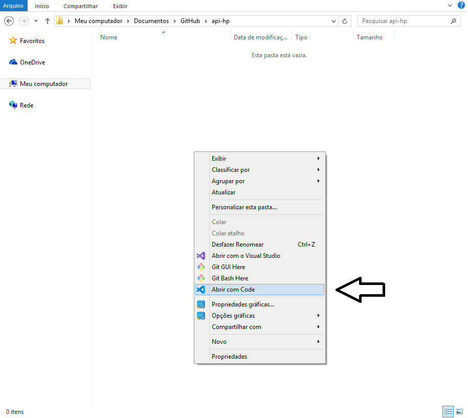
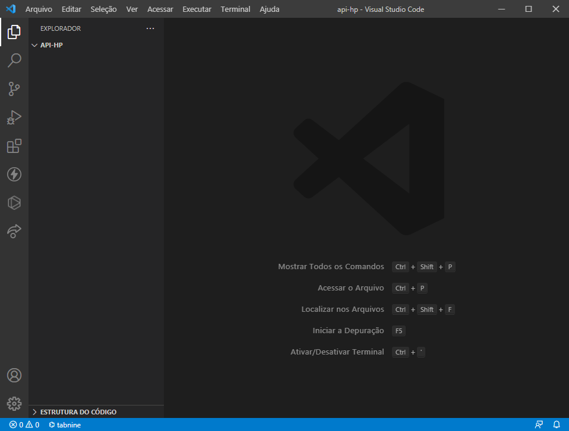
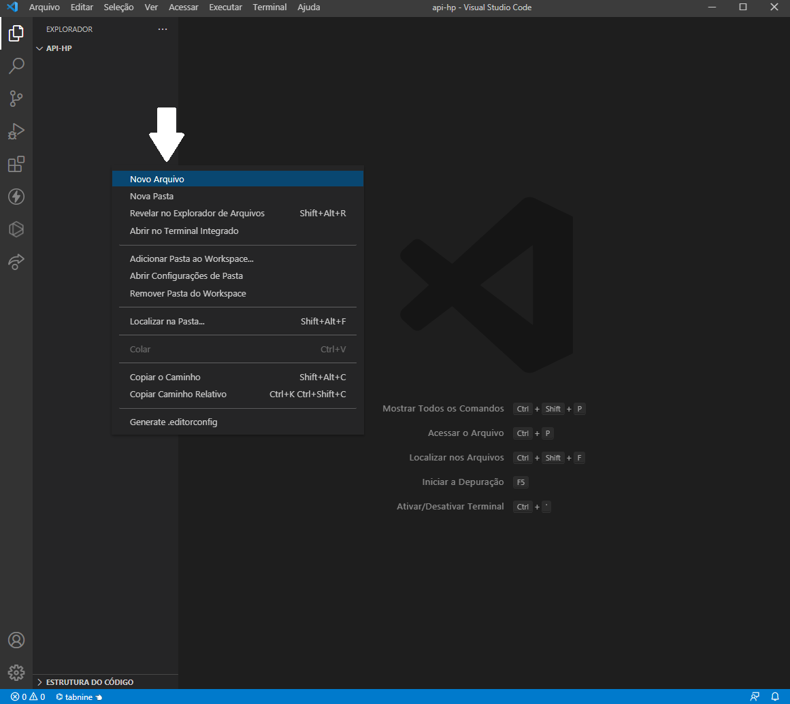
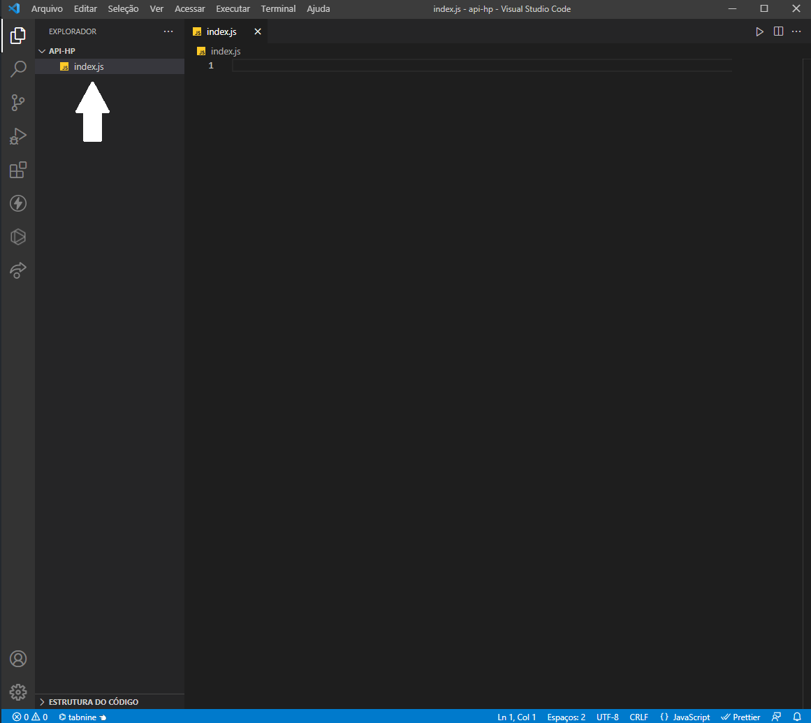
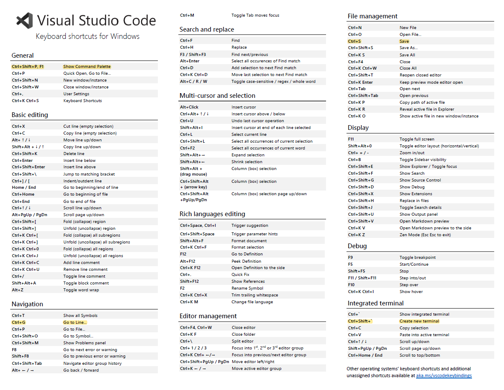
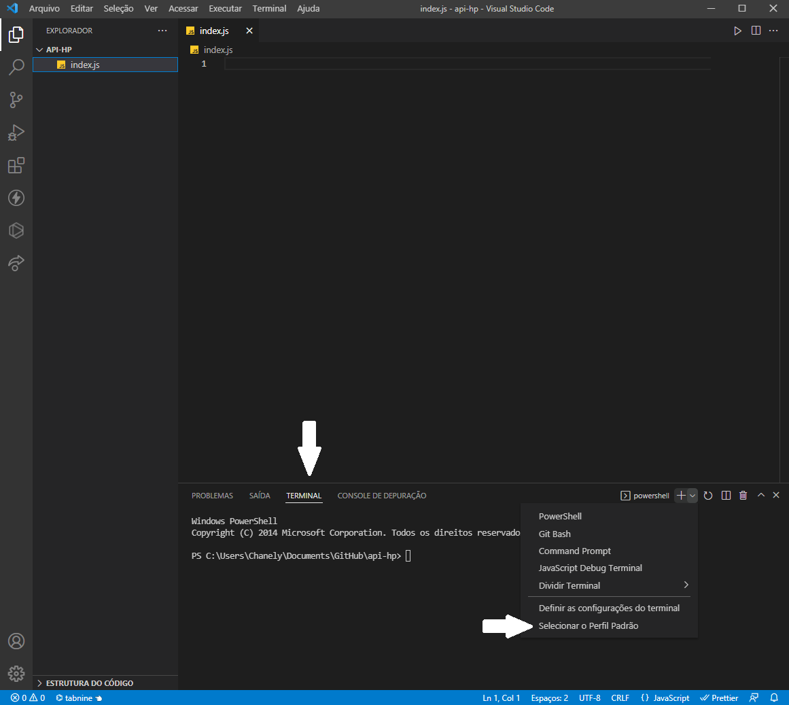
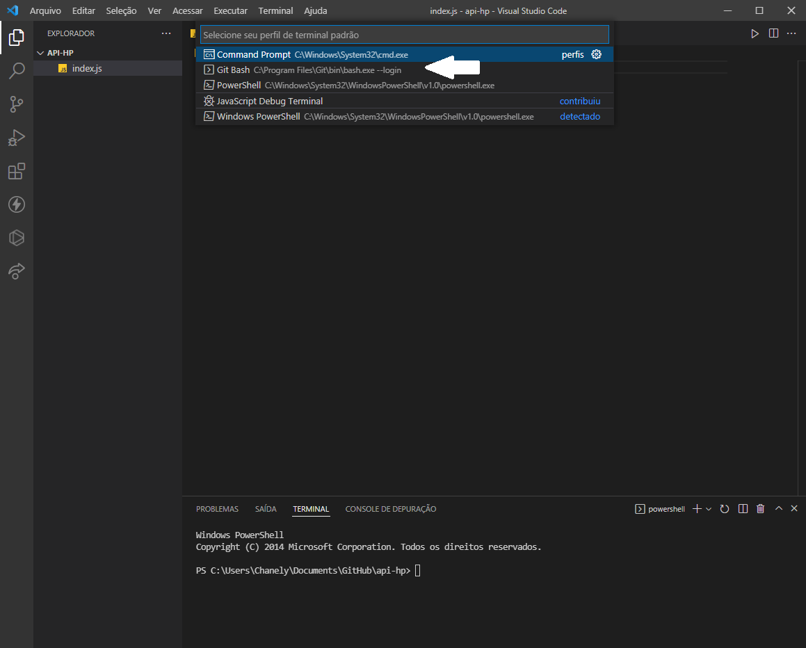

# Aula #4 - Back-end NodeJS - Parte 1

Por <a href="https://www.linkedin.com/in/thicode/" target="_blank">Thiago Lima</a> - Professor <a href="https://blueedtech.com.br/quem-somos/" target="_blank">@Blue Edtech</a> & <a href="https://www.linkedin.com/in/chanelym/" target="_blank">Chanely Marques</a> - Eterna Aprendiz <a href="https://blueedtech.com.br/quem-somos/" target="_blank">@Blue Edtech</a>

Olá :wave:, seja bem-vindo(a) ao quarto vídeo desta série. Nosso objetivo é introduzir conceitos básicos de construção de uma API utilizando o Node.js, Express e MongoDB. #partiu :blue_heart:

## Introdução

Em Tecnologia, diariamente nos deparamos com novos termos e siglas - ~~e que quase sempre deixa a gente bem lost (risos)~~. 

A sopa de letrinhas é gigantesca, nos forçando o estudo constante e perseverante. Por isso, é sempre bom nos atentarmos às definições, traduções e conceitos.

Hoje, o nosso tema é **API**, um acrônimo em inglês para (_Application Programming Interface_), em tradução livre: **interface de programação de aplicação**.

Uma API permite que sua solução ou serviço se comunique com outros produtos e serviços sem precisar saber como eles foram implementados.

> **_NOTA:_** Quando construímos uma API estamos disponibilizando um serviço que pode ser utilizado por qualquer outro serviço e/ou aplicação de maneira isolada.

> **_Curiosidade:_** Quando você ouvir/ler o termo "Consumir uma API", significa que algum serviço ou outra API está utilizando ao menos uma das funcionalidades que a API-fonte fornece.

De maneira bem simplista, podemos dividir alguns softwares em duas camadas:

- **_Front-end_**: a tela com tudo bonitinho que vemos, e;
- **_Backend_**: o lugar onde fica a lógica e também como acontece a comunicação com os dados.

Quando falamos da construção e uma API, estamos dizendo sobre uma importante parte de todo o _Back-end_.

## Como funciona uma API? Onde vive? Do que se alimenta?

Até aqui, podemos concluir que parte do cérebro da nossa aplicação reside na API.

Uma API permite aos desenvolvedores de software tornem processos repetitivos, porém complexos, altamente reutilizáveis, acelerando toda o processo de entregar valor aos clientes.

Podemos ilustrar que uma API é um **grande mensageiro**...

Imagine que você está no seu restaurante favorito, com sua pessoa mais amada <3 escolhendo dentre as diversas opções no menu.

Neste cenário hipotético temos o garçom à sua espera com os pedidos e a cozinha pronta para prover a sua necessidade.

Quando o pedido é feito, o _chef_ não é capaz de recebê-lo, pois ele está focado em preparar a receita. A pessoa do caixa também não pode fazê-lo, pois está responsável em receber os pagamentos.

É aqui que encontramos a necessidade do garçom, que te conecta à cozinha fazendo nota de seu pedido, levando ao _chef_ que irá prepará-lo e à pessoa do caixa, que efetuará a cobrança.

O processo se resume em: garçom toma nota do seu pedido, entrega à cozinha, que irá prepará-lo. Quando pronto, entrega uma resposta, ou seja, o prato pronto a você.

No mundo real, podemos pinçar um site qualquer de compras que em algum momento nos pede para preencher nosso endereço para recebermos um produto.

Os Correios possuem uma API específica que nos ajuda nesta tarefa, que **recebe** o CEP que digitamos no formulário e nos **devolve**  a resposta com as informações da rua, estado, cidade, etc., nos sobrando apenas alguns complementos a serem preenchidos.

Neste cenário:

- A API do site de compras se comunica diretamente com a API dos Correios,
- Que devolve os dados que são exibidos no formulário, e;
- Ao finalizar o preenchimento e apertando o botão de "Ok", os dados são enviados e salvos no banco de dados.

> **_Importante:_** Utilizamos o termo "Persistência de Dados" para nos referir ao armazenamento de dados pelo nosso sistema após o término do processo com o qual foram criados.

Vale salientar que a API dos Correios se comunica com seu próprio banco de dados, onde os CEP's estão armazenados juntamente com as demais informações do logradouro.

## Conceituando: CRUD

Vamos a um conceito **muito** divertido e que é muito utilizado na prática no mundo _Back-end_?

Fonte: https://bit.ly/3IbdhQ6

<!-- 10:00 -->

Para que uma API persista dados em um banco, ela se utiliza de quatro funções básicas:

- **CRIAR:** se trata de uma função que irá **adicionar** um dado novo ao banco
- **LER**: se trata de uma função que será chamada para **ler** os dados no banco
- **ATUALIZAR:** se trata de uma função para **modificar** um dado existente no banco
- **DELETAR:** se trata de uma função para **remover** um dado no banco

## O que vamos precisa para construir nossa API?

Essencialmente, vamos utilizar:

- **Node.js**: um <a href="https://nodejs.org/en/" target="_blank">software</a> que permite a execução de códigos JavaScript fora de um navegador web. Acesse o site e faça a **instalação** do mesmo utilizando a **última versão LTS disponível**.

- **Express.js**: um <a href="https://expressjs.com/en/starter/installing.html" target="_blank">framework</a> para Node.js que fornece recursos mínimos para construção de servidores web

  > **_NOTA:_** Um framework nada mais é que uma caixa de ferramentas que nos ajuda a escrever códigos, reutilizando o que ele nos fornece de forma simples, rápida e eficiente.

- **MongoDB**: um <a href="https://www.mongodb.com/pt-br" target="_blank">banco de dados</a> não-relacional (**NoSQL**) orientado a documentos

  > **_NOTA:_** Quando nos utilizamos do termo "SQL" nos referimos à linguagem e **NoSQL** fala sobre uma base que não é somente SQL. Caso queira saber mais sobre isso, leita <a href="https://blog.geekhunter.com.br/sql-nosql-newsql-qual-banco-de-dados-usar/" target="_blank">este texto.</a>

Inicialmente o **JavaScript** foi criado para ser executado no _Front-end_ e com a criação do Node.js, hoje podemos escrever códigos no lado do servidor e para facilitar esta escrita, o _Express_ nos ajuda.

- **VS Code:** é um <a href="https://code.visualstudio.com/?wt.mc_id=DX_841432" target="_blank">editor de texto</a> maravilhÓtimo fornecido pela Microsoft e que nos ajudará a codificar a API. Acesse o site e faça a **instalação** do mesmo.

- **Pasta para o projeto:** crie no local de sua preferência uma pasta chamada **api-hp** e nela, clique com o botão direito do mouse e selecione a opção **Abrir com Code**.

  

E com o _VS Code_ aberto, podemos notar nossa pasta aberta no explorador:

## Primeiros-Passos no VS Code

<!-- 12:15 -->

Antes de colocarmos a mão no código, precisamos preparar o ambiente de forma a aumentar um pouco a nossa Performance. Para isto, vamos criar o arquivo onde codificaremos nossa API e configurar o VS Code.

Clique com o botão direito no **Explorador** > **Novo Arquivo** e dê o nome de `index.js`

Após a criação do arquivo, sua tela deverá estar assim:

Todas as vezes que criamos arquivos com a extensão `.js` estamos nos referindo à extensão **JavaScript** e será neste arquivo que codificaremos o funcionamento da nossa API.

A partir daqui, manipularemos muito o VS Code e por isso, recomendamos que faça o download do arquivo abaixo onde estarão listados os atalhos da ferramenta e atente-se aos marcados em `amarelo`, pois são alguns dos que mais usamos. :wink:

<a href="https://code.visualstudio.com/shortcuts/keyboard-shortcuts-windows.pdf" target="_blank">Clique Aqui</a> para baixar o arquivo diretamente do site do VS Code.

Apertando as teclas **Control + Shift + '** abriremos o terminal integrado que acompanha nossa ferramenta, e nele poderemos digitar comando para instalar aplicativos, bibliotecas e executar a aplicação.

Por padrão este terminal vem configurado no **Powershell** e sugerimos que altere o seu modo de funcionamento, abrindo as opções e clicando em **Selecionar o Perfil Padrão**.

E na tela que abrir, selecione o terminal de sua preferência. Sugerimos que escolha o **Git Bash**:

Feito isso, encerre o terminal clicando no ícone da **Lixeira** e abra um novo.

Onde:

- **Chanely @ todynho: ** indica o nome da pessoa usuária `Chanely` executando tarefas no computador `todynho`. Você deverá ver o usuário que está utilizando e o nome do seu computador.
- **MINGW64:** fala sobre um conjunto de ferramentas minimalistas `GNU` para sistemas 64-bits. (Não entraremos em detalhes nesta aula).
- **~Documents/GitHub/api-hp:** indica o diretório, ou a pasta, em que estamos executando o terminal. Note que é a mesma pasta onde iniciamos o VS Code.
- **$:** marca o início da linha onde digitaremos nossos comandos e deve ser **ignorado**.

## Primeiros-Passos na Aplicação

A API que estamos começando a construir, servirá dados dos personagens de **Harry Potter**. 

> **_DICA:_** Pause o vídeo e/ou leitura para adicionar tantos personagens quanto lembrar. Aqui, nós te ensinamos o beabá e ficamos muito felizes quando nossos alunos nos mostram o que fizeram a mais. 

