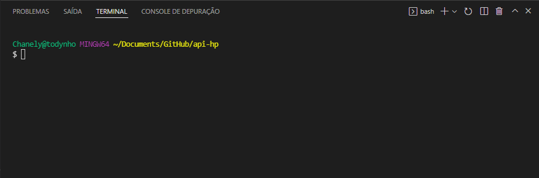
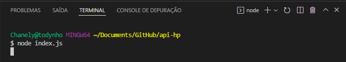
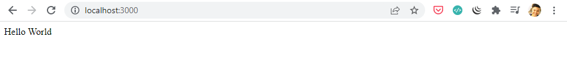
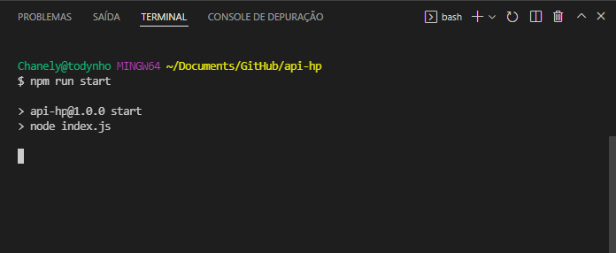

# Aula #4 - Back-end NodeJS - Parte 1

Por <a href="https://www.linkedin.com/in/thicode/" target="_blank">Thiago Lima</a> - Professor <a href="https://blueedtech.com.br/quem-somos/" target="_blank">@Blue Edtech</a> & <a href="https://www.linkedin.com/in/chanelym/" target="_blank">Chanely Marques</a> - Eterna Aprendiz <a href="https://blueedtech.com.br/quem-somos/" target="_blank">@Blue Edtech</a>

Olá :wave:, seja bem-vindo(a) ao quarto vídeo desta série. Nosso objetivo é introduzir conceitos básicos de construção de uma API utilizando o Node.js, Express e MongoDB. #partiu :blue_heart:

## Introdução

Em Tecnologia, diariamente nos deparamos com novos termos e siglas - ~~e que quase sempre deixa a gente bem lost (risos)~~. 

A sopa de letrinhas é gigantesca, nos forçando o estudo constante e perseverante. Por isso, é sempre bom nos atentarmos às definições, traduções e conceitos.

Hoje, o nosso tema é **API**, um acrônimo em inglês para (_Application Programming Interface_), em tradução livre: **interface de programação de aplicação**.

Uma API permite que sua solução ou serviço se comunique com outros produtos e serviços sem precisar saber como eles foram implementados.

> **_NOTA:_** Quando construímos uma API estamos disponibilizando um serviço que pode ser utilizado por qualquer outro serviço e/ou aplicação de maneira isolada.

> **_Curiosidade:_** Quando você ouvir/ler o termo "Consumir uma API", significa que algum serviço ou outra API está utilizando ao menos uma das funcionalidades que a API-fonte fornece.

De maneira bem simplista, podemos dividir alguns softwares em duas camadas:

- **_Front-end_**: a tela com tudo bonitinho que vemos, e;
- **_Back-end_**: o lugar onde fica a lógica e também como acontece a comunicação com os dados.

Quando falamos da construção e uma API, estamos dizendo sobre uma importante parte de todo o _Back-end_.

## Como funciona uma API? Onde vive? Do que se alimenta?

Até aqui, podemos concluir que parte do cérebro da nossa aplicação reside na API.

Uma API permite aos desenvolvedores de software tornem processos repetitivos, porém complexos, altamente reutilizáveis, acelerando toda o processo de entregar valor aos clientes.

Podemos ilustrar que uma API é um **grande mensageiro**...

Imagine que você está no seu restaurante favorito, com sua pessoa mais amada <3 escolhendo dentre as diversas opções no menu.

Neste cenário hipotético temos o garçom à sua espera com os pedidos e a cozinha pronta para prover a sua necessidade.

Quando o pedido é feito, o _chef_ não é capaz de recebê-lo, pois ele está focado em preparar a receita. A pessoa do caixa também não pode fazê-lo, pois está responsável em receber os pagamentos.

É aqui que encontramos a necessidade do garçom, que te conecta à cozinha fazendo nota de seu pedido, levando ao _chef_ que irá prepará-lo e à pessoa do caixa, que efetuará a cobrança.

O processo se resume em: garçom toma nota do seu pedido, entrega à cozinha, que irá prepará-lo. Quando pronto, entrega uma resposta, ou seja, o prato pronto a você.

No mundo real, podemos pinçar um site qualquer de compras que em algum momento nos pede para preencher nosso endereço para recebermos um produto.

Os Correios possuem uma API específica que nos ajuda nesta tarefa, que **recebe** o CEP que digitamos no formulário e nos **devolve**  a resposta com as informações da rua, estado, cidade, etc., nos sobrando apenas alguns complementos a serem preenchidos.

Neste cenário:

- A API do site de compras se comunica diretamente com a API dos Correios,
- Que devolve os dados que são exibidos no formulário, e;
- Ao finalizar o preenchimento e apertando o botão de "Ok", os dados são enviados e salvos no banco de dados.

> **_Importante:_** Utilizamos o termo "Persistência de Dados" para nos referir ao armazenamento de dados pelo nosso sistema após o término do processo com o qual foram criados.

Vale salientar que a API dos Correios se comunica com seu próprio banco de dados, onde os CEP's estão armazenados juntamente com as demais informações do logradouro.

## Conceituando: CRUD

Vamos a um conceito **muito** divertido e que é muito utilizado na prática no mundo _Back-end_?


Fonte: https://bit.ly/3IbdhQ6

<!-- 10:00 -->

Para que uma API persista dados em um banco, ela se utiliza de quatro funções básicas:

- **CRIAR:** se trata de uma função que irá **adicionar** um dado novo ao banco
- **LER**: se trata de uma função que será chamada para **ler** os dados no banco
- **ATUALIZAR:** se trata de uma função para **modificar** um dado existente no banco
- **DELETAR:** se trata de uma função para **remover** um dado no banco

## O que vamos precisa para construir nossa API?

Essencialmente, vamos utilizar:

- **Node.js**: um <a href="https://nodejs.org/en/" target="_blank">software</a> que permite a execução de códigos JavaScript fora de um navegador web. Acesse o site e faça a **instalação** do mesmo utilizando a **última versão LTS disponível**.

- **Express.js**: um <a href="https://expressjs.com/en/starter/installing.html" target="_blank">framework</a> para Node.js que fornece recursos mínimos para construção de servidores web

  > **_NOTA:_** Um framework nada mais é que uma caixa de ferramentas que nos ajuda a escrever códigos, reutilizando o que ele nos fornece de forma simples, rápida e eficiente.

- **MongoDB**: um <a href="https://www.mongodb.com/pt-br" target="_blank">banco de dados</a> não-relacional (**NoSQL**) orientado a documentos

  > **_NOTA:_** Quando nos utilizamos do termo "SQL" nos referimos à linguagem e **NoSQL** fala sobre uma base que não é somente SQL. Caso queira saber mais sobre isso, leita <a href="https://blog.geekhunter.com.br/sql-nosql-newsql-qual-banco-de-dados-usar/" target="_blank">este texto.</a>

Inicialmente o **JavaScript** foi criado para ser executado no _Front-end_ e com a criação do Node.js, hoje podemos escrever códigos no lado do servidor e para facilitar esta escrita, o _Express_ nos ajuda.

- **VS Code:** é um <a href="https://code.visualstudio.com/?wt.mc_id=DX_841432" target="_blank">editor de texto</a> maravilhÓtimo fornecido pela Microsoft e que nos ajudará a codificar a API. Acesse o site e faça a **instalação** do mesmo.

- **Pasta para o projeto:** crie no local de sua preferência uma pasta chamada **api-hp** e nela, clique com o botão direito do mouse e selecione a opção **Abrir com Code**.

  

E com o _VS Code_ aberto, podemos notar nossa pasta aberta no explorador:


## Primeiros-Passos no VS Code

<!-- 12:15 -->

Antes de colocarmos a mão no código, precisamos preparar o ambiente de forma a aumentar um pouco a nossa Performance. Para isto, vamos criar o arquivo onde codificaremos nossa API e configurar o VS Code.

Clique com o botão direito no **Explorador** > **Novo Arquivo** e dê o nome de `index.js`


Após a criação do arquivo, sua tela deverá estar assim:


Todas as vezes que criamos arquivos com a extensão `.js` estamos nos referindo à extensão **JavaScript** e será neste arquivo que codificaremos o funcionamento da nossa API.

A partir daqui, manipularemos muito o VS Code e por isso, recomendamos que faça o download do arquivo abaixo onde estarão listados os atalhos da ferramenta e atente-se aos marcados em `amarelo`, pois são alguns dos que mais usamos. :wink:


<a href="https://code.visualstudio.com/shortcuts/keyboard-shortcuts-windows.pdf" target="_blank">Clique Aqui</a> para baixar o arquivo diretamente do site do VS Code.

Apertando as teclas **Control + Shift + '** abriremos o terminal integrado que acompanha nossa ferramenta, e nele poderemos digitar comando para instalar aplicativos, bibliotecas e executar a aplicação.

Por padrão este terminal vem configurado no **Powershell** e sugerimos que altere o seu modo de funcionamento, abrindo as opções e clicando em **Selecionar o Perfil Padrão**.


E na tela que abrir, selecione o terminal de sua preferência. Sugerimos que escolha o **Git Bash**:


Feito isso, encerre o terminal clicando no ícone da **Lixeira** e abra um novo.



Onde:

- **Chanely** @ **todynho:** indica o nome da pessoa usuária `Chanely` executando tarefas no computador `todynho`. Você deverá ver o usuário que está utilizando e o nome do seu computador.
- **MINGW64:** fala sobre um conjunto de ferramentas minimalistas `GNU` para sistemas 64-bits. (Não entraremos em detalhes nesta aula).
- **~Documents/GitHub/api-hp:** indica o diretório, ou a pasta, em que estamos executando o terminal. Note que é a mesma pasta onde iniciamos o VS Code.
- **$:** marca o início da linha onde digitaremos nossos comandos e deve ser **ignorado**.

## Primeiros-Passos na Aplicação

<!-- 13:32 -->

A API que estamos começando a construir, servirá dados dos personagens de **Harry Potter**. 

> **_DICA:_** Pause o vídeo e/ou leitura para adicionar tantos personagens quanto lembrar. Aqui, nós te ensinamos o beabá e ficamos muito felizes quando nossos alunos nos mostram o que fizeram a mais. 

Para iniciar nosso projeto em Node.js, vamos digitar no terminal o comando `npm init`


Onde:

- **npm:** é a sigla para <a href="https://docs.npmjs.com/cli/v6/commands/npm/" target="_blank">_Node Package Manager_</a>, ou seja, o gerenciador de pacotes do Node. Não entraremos no detalhe dele agora, porém, recomendamos que leia sua documentação porque o npm é capaz de realizar **muitas** coisas.
- **init:** inicia um novo projeto Node na pasta.

E então algumas informações de preenchimento nos são solicitadas e sua confirmação:


Onde:

- **package name: (api-hp):** aqui confirmamos ou damos outro nome à nossa API, no caso, `api-hp`;

- **version: (1.0.0):** versão da API;

- **description:** breve descrição sobre o que é a API que estamos criando;

- **entry point: (index.js):** arquivo onde nossa aplicação será iniciada;

- **test command:** comando utilizado para realizarmos testes;

- **git repository:** repositório no _Git_ onde armazenaremos nosso código. Não utilizaremos esta função neste projeto;

- **keywords:** palavras-chave de auxílio;

- **author:** pessoas que estão codificando a API, e;

- **license: (ISC):** licença utilizada para este projeto. 

  > **SOBRE LICENÇAS:** Você pode entender um pouco mais sobre este assunto importantíssimo vendo este <a href="https://www.youtube.com/watch?v=fPfzp6ov2bQ" target="_blank">vídeo</a> no canal **Código Fonte TV**.

Ao término, note que um arquivo chamado `package.json` foi criado, e ao abrirmos este arquivo clicando nele, seu conteúdo está preenchido com as informações anteriores:


O formato de arquivo **JSON** se refere a _JavaScript Object Notation_, ou seja, **uma forma de escrever arquivos JavaScript como objetos** e, atualmente é a forma mais simples e leve de **transmitir** e **solicitar** informações entre APIs.

> **_DICA_:** Você pode ler um pouco mais ~~prometo que é só um pouco~~ sobre JSON, clicando neste <a href="https://www.alura.com.br/artigos/o-que-e-json" target="_blank">link.</a>

A importância deste arquivo para a nossa aplicação é que nele configuramos os _scripts_ de testes, acompanhamos tudo o que é instalado para o correto funcionamento da API e sua configuramos sua forma de funcionar. :wink:

> **_IMPORTANTE_**: o `package.json` fala sobre a configuração da API local, ou seja, a que estamos configurando. De forma alguma enviamos ou recebemos este arquivo entre APIs.

## O Primeiro 'Olá mundo!' com Express

<!-- 20:25 -->

Ao acessar o site do <a href="https://www.npmjs.com/" target="_blank">npm</a> e digitar 'express' na barra de busca podemos notar uma imensidão de bibliotecas relacionadas a ele:


Quando clicamos em **express** a página que abre contém informações importantes pra nós:


Onde:

```bash
npm i express
```

É o comando para a instalação (**i ou _install_**) do _express_ em nosso terminal através do **npm** que é instalado juntamente com o Node.js:


Ao término, percebemos que **50** novos pacotes foram instalados e **51** checados por vulnerabilidades. Além disso, uma pasta chamada **node_modules** foi criada e o arquivo `package-lock.json`:


O `package-lock.json` vai controlar a versão do _express_ e tudo o que veio com ele e para evitar catástrofes, é importante **não mexer** neste arquivo.

Na pasta `node_module` encontramos tudo que veio instalado junto com o _express_.

Voltando lá no site do **npm** vamos copiar o _template_ básico de configuração do _express_:

```javascript
const express = require('express')
const app = express()

app.get('/', function (req, res) {
  res.send('Hello World')
})

app.listen(3000)
```

E colar em nosso arquivo `index.js`. Vamos entender o que estamos fazendo:

```javascript
const express = require('express')
```

Cria uma variável imutável chamada `express` com uma função `require` que busca por `express` na pasta node_modules e armazena tudo na variável.

```javascript
const app = express()
```

Estamos executando `()` o _express_ dentro da variável `app`, ou seja, todas as vezes que chamarmos `app` é o mesmo que executar `express()`.

```javascript
app.listen(3000)
```

O _express_ irá criar na máquina local um servidor que escutará na porta `3000`. 

Agora, podemos salvar o arquivo e executá-lo em nosso terminal através do comando `node index.js`

Caso tenha dado algum erro na execução, busque por falhas de escrita no código, ou se o arquivo não foi salvo corretamente através da bolinha que indica que o arquivo precisa ser salvo:


> **_DICA:_** Ao clicar em **Arquivo** o VS Code nos dá uma opção de **Salvamento Automático**. Caso seu computador seja mais simples, sugiro não utilizar essa opção com o **nodemon**, que instalaremos em breve, para não sobrecarregar a execução do terminal. :wink:

Após rodar o comando acima, não recebemos nada na saída do terminal, pois **apenas pedimos** ao Node para escutar na porta `3000`. 



Isto gera um incômodo, uma sensação de que nada está funcionando e podemos checar se está tudo certo, indo até o navegador e digitando `localhost:3000`



Ufa, nosso **Hello World** foi exibido com sucesso, indicando que nossa aplicação está sendo executada corretamente. Mas, pera, onde esta mensagem foi configurada?

```javascript
app.get('/', function (req, res) {
  res.send('Hello World')
})
```

Vamos entender:

- `app.get()` é uma **função** do _express_ que quando chamada, **recebe** os parâmetros que configuramos a seguir:

  - `'/'`, o primeiro parâmetro da função `app.get()` que significa raiz, o ponto de partida;

  - Uma função **callback**, o segundo parâmetro da função `app.get()` que nada mais é do uma função executada dentro de `app.get()`:

    ```javascript
    function (req, res) {
      res.send('Hello World')
    }
    ```

    Esta função de **callback** também recebe dois parâmetros:

    - `req` de requisição, ou seja, ele recebe o que digitarmos no navegador, e;

    - `res` de resposta, ou seja, devolve a mensagem que configurarmos.

    Ela envia uma resposta na tela através do `res.send()`, mostrando a mensagem que digitarmos entre as **' '** simples todas as vezes que a rota `'/'` é solicitada.

    Por tanto, todas as vezes que digitarmos no navegador **localhost:3000**, a função `app.get()` será chamada e se configurada corretamente, nos devolverá a mensagem **'Hello World**.


Para que este conhecimento fique mais claro, vamos chamar no navegador **localhost:3000/ola**, que deve nos devolver a mensagem: **Olá mundo!**

Primeiro, pause a execução no terminal digitando **Control+C** e edite o código da forma que segue:

```javascript
const express = require('express')
const app = express()

app.get('/ola', function (req, res) { 
  // Dentro das aspas acima nós configuramos o /ola, que
  // será chamado após o :3000 no navegador

  res.send('Olá mundo!')
  // Olá mundo! é a mensagem que queremos de resposta
  // A gente configura a resposta nesta função
})

app.listen(3000)
```

> **_DICA:_** Usamos sempre // para realizar comentários no código e estes não são executados pela aplicação. :wink: 

Salve o arquivo e digite `node index.js` novamente, vá até o navegador e digite **localhost:3000/ola**


<!-- 28:40 -->

Interessante notar o que acontece no navegador se tentarmos acessar novamente **localhost:3000** 


O navegador já considera que após o 3000 já existe uma **"/"** , chamando ela no `app.get()` e que neste momento, já não existe mais pois alteramos a rota para receber **"/ola"**.

> **_IMPORTANTE:_** Quando usamos o termo **rota** em API, estamos nos referindo a um "caminho" que é chamado por outra API ou um cliente, como o navegador por exemplo, e que responde com alguma configuração que fizermos.
>
> Cada rota pode ter uma ou mais funções, realizar cálculos e devolver a respostas para a tela, enfim... podemos fazer **n** coisas em uma rota. 
>
> Contudo, cada rota **deve ser única** dentro da API. :wink:

Vamos adicionar a rota **"/"** à nossa aplicação novamente, que nos devolverá a mensagem **Home**. 

Pause a execução no terminal digitando **Control+C** e edite o código da forma que segue:

```javascript
const express = require('express');
const app = express();

app.get('/', function (req, res) {
  res.send('Home');
});

app.get('/ola', function (req, res) {
  res.send('Olá mundo!');
});

app.listen(3000);
```

Salve o arquivo e digite `node index.js` novamente, vá até o navegador e digite **localhost:3000**


Pronto! Agora temos duas rotas **diferentes** configuradas em nossa API. :smiley:

<!-- 32:00 -->

### Automatizando a execução do servidor

Até aqui, todas as vezes que realizamos uma mudança no código, precisamos para o terminal e executar `node index.js` novamente para que as alterações sejam executadas.

Podemos automatizar essa execução sempre **após salvar** o arquivo através do **nodemon**, que é uma biblioteca para Node.js que reinicia automaticamente o servidor.

No site do npm, vamos buscar pelo **nodemon** e ver como podemos instalar:


Ótimo! No terminal podemos executar o comando abaixo para realizar a sua instalação:

```bash
npm i nodemon
```


Com o _nodemon_ instalado, vamos configurar a automatização do servidor no arquivo `package.json`. Primeiro, vamos melhorar a forma de executar o comando `node index.js` na parte de **scripts**.

Remova este conteúdo:

```json
"test": "echo \"Error: no test specified\" && exit 1"
```

E, adicione:

```json
"start": "node index.js"
```

Salve o arquivo, vá até o terminal e digite:

``` bash
npm run start
```



Nós configuramos o comando `node index.js` para ser executado todas as vezes que digitamos `npm run start`.

Agora,  precisamos colocar _nodemon_ no meio dessa execução. Vamos fazer mais uma alteração no arquivo `package.json` na parte de **scripts**:

```json
"scripts": {
    "start": "node index.js",
    "dev": "nodemon index.js"
 },
```

Onde `dev` chama o _nodemon_ executando nosso servidor configurado no `index.js`. Vamos ao terminal e ver o que acontece:

```bash
npm run dev
```

<!-- 38:00 -->


A linha verde nos indica que o _nodemon_ está executando nosso servidor com sucesso. Antes, contudo, precisamos entender algumas coisas.

Anteriormente dissemos que o **npm** é um gerenciador de pacotes e agora, estamos percebendo que é possível fazer mais coisas com ele!

A grosso modo... quando utilizamos `npm run`, uma espécie de interface é disponibilizada e onde podemos configurar diversas formas de execução do servidor. 

Estas configurações são feitas e lidas pelo **npm** ali na parte de scripts do arquivo `package.json`. Portanto:

- `npm run start` executa o comando **node index.js**, e;
- `npm run dev` executa o comando **nodemon index.js**.

Quando o _nodemon_ é executado, as coisas abaixo acontecem:

- Na primeira linha temos a versão do pacote;
- Na segunda recebemos a informação de que para reiniciar o serviço, basta digitar `rs`;
- Na terceira linha ele fica procurando alterações em arquivos **.js, .mjs e .json**, e;
- Por fim, na quarta linha, o servidor é iniciado.

Ainda sim, a saída deste terminal gera um um tanto de desconforto porque quase nenhuma informação a mais é passada pra gente. Vamos dar uma melhorada nisso!

No arquivo `index.js` a gente configurou o servidor para ouvir na porta 3000. Vamos fazer com que nosso terminal nos diga isto adicionando as configurações a seguir:

```javascript
app.listen(3000, () => {
  console.log("Servidor rodando em http://localhost:3000");
});
```

Aqui, estamos passando mais alguns parâmetros para a função `app.listen()`:

- A porta 3000;
- Uma _arrow function_ `() => { }` que:
  - Devolve pra tela através do `console.log()` a mensagem **Servidor rodando em http://localhost:3000**

> **_DICA:_** Você pode explorar mais sobre <a href="https://www.youtube.com/watch?v=mc3TKp2XzhI" target="_blank">funções</a> nesta aula maraviGold do professor Guanabara :heartbeat: ou ler mais a respeito na própria <a href="https://developer.mozilla.org/pt-BR/docs/Web/JavaScript/Guide/Functions" target="_blank">documentação</a>

Salve o arquivo e vamos ver a saída em nosso terminal:


Agora sim! Mais confortável...

Antes de prosseguirmos, vamos entender duas coisas acerca do terminal que irá nos ajudar na próxima tarefa: 

- Quando a gente clica no ícone da **lixeira**, nosso terminal é encerrada e perdemos a execução do servidor, sendo necessário rodar `npm run dev` novamente:

  

- Quando clicamos no ícone do **x**, apenas fechamos o painel que contém o terminal sem perder execução do servidor. O atalho no teclado para **fechar** o terminal e também **abrí-lo** novamente é **Control + J**. :wink:

  

A segunda coisa que precisamos entender é que o terminal nos ajuda em muitos sentidos. Se passarmos o mouse em cima de **localhost:3000** e segurarmos a tecla **Control** no teclado, ele abre automaticamente uma nova tela no navegador:


Experimente! :wink:

<!-- 40:07 -->

### Fazendo requisições com o Thunder

Enquanto pessoas desenvolvedoras _Back-end_, mexemos muito pouco com interfaces gráficas. Não é correto realizarmos nossos testes e saber se as coisas estão acontecendo como gostaríamos pelo navegador.

Para nos auxiliar nisso, o VS Code conta com uma extensão maraviGold chamada **Thunder**, vamos instalá-la clicando no ícone de extensões ou utilizando o atalho **Control + Shift + x**:


Na barra de pesquisa digite **Thunder** e selecione o ícone abaixo, clicando em **Instalar**:


Após a instalação, o _thunder_ fica disponível pra gente na barra:


<!-- 41:05 -->

Clicando em **New Request**, o VS Code abre pra gente uma tela cheia de coisas e o mais interessante neste momento, é a URL **https://www.thunderclient.com/welcome**. Vamos clicar no botão **Send** e ver o que acontece:


A resposta parece bastante com algo que já vimos até aqui, um **json**:


Desde já, é um formato que vamos nos acostumando a trabalhar, pois utilizaremos muito como forma de enviar e receber informações entre APIs. :wink:

<!-- 41:50 -->

Agora, vamos testar nosso servidor... entender o que ele nos devolve na tela. 

Na barra de endereço:

- Vamos remover o que está escrito;
- Inserir o endereço do nosso servidor - **http://localhost:3000**, e;
- Realizar a requisição apertando o botão **Send**


O servidor está mostrando exatamente o que configuramos nele, porém, não um JSON. 

Vamos alterar nosso arquivo `index.js` para que ao acessar as rotas, uma mensagem em formato JSON seja enviada pra nós:

```javascript
app.get('/', function (req, res) {
  res.send({
    message: 'Home'
  });
});

app.get('/ola', function (req, res) {
  res.send({
    message: 'Olá mundo!'
  });
});
```

Em ambas as rotas:

- Usamos as chaves **{ }** para dizer ao JavaScript que vamos criar um objeto, neste caso, em JSON;
- Usamos o parâmetro **message** como chave para o nosso objeto, e;
- O valor **'Home'** como chave para a rota **/** e, **'Olá mundo!'** para a rota **/ola**

> **_DICA:_** Caso queira entender melhor sobre Objetos com JavaScript, <a href="https://developer.mozilla.org/pt-BR/docs/Learn/JavaScript/Objects/Basics" target="_blank">clique aqui</a>. Não entraremos neste tema para esta aula.

Vamos novamente salvar o arquivo e apertar o botão **Send** no Thunder para ver a nova resposta:


Mas, Chanely, no arquivo `index.js` nós configuramos a **message** sem aspas. Como a requisição devolveu ela com as aspas?

Não entraremos no detalhe pois não é o foco desta aula. Podemos dizer que o _Express_ realiza esta tarefa por debaixo dos panos e conforme vamos nos aprofundando em **protocolos**, esta maquinaria toda fica mais clara pra gente. :smile:

E, falando em protocolos, nossas requisições são feitas utilizando um dos mais conhecidos: **HTTP**. 

> **_DICA:_** O pessoal do Código Fonte TV também têm um <a href="https://www.youtube.com/watch?v=hwttZtWkXTk" target="_blank">vídeo</a> super bacana sobre o tema.

Neste momento é importante entendermos que o _HTTP_ executa algumas ações. 

Se lembrarmos bem de nossas aulas de português, sabemos que **um verbo fala de uma ação**, ou seja, o _HTTP_ se utiliza de **verbos** para realizar ações:

- **GET**  - utilizado para obter um resultado;
- **POST** - utilizado para adicionar um novo registro;
- **PUT** - utilizado para editar os dados de um registro de que já existe, e;
- **DELETE** - utilizado para remover um registro existente.

O _HTTP_ conta com mais verbos, porém, para a execução de um CRUD básico, somente estes quatro são necessários.

>  **_DICA:_** Você pode ler um pouco mais sobre os verbos _HTTP_ clicando <a href="https://www.devmedia.com.br/servicos-restful-verbos-http/37103" target="_blank">aqui</a>

Atente-se aqui que CRUD **não é** o mesmo que realizar requisições _HTTP_, esta é um equívoco que cometemos.

As raízes do CRUD estão em **registros relacionados a banco de dados**.

As requisições _HTTP_ fala sobre um estilo de arquitetura chamado **REST**.

Segundo o <a href="https://pt.stackoverflow.com/questions/488912/qual-a-diferen%C3%A7a-entre-rest-api-e-crud#:~:text=CRUD%20%C3%A9%20um%20conjunto%20de,interage%20com%20um%20sistema%20complexo." target="_blank">Stackoverflow</a>, temos a seguinte definição:

> CRUD é um conjunto de operações primitivas (principalmente para bancos de dados e armazenamento de dados estáticos), enquanto o REST é um estilo de API de nível muito alto (principalmente para serviços da Web e outros sistemas "ativos").
>
> O primeiro manipula dados básicos, o outro interage com um sistema complexo.

<!-- 46:40 -->

Agora que entendemos a diferença entre CRUD e uma requisição _HTTP_, vamos configurar nossa API para **persistir os dados em um simples arquivo JSON** antes de evoluir para o banco de dados.

Este processo é importante para vermos na prática se entendemos os conceitos acima. :wink:

Tal qual Jack, vamos por partes... se temos uma requisição _HTTP_ para cada operação CRUD, vamos precisar de uma única rota para cada requisição.

No arquivo `index.js` vamos adicionar comentários no código de forma a nos apoiar no que vamos fazer:

```javascript
const express = require('express');
const app = express();

// Rotas da minha API

// 1 - Método HTTP GET - Operação Read

app.get('/', function (req, res) {
  res.send({
    message: 'Home'
  });
});

// 2 - Método HTTP POST - Operação Create

// 3 - Método HTTP PUT - Operação Update

// 4 - Método HTTP DELETE - Operação Delete

app.listen(3000, () => {
  console.log("Servidor rodando em http://localhost:3000");
});

```

Até aqui, nós vimos como enviar uma mensagem através do Thunder e para alcançar nosso primeiro resultado, que é enviar uma lista de personagens armazenados em **memória**, precisamos preparar nossa rota `app.get` para mostrar essa informação na tela.

Vamos entender isso através de um simples _array_, ou seja, uma lista:

``` javascript
const express = require('express');
const app = express();

// Array contendo os personagens

const characters = [2, 3, 4, 5];

// Rotas da minha API

// 1 - Método HTTP GET - Operação Read

app.get('/', function (req, res) {
  res.send(characters); // Adicionando o Array na resposta para ser exibida na tela
});

// 2 - Método HTTP POST - Operação Create

// 3 - Método HTTP PUT - Operação Update

// 4 - Método HTTP DELETE - Operação Delete

app.listen(3000, () => {
  console.log("Servidor rodando em http://localhost:3000");
});

```

Ao realizar a requisição, a resposta é exatamente a nossa lista:


Entretanto, novamente a resposta não é um _JSON_ e sim uma lista de números. Para facilitar o nosso trabalho, vamos configurar o _Express_ para sempre nos retornar a resposta em um _JSON_.

```javascript
const express = require('express');
const app = express();

app.use(express.json());
```

Onde `app.use` é uma função que diz para a aplicação utilizar `app.json()`, que também é uma função, em todas as respostas e requisições. :wink:

Vamos testar:


Ué!? Parece que o trem tá doido, mas tá não. :smiley:

Lembra que anteriormente nós criamos um **objeto** e que ao fazer isso a resposta na tela retornou em formato _JSON_? Exatamente, precisamos transformar esta lista numa lista de objetos:

```javascript
const characters = [
  { number: 2 },
  { number: 3 }, 
  { number: 4 }, 
  { number: 5 }
];
```

Onde:

- **number** representa a _key_, e;
- Cada um dos números, um valor.

Vamos testar novamente:


Para uma lista de objetos, cada um dos números **representa um único objeto** diferente.

O número **2** é par e tem seu formato único. O mesmo acontece com cada dígito do nosso sistema atual de números.

Com isso em mente, cada personagem do _Harry Potter_ em nossa lista, será um objeto com:

- Nome;
- Espécie;
- Casa, e;
- Ator que interpreta o personagem.

Vamos começar pelo próprio _Harry_: 

```javascript
const characters = [
  { 
    name: 'Harry Potter',
    specie: 'Human',
    house: 'Gryffindor',
    portrayedBy: 'Daniel Radcliffe'
  },
];
```

E ver como ficou nossa requisição:


Ótimo, o _Express_ está transformando nosso objeto num _JSON_, colocando aspas também nas chaves, e exibindo o resultado que esperamos na tela. 

Vamos adicionar mais um personagem à nossa lista e um detalhe importante em cada um deles:

```javascript
const characters = [
  { 
    id: 1,
    name: 'Harry Potter',
    specie: 'Human',
    house: 'Gryffindor',
    portrayedBy: 'Daniel Radcliffe'
  }, // Após esta vírgula, adicionamos a personagem abaixo
  { 
    id: 2,
    name: 'Hermione Granger',
    specie: 'Human',
    house: 'Gryffindor',
    portrayedBy: 'Emma Watson'
  },
];
```

Ao adicionarmos a _Hermione_, também colocamos **identificadores** numéricos em cada um destes personagens.

Cada identificador impede que tenhamos informações duplicadas em nossa lista de objetos e também no banco de dados. 

Este identificador é criado de forma **automática** pelo banco, entretanto, nós estamos utilizando dados apenas em memória e por isso, precisamos criar manualmente.

Dando andamento, vamos criar nossa rota `app.post` e criar todas as rotas a partir daqui com _arrow functions_:

```javascript
// 1 - Método HTTP GET - Operação Read

app.get('/', (req, res) => {
  res.send(characters); // Adicionando o Array na resposta para ser exibida na tela
});

// 2 - Método HTTP POST - Operação Create

app.post('/create', (req, res) => {

});
```

Note que a estrutura de criação das rotas é semelhante. Aqui, no entanto, temos o caminho **/create** que é para onde enviaremos a requisição **POST**.

Como estamos devolvendo uma requisição em _JSON_ e configuramos o _Express_ para também receber requisições neste formato, vamos ver onde colocamos isso no Thunder:


Seguindo as setas no sentido horário:

- **Seta 1** - Mudamos o verbo _HTTP_ para **POST**;
- **Seta 2** - Alteramos o endereço da requisição para **http://localhost:3000/create**;
- **Seta 3** -  Dizemos ao Thunder que vamos passar uma informação através do corpo, **Body**, da requisição, e;
- **Seta 4** - Que o formato do corpo será em _**JSON**_.

Agora, vamos configurar no Thunder o que irá no corpo da requisição:

```json
{
    "name": "Ron Weasley",
    "specie": "Human",
    "house": "Gryffindor",
    "portrayedBy": "Rupert Grint"
}
```

Também, um objeto, só que sem a informação do **ID**. Se tentarmos enviar a requisição, a mesma não será processada pois apenas criamos a rota, sem configurar o que ela deve fazer com os dados recebidos no corpo. Vamos voltar à ela:

```javascript
app.post('/create', (req, res) => {
  const character = req.body;
});
```

Primeiro, criamos uma variável que vai armazenar os dados que chegarão do corpo da requisição.

Em seguida:

```javascript
app.post('/create', (req, res) => {
  const character = req.body;

  character.id = characters.length + 1;
});
```

A cada novo personagem recebido na requisição, criamos um **ID** para ele:

- Analisando a quantidade de objetos na lista através de `characters.lenght`e somando `+1`, e;
- Em `characters.id` estamos enviando para o **id** o número da soma anterior.

```javascript
app.post('/create', (req, res) => {
  const character = req.body;

   character.id = characters.length + 1;
  characters.push(character);
});
```

Por fim, mandamos através do `characters.push`, as informações do personagem que chegam no **corpo da requisição + id**.

```javascript
app.post('/create', (req, res) => {
  const character = req.body;

   character.id = characters.length + 1;
  characters.push(character);

  res.send({message: 'Character successfully created!'}); 
});
```

Para enfim, devolver uma resposta na tela de que o personagem foi criado com sucesso!


Aparentemente nossos dados foram criados com sucesso. Vamos checar através de um **GET** se a nossa lista contém todos os dados:


<!-- 01:00:20 -->