# Aula #5 - Back-end NodeJS - Parte 2

Por <a href="https://www.linkedin.com/in/thicode/" target="_blank">Thiago Lima</a> - Professor <a href="https://blueedtech.com.br/quem-somos/" target="_blank">@Blue Edtech</a> & <a href="https://www.linkedin.com/in/chanelym/" target="_blank">Chanely Marques</a> - Eterna Aprendiz <a href="https://blueedtech.com.br/quem-somos/" target="_blank">@Blue Edtech</a>

Olá :wave:, seja bem-vindo(a) ao quinto vídeo desta série. Nosso objetivo é introduzir conceitos básicos de construção de uma API utilizando o Node.js, Express e MongoDB. #partiu :blue_heart:

## Versionamento de Código com Git e GitHub

Para prosseguirmos em nosso tema, é necessário que você faça uma pausa aqui para assistir às aulas abaixo:

- <a href="https://www.youtube.com/watch?v=HIqyLRKv-YE" target="_blank">Como trabalhar com Git e GitHub no VsCode | Tutorial</a>
- <a href="https://youtu.be/0hJzCkqtnXQ" target="_blank">Git e GitHub: A forma mais fácil de começar a utilizar em seus projetos</a>

Seguimos... :blue_heart:

<!-- 12:00 -->

## Primeiros Passos com MongoDB

Vamos então, relembrar alguns conceitos que vimos na aula passada:

- **MongoDB** é um <a href="https://www.mongodb.com/pt-br" target="_blank">banco de dados</a> não-relacional (**NoSQL**) orientado a documentos;
- Quando nos utilizamos do termo "SQL" nos referimos à linguagem e **NoSQL** fala sobre uma base que não é somente SQL. Caso queira saber mais sobre isso, leita <a href="https://blog.geekhunter.com.br/sql-nosql-newsql-qual-banco-de-dados-usar/" target="_blank">este texto.</a>

Atualmente existem algumas formas de executar o MongoDB:

- Na máquina local, ou;
- Utilizando o <a href="https://www.mongodb.com/pt-br/cloud/atlas/register" target="_blank">MongoDB Atlas</a> que é um serviço de banco de dados na nuvem.

Pela facilidade e comodidade de acesso em qualquer lugar, **registre-se** no site do _MongoDB Atlas_ para iniciarmos os trabalhos desta aula. :wink:

Na Tela Inicial, clique em **Novo Projeto**:

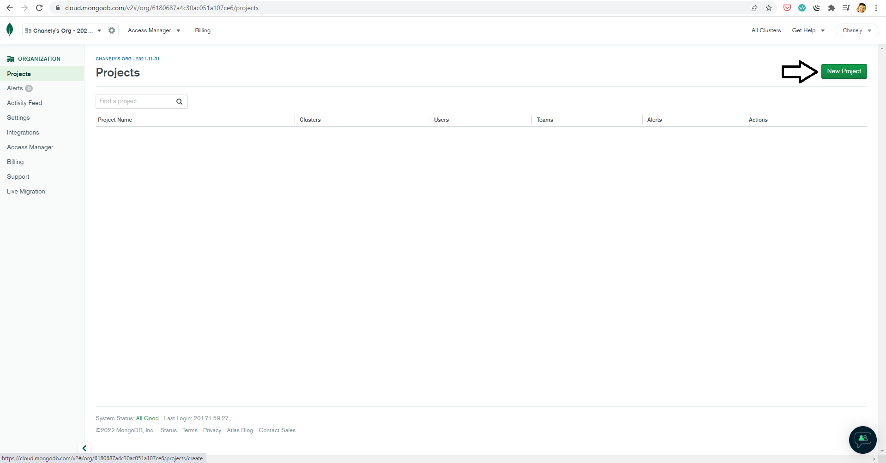

Escolha um nome para o seu projeto e clique em **Next**:

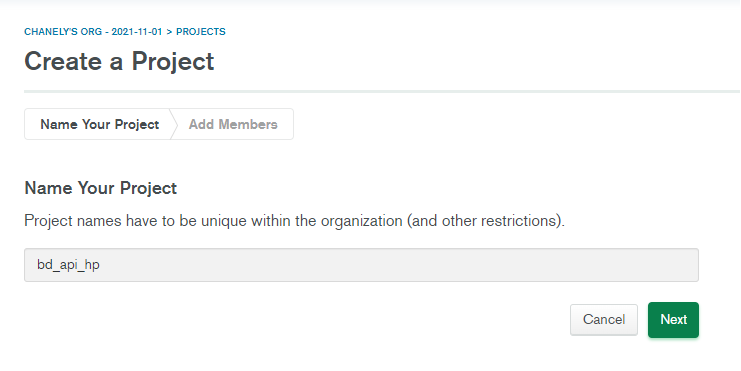

Na próxima tela existe a possibilidade de adicionar novos membros ao projeto via e-mail, caso deseje. Feito isto, clique em **Create Project**:

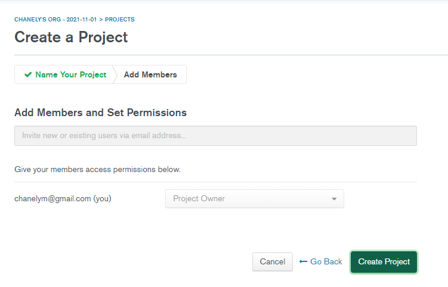

Com o projeto criado, precisamos construir um Banco de Dados associado a ele. Clique em **Build a Database**:

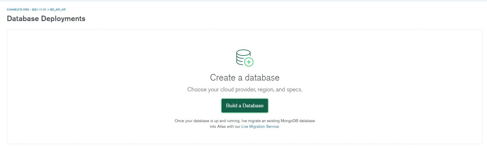

Escolha a opção gratuita, selecionando **Shared**:

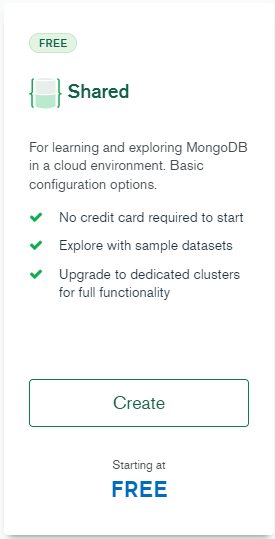

Na tela para seleção do _provider_, escolha a **Google Cloud** e clique em **Create Cluster**:

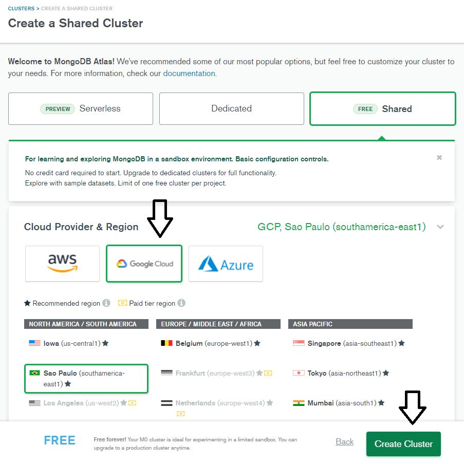

Para este projeto, escolhemos a Google pois seu servidor se encontra no Brasil, ajudando a diminuir os problemas de latência.

Enquanto aguarda a criação do banco, adicione um usuário e senha para o mesmo:

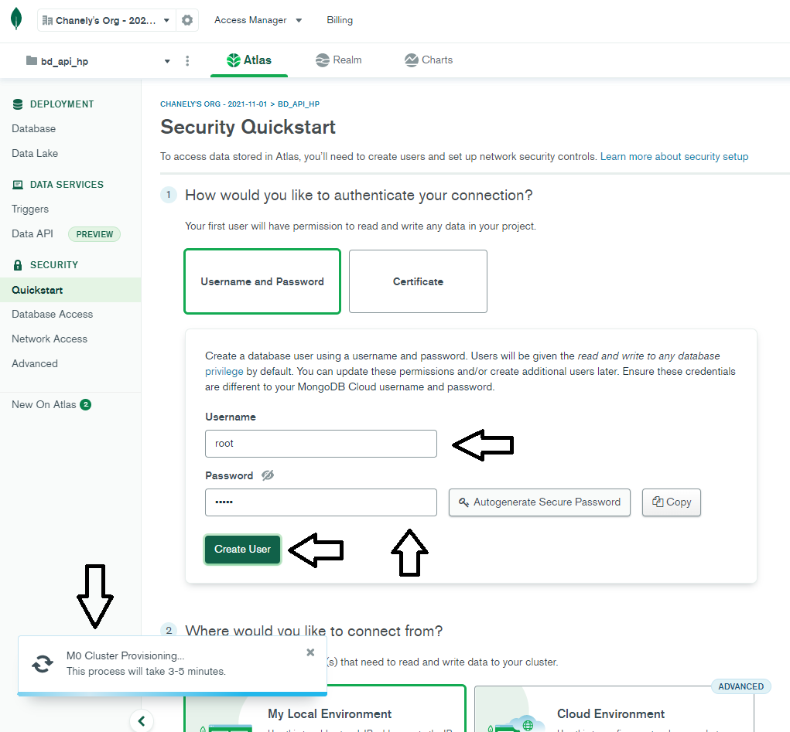

Criado o usuário e finalizada a criação do banco, clique em **Network Access** no menu lateral para configurar os lugares de onde nosso Banco de Dados aceitará conexões, pois na criação deixamos habilitado somente acesso local.

Clique em **Add IP Address**:

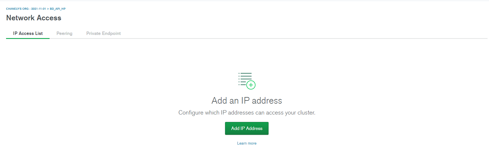

Selecione a opção que dá acesso de qualquer lugar e clique em **Confirm**:

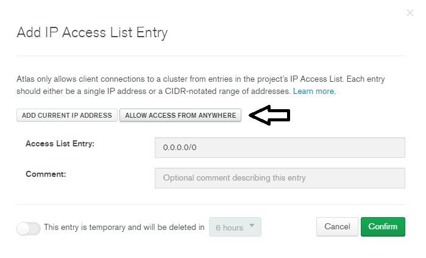

> ***_Importante :mega: :_*** Apenas por questões pedagógicas estamos criando essa liberação vinda de qualquer lugar. Por questões e recomendações de segurança é necessária a liberação por IP.

Aguarde até que o _status_ mude de _Pending_ para **_Active_**:

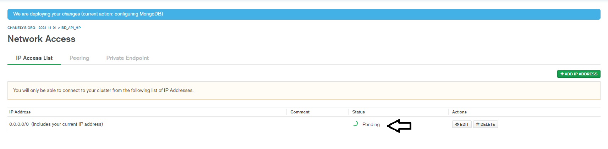

> ***_Importante :mega: :_*** Todas as alterações que fazemos no site do _MongoDB Atlas_ chegam no e-mail. :wink:

Clicando em **Database** no menu lateral, podemos ver que o _Cluster_ foi criado com sucesso e disponibilizado:

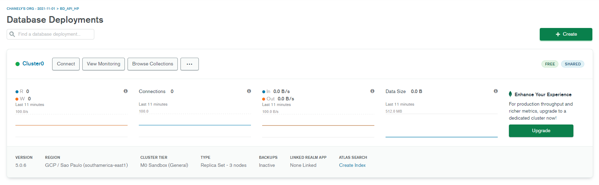

Agora podemos voltar ao código para dar início às configurações. :stuck_out_tongue_winking_eye:

<!-- 19:40 -->
